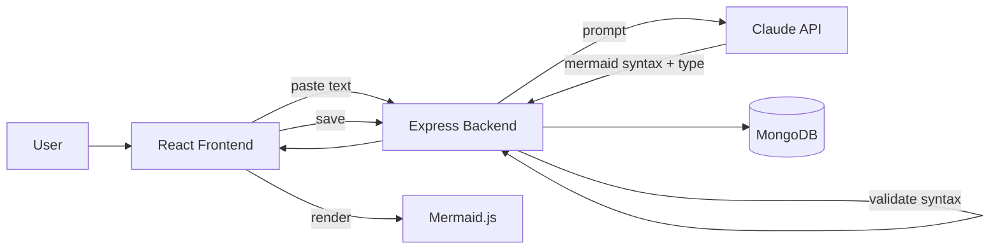

# Phase 1 — DiagramForge: The Application
### Frontend + Backend + Local Development (Before Any Cloud Infrastructure)

---

## Overview

**DiagramForge** is our Napkin-AI-style tool: paste text, an LLM figures out the best diagram type and structure, Mermaid.js renders it live, and you can save/export it. This phase builds the entire application and gets it running locally in Docker Compose — no AWS, no Kubernetes yet. Get this rock-solid first; every later phase just deploys what already works.

**Why local-first matters, concretely:** if something breaks after we deploy to EKS in Phase 4+, you need to instantly know whether the bug is in *your application* or in *the infrastructure around it*. If it only ever ran in Kubernetes, every bug is ambiguous. If it's proven solid locally first, a bug after deployment is almost certainly infra — which is exactly the diagnostic clarity a real engineering team relies on.

## Architecture for this phase



## Tech stack for this phase

| Layer | Choice | Why |
|---|---|---|
| Frontend build tool | Vite + React | Fast dev server, modern standard, lighter than CRA |
| Diagram rendering | Mermaid.js | Does the hard auto-layout work for us — this is the whole reason the project stays simple |
| Styling | Tailwind CSS | Fast to build a clean, animated UI without hand-rolling CSS |
| Backend | Node.js + Express | Matches the reference architecture's stack, keeps the whole team (you) in one language |
| LLM | Claude API (Anthropic) | Strong at structured output; we'll constrain it to valid JSON |
| Database | MongoDB + Mongoose | Matches the reference architecture; simple document model fits a "saved diagram" perfectly |

## Data model

```javascript
// One collection. Genuinely this simple.
Diagram {
  _id: ObjectId,
  title: String,
  inputText: String,
  diagramType: String,      // "flowchart" | "sequence" | "mindmap" | "class" | "state" | "er" | "timeline"
  mermaidSyntax: String,
  createdAt: Date,
  updatedAt: Date
}
```

---

## Backend build

### 1.1 Scaffold

```bash
cd application/backend
npm init -y
npm install express mongoose cors dotenv helmet express-rate-limit @anthropic-ai/sdk
npm install -D nodemon jest supertest
```

Folder structure:
```
backend/
├── src/
│   ├── config/
│   │   └── db.js
│   ├── models/
│   │   └── Diagram.js
│   ├── services/
│   │   └── diagramGenerator.js    # the AI call lives here
│   ├── routes/
│   │   └── diagram.routes.js
│   ├── controllers/
│   │   └── diagram.controller.js
│   ├── middleware/
│   │   ├── errorHandler.js
│   │   └── validateRequest.js
│   └── app.js
├── tests/
│   └── diagram.test.js
├── .env.example
├── .dockerignore
├── Dockerfile
├── package.json
└── server.js
```

### 1.2 Environment config

```bash
# .env.example  (commit this; never commit the real .env)
PORT=5000
MONGO_URI=mongodb://localhost:27017/diagramforge
ANTHROPIC_API_KEY=your_key_here
NODE_ENV=development
CORS_ORIGIN=http://localhost:5173
```

```javascript
// src/config/db.js
const mongoose = require('mongoose');

const connectDB = async () => {
  try {
    await mongoose.connect(process.env.MONGO_URI);
    console.log('MongoDB connected');
  } catch (err) {
    console.error('MongoDB connection error:', err.message);
    process.exit(1);
  }
};

module.exports = connectDB;
```

### 1.3 The data model

```javascript
// src/models/Diagram.js
const mongoose = require('mongoose');

const diagramSchema = new mongoose.Schema(
  {
    title: { type: String, required: true, trim: true, maxlength: 200 },
    inputText: { type: String, required: true, maxlength: 10000 },
    diagramType: {
      type: String,
      required: true,
      enum: ['flowchart', 'sequence', 'mindmap', 'class', 'state', 'er', 'timeline'],
    },
    mermaidSyntax: { type: String, required: true },
  },
  { timestamps: true }
);

module.exports = mongoose.model('Diagram', diagramSchema);
```

### 1.4 The core AI generation service — the actual product logic

This is the piece worth getting right. Two things matter: a prompt that reliably picks a good diagram type, and a **validation + retry loop**, because LLMs occasionally emit Mermaid syntax that doesn't quite parse — and silently shipping a broken diagram is worse than retrying once.

```javascript
// src/services/diagramGenerator.js
const Anthropic = require('@anthropic-ai/sdk');

const client = new Anthropic({ apiKey: process.env.ANTHROPIC_API_KEY });

const SYSTEM_PROMPT = `You are a diagram generation engine. Given input text, do two things:

1. Choose the SINGLE best Mermaid diagram type for this content:
   - flowchart: processes, decisions, sequential steps
   - sequence: interactions between actors/systems over time
   - mindmap: hierarchical brainstorm/breakdown of a central topic
   - class: object-oriented structure/relationships
   - state: state machines, status transitions
   - er: entity relationships, data models
   - timeline: chronological events

2. Generate valid Mermaid syntax for that diagram type representing the input text accurately.

Rules:
- Output ONLY valid JSON, no markdown fences, no commentary.
- Format: {"diagramType": "...", "title": "...", "mermaidSyntax": "..."}
- The mermaidSyntax value must be syntactically correct Mermaid code that would render without errors.
- Keep node labels concise (under 8 words each).
- title should be a short, descriptive name for the diagram (under 10 words).`;

async function callClaude(userText, correctionContext = null) {
  const messages = [{ role: 'user', content: userText }];

  if (correctionContext) {
    messages.push(
      { role: 'assistant', content: correctionContext.previousOutput },
      {
        role: 'user',
        content: `That Mermaid syntax failed to parse with this error: "${correctionContext.error}". Please fix the syntax and return the corrected JSON in the same format.`,
      }
    );
  }

  const response = await client.messages.create({
    model: 'claude-sonnet-4-6',
    max_tokens: 1500,
    system: SYSTEM_PROMPT,
    messages,
  });

  const text = response.content.find((b) => b.type === 'text')?.text || '';
  return JSON.parse(text);
}

// A lightweight structural check before trusting the syntax fully.
// Real validation happens client-side via mermaid.parse(), but this
// catches obviously malformed output before it even reaches the frontend.
function basicSyntaxCheck(diagramType, syntax) {
  const typePrefixes = {
    flowchart: /^(graph|flowchart)/i,
    sequence: /^sequenceDiagram/i,
    mindmap: /^mindmap/i,
    class: /^classDiagram/i,
    state: /^stateDiagram/i,
    er: /^erDiagram/i,
    timeline: /^timeline/i,
  };
  const pattern = typePrefixes[diagramType];
  return pattern ? pattern.test(syntax.trim()) : false;
}

async function generateDiagram(inputText) {
  let result = await callClaude(inputText);

  if (!basicSyntaxCheck(result.diagramType, result.mermaidSyntax)) {
    // One retry with explicit correction context — mirrors the
    // Reflexion pattern: give the model its own bad output plus
    // the specific reason it failed, not just "try again."
    result = await callClaude(inputText, {
      previousOutput: JSON.stringify(result),
      error: `Output did not start with the expected Mermaid keyword for diagram type "${result.diagramType}"`,
    });
  }

  return result;
}

module.exports = { generateDiagram };
```

### 1.5 Controller + routes

```javascript
// src/controllers/diagram.controller.js
const Diagram = require('../models/Diagram');
const { generateDiagram } = require('../services/diagramGenerator');

exports.generate = async (req, res, next) => {
  try {
    const { text } = req.body;
    const result = await generateDiagram(text);
    res.json(result);
  } catch (err) {
    next(err);
  }
};

exports.save = async (req, res, next) => {
  try {
    const diagram = await Diagram.create(req.body);
    res.status(201).json(diagram);
  } catch (err) {
    next(err);
  }
};

exports.list = async (req, res, next) => {
  try {
    const diagrams = await Diagram.find().sort({ createdAt: -1 }).select('title diagramType createdAt');
    res.json(diagrams);
  } catch (err) {
    next(err);
  }
};

exports.getOne = async (req, res, next) => {
  try {
    const diagram = await Diagram.findById(req.params.id);
    if (!diagram) return res.status(404).json({ error: 'Diagram not found' });
    res.json(diagram);
  } catch (err) {
    next(err);
  }
};

exports.remove = async (req, res, next) => {
  try {
    await Diagram.findByIdAndDelete(req.params.id);
    res.status(204).send();
  } catch (err) {
    next(err);
  }
};
```

```javascript
// src/routes/diagram.routes.js
const express = require('express');
const router = express.Router();
const ctrl = require('../controllers/diagram.controller');
const { validateGenerateRequest } = require('../middleware/validateRequest');

router.post('/generate', validateGenerateRequest, ctrl.generate);
router.post('/', ctrl.save);
router.get('/', ctrl.list);
router.get('/:id', ctrl.getOne);
router.delete('/:id', ctrl.remove);

module.exports = router;
```

### 1.6 Validation + error handling middleware

```javascript
// src/middleware/validateRequest.js
exports.validateGenerateRequest = (req, res, next) => {
  const { text } = req.body;
  if (!text || typeof text !== 'string' || text.trim().length === 0) {
    return res.status(400).json({ error: 'text is required and must be a non-empty string' });
  }
  if (text.length > 10000) {
    return res.status(400).json({ error: 'text exceeds 10,000 character limit' });
  }
  next();
};
```

```javascript
// src/middleware/errorHandler.js
module.exports = (err, req, res, next) => {
  console.error(err);
  const status = err.status || 500;
  const message = process.env.NODE_ENV === 'production' ? 'Internal server error' : err.message;
  res.status(status).json({ error: message });
};
```

### 1.7 App entrypoint — with a health check endpoint

This `/healthz` endpoint isn't optional polish — Kubernetes will use exactly this in Phase 7 for liveness/readiness probes. Build it now so it's already tested by the time it matters.

```javascript
// src/app.js
const express = require('express');
const cors = require('cors');
const helmet = require('helmet');
const rateLimit = require('express-rate-limit');
const diagramRoutes = require('./routes/diagram.routes');
const errorHandler = require('./middleware/errorHandler');

const app = express();

app.use(helmet());
app.use(cors({ origin: process.env.CORS_ORIGIN }));
app.use(express.json({ limit: '1mb' }));
app.use(rateLimit({ windowMs: 60 * 1000, max: 30 })); // 30 req/min — generous for one user, protects the LLM cost surface

app.get('/healthz', (req, res) => res.status(200).json({ status: 'ok' }));

app.use('/api/diagrams', diagramRoutes);

app.use(errorHandler);

module.exports = app;
```

```javascript
// server.js
require('dotenv').config();
const app = require('./src/app');
const connectDB = require('./src/config/db');

const PORT = process.env.PORT || 5000;

connectDB().then(() => {
  app.listen(PORT, () => console.log(`DiagramForge backend running on port ${PORT}`));
});
```

### 1.8 Backend Dockerfile — production-standard from day one

```dockerfile
# application/backend/Dockerfile
FROM node:20-alpine AS deps
WORKDIR /app
COPY package*.json ./
RUN npm ci --omit=dev

FROM node:20-alpine
WORKDIR /app
RUN addgroup -S appgroup && adduser -S appuser -G appgroup
COPY --from=deps /app/node_modules ./node_modules
COPY . .
USER appuser
EXPOSE 5000
HEALTHCHECK --interval=30s --timeout=3s CMD wget -qO- http://localhost:5000/healthz || exit 1
CMD ["node", "server.js"]
```

```
# application/backend/.dockerignore
node_modules
.env
.env.local
tests
*.md
.git
```

**Why each line matters:** multi-stage build keeps the final image small (no build tools in the runtime layer); a non-root `appuser` means a container compromise doesn't hand an attacker root; the `HEALTHCHECK` directive is what Docker (and later Kubernetes) uses to know the container is actually serving traffic, not just running.

---

## Frontend build

### 2.1 Scaffold

```bash
cd application/frontend
npm create vite@latest . -- --template react
npm install mermaid axios
npm install -D tailwindcss postcss autoprefixer
npx tailwindcss init -p
```

Folder structure:
```
frontend/
├── src/
│   ├── components/
│   │   ├── DiagramInput.jsx
│   │   ├── DiagramPreview.jsx
│   │   └── SavedDiagramsList.jsx
│   ├── services/
│   │   └── api.js
│   ├── App.jsx
│   └── main.jsx
├── .env.example
├── .dockerignore
├── Dockerfile
├── nginx.conf
└── package.json
```

### 2.2 API client

```javascript
// src/services/api.js
import axios from 'axios';

const api = axios.create({ baseURL: import.meta.env.VITE_API_URL });

export const generateDiagram = (text) => api.post('/api/diagrams/generate', { text }).then((r) => r.data);
export const saveDiagram = (diagram) => api.post('/api/diagrams', diagram).then((r) => r.data);
export const listDiagrams = () => api.get('/api/diagrams').then((r) => r.data);
export const getDiagram = (id) => api.get(`/api/diagrams/${id}`).then((r) => r.data);
export const deleteDiagram = (id) => api.delete(`/api/diagrams/${id}`);
```

### 2.3 Diagram preview — where Mermaid.js does the real work

```jsx
// src/components/DiagramPreview.jsx
import { useEffect, useRef } from 'react';
import mermaid from 'mermaid';

mermaid.initialize({ startOnLoad: false, theme: 'default' });

export default function DiagramPreview({ syntax }) {
  const ref = useRef(null);

  useEffect(() => {
    if (!syntax || !ref.current) return;
    const id = `mermaid-${Date.now()}`;
    mermaid
      .render(id, syntax)
      .then(({ svg }) => {
        ref.current.innerHTML = svg;
      })
      .catch((err) => {
        ref.current.innerHTML = `<p class="text-red-500">Failed to render diagram: ${err.message}</p>`;
      });
  }, [syntax]);

  return <div ref={ref} className="p-6 bg-white rounded-lg shadow-md min-h-[300px] flex items-center justify-center" />;
}
```

### 2.4 Input component + main app flow

```jsx
// src/components/DiagramInput.jsx
import { useState } from 'react';

export default function DiagramInput({ onGenerate, loading }) {
  const [text, setText] = useState('');

  return (
    <div className="space-y-3">
      <textarea
        className="w-full h-40 p-4 border rounded-lg focus:ring-2 focus:ring-indigo-400 transition"
        placeholder="Paste your notes, a process description, or any text..."
        value={text}
        onChange={(e) => setText(e.target.value)}
      />
      <button
        onClick={() => onGenerate(text)}
        disabled={loading || !text.trim()}
        className="px-6 py-2 bg-indigo-600 text-white rounded-lg hover:bg-indigo-700 disabled:opacity-50 transition"
      >
        {loading ? 'Generating...' : 'Generate Diagram'}
      </button>
    </div>
  );
}
```

```jsx
// src/App.jsx
import { useState } from 'react';
import DiagramInput from './components/DiagramInput';
import DiagramPreview from './components/DiagramPreview';
import { generateDiagram, saveDiagram } from './services/api';

export default function App() {
  const [result, setResult] = useState(null);
  const [loading, setLoading] = useState(false);

  const handleGenerate = async (text) => {
    setLoading(true);
    try {
      const data = await generateDiagram(text);
      setResult({ ...data, inputText: text });
    } catch (err) {
      alert('Generation failed — try again.');
    } finally {
      setLoading(false);
    }
  };

  const handleSave = async () => {
    if (!result) return;
    await saveDiagram(result);
    alert('Saved!');
  };

  return (
    <div className="max-w-4xl mx-auto py-10 px-4">
      <h1 className="text-3xl font-bold mb-6">DiagramForge</h1>
      <DiagramInput onGenerate={handleGenerate} loading={loading} />
      {result && (
        <div className="mt-8 animate-fade-in">
          <h2 className="text-xl font-semibold mb-2">{result.title}</h2>
          <DiagramPreview syntax={result.mermaidSyntax} />
          <button onClick={handleSave} className="mt-4 px-4 py-2 border rounded-lg hover:bg-gray-50 transition">
            Save Diagram
          </button>
        </div>
      )}
    </div>
  );
}
```

*(The animation polish — the fade-in on result, a growth-style reveal, export-to-PNG/SVG — is exactly what we'll layer on once the functional core works. Get this plain version working end-to-end first.)*

### 2.5 Frontend Dockerfile — multi-stage, served by Nginx

```dockerfile
# application/frontend/Dockerfile
FROM node:20-alpine AS build
WORKDIR /app
COPY package*.json ./
RUN npm ci
COPY . .
RUN npm run build

FROM nginx:alpine
COPY --from=build /app/dist /usr/share/nginx/html
COPY nginx.conf /etc/nginx/conf.d/default.conf
EXPOSE 80
HEALTHCHECK --interval=30s --timeout=3s CMD wget -qO- http://localhost:80 || exit 1
```

```nginx
# application/frontend/nginx.conf
server {
    listen 80;
    root /usr/share/nginx/html;
    index index.html;
    location / {
        try_files $uri $uri/ /index.html;  # SPA routing
    }
    location /healthz {
        return 200 'ok';
    }
}
```

**Why build with Node but serve with Nginx:** the final image contains no Node runtime, no `node_modules`, no build tools — just static files and a lightweight web server. Materially smaller image, materially smaller attack surface, and it's the standard production pattern for any React app.

---

## Local orchestration — docker-compose.yaml

```yaml
# application/docker-compose.yaml
version: '3.8'
services:
  mongo:
    image: mongo:7
    ports:
      - "27017:27017"
    volumes:
      - mongo-data:/data/db

  backend:
    build: ./backend
    ports:
      - "5000:5000"
    environment:
      - MONGO_URI=mongodb://mongo:27017/diagramforge
      - ANTHROPIC_API_KEY=${ANTHROPIC_API_KEY}
      - CORS_ORIGIN=http://localhost:5173
      - NODE_ENV=development
    depends_on:
      - mongo

  frontend:
    build: ./frontend
    ports:
      - "5173:80"
    depends_on:
      - backend

volumes:
  mongo-data:
```

Run it:
```bash
export ANTHROPIC_API_KEY=your_key_here
docker compose up --build
```

---

## Git practices for this phase

```bash
git checkout -b feat/phase-1-application-scaffold

# after backend works locally:
git add application/backend
git commit -m "feat(backend): scaffold Express API with diagram generation endpoint"

# after the AI service + validation loop works:
git commit -m "feat(backend): add Claude-based diagram generation with syntax validation retry"

# after frontend works:
git commit -m "feat(frontend): scaffold React app with Mermaid.js rendering"

# after docker-compose works end-to-end:
git commit -m "feat(docker): add Dockerfiles and docker-compose for local three-tier setup"

git push origin feat/phase-1-application-scaffold
# open a PR against main, fill out the PR template, self-review the diff, merge
```

---

## Verification checklist before moving to Phase 2

- [ ] `docker compose up --build` runs all three services with no errors
- [ ] Pasting text into the frontend produces a rendered diagram within a few seconds
- [ ] A deliberately malformed/ambiguous input still produces *something* renderable (tests the retry loop)
- [ ] Saving a diagram persists it in MongoDB (`docker exec -it <mongo-container> mongosh` and query it directly to confirm)
- [ ] `curl http://localhost:5000/healthz` returns `{"status":"ok"}`
- [ ] `.env` is git-ignored; only `.env.example` is committed
- [ ] PR merged to `main` with a clean Conventional Commits history

---

## What's next

**Phase 2** moves to the cloud: Terraform provisioning the Jenkins server on AWS EC2, with remote state, least-privilege IAM, and proper networking — the first real infrastructure this project touches.

Say **Continue** and I'll build Phase 2.
