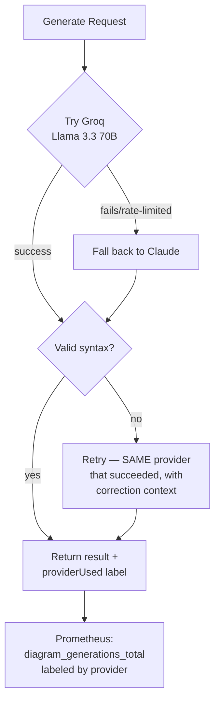

# Addendum — Multi-Provider LLM Abstraction
### Groq (Free Default) + Claude (Fallback), With Automatic Failover and Provider-Aware Observability

---

## Overview

Replaces the single-provider Claude call with a proper provider abstraction: **Groq (Llama 3.3 70B) as the free, default provider**, **Claude as automatic fallback** if Groq is unavailable or rate-limited, a "sticky provider" retry (the syntax-correction retry stays on whichever provider succeeded, rather than re-triggering the whole fallback cascade), and provider-labeled metrics so you can actually see the fallback rate in Grafana rather than assume it's low.

## Architecture



---

## Provider classes

```bash
cd application/backend
npm install openai
```

```javascript
// src/services/providers/groqProvider.js
const OpenAI = require('openai');

class GroqProvider {
  constructor() {
    this.client = new OpenAI({
      apiKey: process.env.GROQ_API_KEY,
      baseURL: 'https://api.groq.com/openai/v1',
    });
    this.name = 'groq';
    this.model = 'llama-3.3-70b-versatile';
  }

  async generate(systemPrompt, messages) {
    const response = await this.client.chat.completions.create({
      model: this.model,
      max_tokens: 1500,
      messages: [{ role: 'system', content: systemPrompt }, ...messages],
    });
    return response.choices[0].message.content;
  }
}

module.exports = GroqProvider;
```

```javascript
// src/services/providers/claudeProvider.js
const Anthropic = require('@anthropic-ai/sdk');

class ClaudeProvider {
  constructor() {
    this.client = new Anthropic({ apiKey: process.env.ANTHROPIC_API_KEY });
    this.name = 'claude';
    this.model = 'claude-sonnet-4-6';
  }

  async generate(systemPrompt, messages) {
    const response = await this.client.messages.create({
      model: this.model,
      max_tokens: 1500,
      system: systemPrompt,
      messages,
    });
    return response.content.find((b) => b.type === 'text')?.text || '';
  }
}

module.exports = ClaudeProvider;
```

```javascript
// src/services/providers/index.js
const GroqProvider = require('./groqProvider');
const ClaudeProvider = require('./claudeProvider');

const providers = {
  groq: new GroqProvider(),
  claude: new ClaudeProvider(),
};

const DEFAULT_PROVIDER = process.env.DEFAULT_LLM_PROVIDER || 'groq';
const FALLBACK_PROVIDER = process.env.FALLBACK_LLM_PROVIDER || 'claude';

async function generateWithFallback(systemPrompt, messages) {
  const primary = providers[DEFAULT_PROVIDER];
  try {
    const text = await primary.generate(systemPrompt, messages);
    return { text, providerUsed: primary.name };
  } catch (err) {
    console.warn(`Primary provider "${primary.name}" failed (${err.message}) — falling back to "${FALLBACK_PROVIDER}"`);
    const fallback = providers[FALLBACK_PROVIDER];
    const text = await fallback.generate(systemPrompt, messages);
    return { text, providerUsed: fallback.name };
  }
}

module.exports = { generateWithFallback, providers };
```

---

## Updated diagram generation service

One real robustness improvement bundled in here: Llama-family models (Groq) are more prone than Claude to wrapping JSON output in markdown code fences even when told not to — `extractJSON` strips that defensively rather than letting `JSON.parse` fail on it.

```javascript
// src/services/diagramGenerator.js
const { generateWithFallback, providers } = require('./providers');
const { diagramGenerations, diagramGenerationDuration } = require('./metrics');

const SYSTEM_PROMPT = `You are a diagram generation engine. Given input text, do two things:

1. Choose the SINGLE best Mermaid diagram type for this content:
   - flowchart: processes, decisions, sequential steps
   - sequence: interactions between actors/systems over time
   - mindmap: hierarchical brainstorm/breakdown of a central topic
   - class: object-oriented structure/relationships
   - state: state machines, status transitions
   - er: entity relationships, data models
   - timeline: chronological events

2. Generate valid Mermaid syntax for that diagram type representing the input text accurately.

Rules:
- Output ONLY valid JSON, no markdown fences, no commentary.
- Format: {"diagramType": "...", "title": "...", "mermaidSyntax": "..."}
- The mermaidSyntax value must be syntactically correct Mermaid code that would render without errors.
- Keep node labels concise (under 8 words each).
- title should be a short, descriptive name for the diagram (under 10 words).`;

function extractJSON(text) {
  const cleaned = text.trim().replace(/^```(?:json)?\n?/, '').replace(/\n?```$/, '');
  return JSON.parse(cleaned);
}

function basicSyntaxCheck(diagramType, syntax) {
  const typePrefixes = {
    flowchart: /^(graph|flowchart)/i,
    sequence: /^sequenceDiagram/i,
    mindmap: /^mindmap/i,
    class: /^classDiagram/i,
    state: /^stateDiagram/i,
    er: /^erDiagram/i,
    timeline: /^timeline/i,
  };
  const pattern = typePrefixes[diagramType];
  return pattern ? pattern.test(syntax.trim()) : false;
}

async function generateDiagram(inputText) {
  const endTimer = diagramGenerationDuration.startTimer();
  try {
    const messages = [{ role: 'user', content: inputText }];
    let { text, providerUsed } = await generateWithFallback(SYSTEM_PROMPT, messages);
    let result = extractJSON(text);
    let status = 'success';

    if (!basicSyntaxCheck(result.diagramType, result.mermaidSyntax)) {
      // Sticky retry: stay on whichever provider already succeeded once,
      // rather than re-triggering the fallback cascade from scratch.
      messages.push(
        { role: 'assistant', content: text },
        {
          role: 'user',
          content: `That Mermaid syntax failed to parse for diagram type "${result.diagramType}". Please fix the syntax and return the corrected JSON in the same format.`,
        },
      );
      const retryText = await providers[providerUsed].generate(SYSTEM_PROMPT, messages);
      result = extractJSON(retryText);
      status = 'success_after_retry';
    }

    diagramGenerations.inc({ status, provider: providerUsed });
    return { ...result, providerUsed };
  } catch (err) {
    diagramGenerations.inc({ status: 'failure', provider: 'unavailable' });
    throw err;
  } finally {
    endTimer();
  }
}

module.exports = { generateDiagram, basicSyntaxCheck, extractJSON };
```

---

## Metrics update — provider is now a real label, not an afterthought

```javascript
// src/middleware/metrics.js — update the counter definition
const diagramGenerations = new client.Counter({
  name: 'diagram_generations_total',
  help: 'Total diagram generation attempts',
  labelNames: ['status', 'provider'],
});
```

**New Grafana panel — fallback rate, a genuinely important production signal:**
```
sum(rate(diagram_generations_total{provider="claude"}[1h]))
/ sum(rate(diagram_generations_total[1h])) * 100
```
This tells you, at a glance, what fraction of traffic is silently costing money on the paid fallback versus running free — the number a real cost-conscious team would actually watch.

**New alert rule** — add to `charts/three-tier-app/templates/alerts.yaml`:
```yaml
- alert: PrimaryProviderDegraded
  expr: |
    sum(rate(diagram_generations_total{provider="claude"}[15m]))
    / sum(rate(diagram_generations_total[15m])) > 0.3
  for: 10m
  labels: { severity: warning }
  annotations:
    summary: "Over 30% of requests falling back to Claude — Groq may be degraded or rate-limited"
```

---

## Environment configuration

```bash
# .env.example — updated
PORT=5000
MONGO_URI=mongodb://localhost:27017/diagramforge
GROQ_API_KEY=your_groq_key_here
ANTHROPIC_API_KEY=your_claude_key_here
DEFAULT_LLM_PROVIDER=groq
FALLBACK_LLM_PROVIDER=claude
NODE_ENV=development
CORS_ORIGIN=http://localhost:5173
```

```yaml
# application/docker-compose.yaml — backend service environment, updated
backend:
  build: ./backend
  ports: ["5000:5000"]
  environment:
    - MONGO_URI=mongodb://mongo:27017/diagramforge
    - GROQ_API_KEY=${GROQ_API_KEY}
    - ANTHROPIC_API_KEY=${ANTHROPIC_API_KEY}
    - DEFAULT_LLM_PROVIDER=${DEFAULT_LLM_PROVIDER:-groq}
    - FALLBACK_LLM_PROVIDER=${FALLBACK_LLM_PROVIDER:-claude}
    - CORS_ORIGIN=http://localhost:5173
    - NODE_ENV=development
  depends_on: [mongo]
```

---

## Kubernetes / Helm updates

```bash
# One more secret to create in AWS Secrets Manager, same pattern as Phase 12
aws secretsmanager create-secret \
  --name diagramforge/groq-api-key \
  --secret-string "$GROQ_API_KEY" \
  --region ap-south-1
```

```yaml
# charts/three-tier-app/templates/external-secrets.yaml — extend the ExternalSecret's data block
apiVersion: external-secrets.io/v1beta1
kind: ExternalSecret
metadata:
  name: diagramforge-secrets
  namespace: {{ .Release.Namespace }}
spec:
  refreshInterval: 1h
  secretStoreRef: { name: aws-secretsmanager, kind: SecretStore }
  target:
    name: diagramforge-secrets
    creationPolicy: Owner
  data:
    - secretKey: anthropic-api-key
      remoteRef: { key: diagramforge/anthropic-api-key }
    - secretKey: groq-api-key
      remoteRef: { key: diagramforge/groq-api-key }
```

```yaml
# charts/three-tier-app/templates/backend-deployment.yaml — env block, updated
env:
  - name: MONGO_URI
    value: "mongodb://{{ include "three-tier-app.fullname" . }}-mongodb:27017/diagramforge"
  - name: NODE_ENV
    value: {{ .Values.backend.env.nodeEnv }}
  - name: DEFAULT_LLM_PROVIDER
    value: {{ .Values.backend.env.defaultLlmProvider | default "groq" | quote }}
  - name: FALLBACK_LLM_PROVIDER
    value: {{ .Values.backend.env.fallbackLlmProvider | default "claude" | quote }}
  - name: GROQ_API_KEY
    valueFrom:
      secretKeyRef: { name: diagramforge-secrets, key: groq-api-key }
  - name: ANTHROPIC_API_KEY
    valueFrom:
      secretKeyRef: { name: diagramforge-secrets, key: anthropic-api-key }
```

---

## Frontend — show which provider actually generated the diagram

Small, honest transparency touch — the badge reads differently depending on whether the free or paid path served the request, which is a nice thing for you to see live during your own demo too.

```jsx
// src/App.jsx — inside the result display, after the title
{result && (
  <div className="mt-8 animate-fade-in">
    <div className="flex items-center gap-2 mb-2">
      <h2 className="text-xl font-semibold">{result.title}</h2>
      <span className={`text-xs px-2 py-0.5 rounded-full ${
        result.providerUsed === 'groq' ? 'bg-green-100 text-green-700' : 'bg-amber-100 text-amber-700'
      }`}>
        {result.providerUsed === 'groq' ? 'Generated free (Groq)' : 'Generated via Claude (fallback)'}
      </span>
    </div>
    <DiagramPreview syntax={result.mermaidSyntax} loading={loading} />
  </div>
)}
```

---

## Git practices

```bash
git checkout -b feat/multi-provider-llm-abstraction

git add application/backend/src/services/providers
git commit -m "feat(backend): add provider abstraction with Groq default and Claude fallback"

git add application/backend/src/services/diagramGenerator.js
git commit -m "feat(backend): sticky-provider retry, robust JSON extraction across providers"

git add application/backend/src/middleware/metrics.js charts/three-tier-app/templates/alerts.yaml
git commit -m "feat(observability): label diagram generation metrics by provider, add fallback-rate alert"

git add application/backend/.env.example application/docker-compose.yaml
git commit -m "chore(config): add Groq environment variables alongside Claude"

git add charts/three-tier-app/templates/external-secrets.yaml charts/three-tier-app/templates/backend-deployment.yaml
git commit -m "feat(k8s): sync Groq API key via External Secrets, wire into backend deployment"

git add application/frontend/src/App.jsx
git commit -m "feat(frontend): show which provider generated each diagram"

git push origin feat/multi-provider-llm-abstraction
```

---

## Verification checklist

- [ ] With only `GROQ_API_KEY` set (no `ANTHROPIC_API_KEY`), diagram generation works end-to-end on the free path
- [ ] Deliberately set an invalid `GROQ_API_KEY` and confirm the request still succeeds — via automatic fallback to Claude, logged clearly, not a silent failure
- [ ] Grafana's new fallback-rate panel shows real data after generating a handful of diagrams
- [ ] The frontend badge correctly reflects which provider actually served each request
- [ ] `PrimaryProviderDegraded` alert rule is present and would fire under a sustained fallback scenario (test by forcing Groq failures temporarily)
- [ ] AWS Secrets Manager holds both `diagramforge/anthropic-api-key` and `diagramforge/groq-api-key`, and the ExternalSecret syncs both into the single `diagramforge-secrets` K8s Secret correctly
