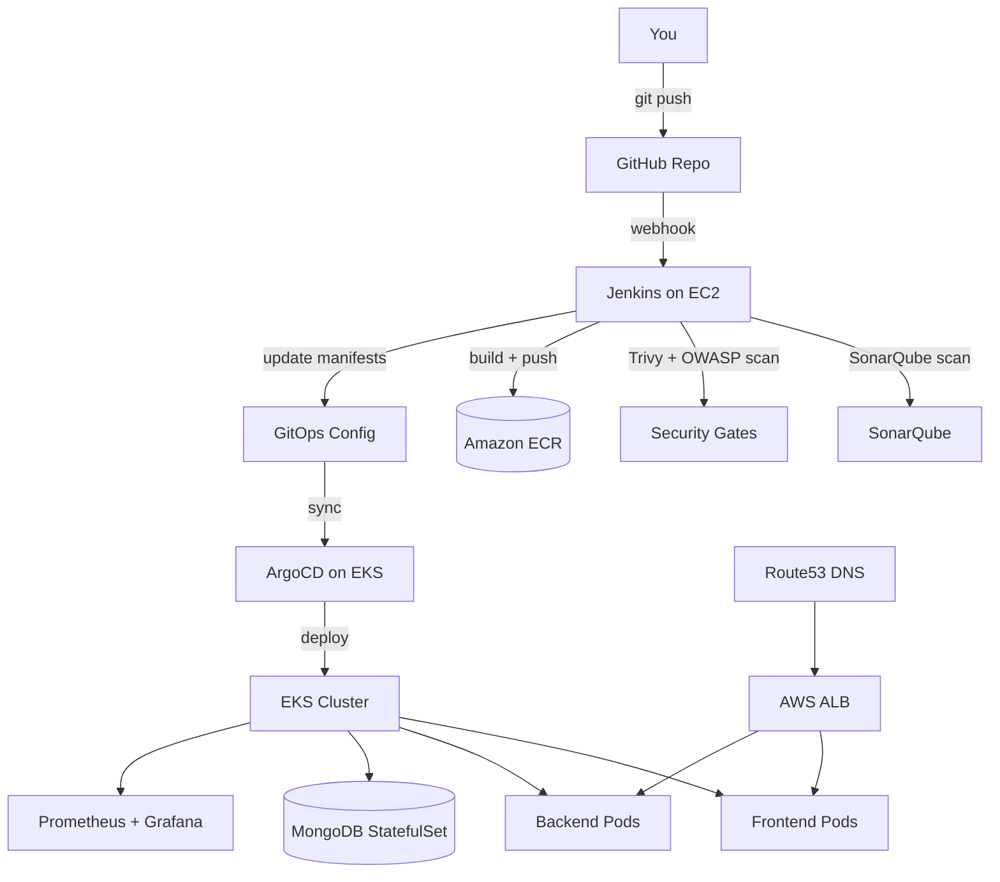

# Phase 0 — Foundations: Repo Structure, Git Strategy & Prerequisites
### Three-Tier DevSecOps Platform on AWS EKS

---

## What you're building, in one paragraph

A React + Node.js + MongoDB application, containerized and deployed to a real AWS EKS cluster, with every production concern wired in: Terraform provisioning everything, Jenkins running a security-gated CI pipeline (SonarQube for code quality, OWASP Dependency-Check + Trivy for vulnerabilities), ArgoCD handling GitOps-based continuous delivery, Prometheus/Grafana for observability, and proper secrets/TLS/persistence handling throughout. By the end, you'll have a system you built piece by piece and can explain at every layer — not a `terraform apply` you ran once and don't fully understand.

## High-level architecture



---

## Repository structure (finalized)

We're using **one monorepo** for learning clarity (a real production setup would often split the GitOps config into its own repo — noted as a deliberate simplification below, not an oversight).

```
three-tier-devsecops-platform/
├── .github/
│   ├── PULL_REQUEST_TEMPLATE.md
│   ├── ISSUE_TEMPLATE/
│   │   ├── bug_report.md
│   │   └── feature_request.md
│   └── CODEOWNERS
├── application/
│   ├── frontend/                 # React app
│   │   ├── src/
│   │   ├── public/
│   │   ├── Dockerfile
│   │   ├── .dockerignore
│   │   └── package.json
│   ├── backend/                  # Node.js/Express API
│   │   ├── src/
│   │   ├── Dockerfile
│   │   ├── .dockerignore
│   │   └── package.json
│   └── docker-compose.yaml       # local dev: all 3 tiers
├── infrastructure/
│   ├── jenkins-server/           # Terraform: EC2 Jenkins host + networking
│   │   ├── main.tf
│   │   ├── variables.tf
│   │   ├── outputs.tf
│   │   └── backend.tf            # S3 remote state config
│   ├── eks-cluster/               # Terraform: EKS + node groups + IRSA
│   │   ├── main.tf
│   │   ├── variables.tf
│   │   ├── outputs.tf
│   │   └── backend.tf
│   └── modules/                   # reusable modules: vpc, security-group, iam-role
├── ci/
│   └── jenkins/
│       ├── Jenkinsfile.backend
│       └── Jenkinsfile.frontend
├── charts/
│   └── three-tier-app/            # Helm chart for the application
│       ├── Chart.yaml
│       ├── values-dev.yaml
│       ├── values-prod.yaml
│       └── templates/
├── gitops/                        # ArgoCD Application manifests (App-of-Apps)
│   ├── root-app.yaml
│   └── apps/
│       ├── three-tier-app.yaml
│       └── monitoring.yaml
├── observability/
│   └── prometheus-grafana/
│       ├── values.yaml
│       └── dashboards/
├── docs/
│   ├── phases/                    # every phase MD file lives here
│   └── architecture-diagram.png
├── .gitignore
├── LICENSE
└── README.md
```

**Why this shape:** each top-level folder maps to one *concern* (application code, infra provisioning, CI, K8s packaging, GitOps, observability) rather than one *tool* — so when you explain this repo in an interview, you're describing a system, not a folder-per-tool junk drawer.

---

## Git strategy

### Branching model: GitHub-flow, not GitFlow

Use a single long-lived branch (`main`) that is always deployable, plus short-lived feature branches. This is deliberate, not a shortcut: GitFlow's `develop`/`release`/`hotfix` branch zoo was designed for scheduled, versioned software releases — most real companies running continuous deployment today (which is what this whole project demonstrates) use GitHub-flow or trunk-based development instead. Learning the modern default is more valuable than learning the legacy pattern.

```
main                    ← always deployable, protected
 ├─ feat/phase-1-app-scaffold
 ├─ feat/phase-2-jenkins-terraform
 ├─ fix/backend-dockerfile-user
 └─ chore/update-gitignore
```

**Rules:**
- `main` is protected: no direct pushes, requires a PR, requires status checks to pass (once CI exists from Phase 6 onward).
- Branch naming: `feat/<short-description>`, `fix/<short-description>`, `chore/<short-description>`, `docs/<short-description>`.
- One branch per phase (or per meaningful sub-task within a phase) — merge to `main` when that piece works, don't let branches live for weeks.

### Commit convention: Conventional Commits

Every commit follows:
```
<type>(<scope>): <short description>

[optional body]

[optional footer]
```

**Types:** `feat`, `fix`, `chore`, `docs`, `refactor`, `test`, `ci`, `infra`

**Examples you'll actually use in this project:**
```
feat(backend): add health check endpoint for K8s liveness probe
infra(eks): add managed node group with spot instances
ci(jenkins): add Trivy image scan stage before ECR push
fix(mongodb): correct PVC storage class for EBS
docs(phase-3): add Jenkins credential rotation steps
```

**Why this matters beyond neatness:** a clean Conventional Commits history is what lets you generate an accurate changelog automatically, and it's a genuinely common thing interviewers glance at when they open your repo — it signals discipline before they've read a line of code.

### Pull request template

Create `.github/PULL_REQUEST_TEMPLATE.md`:
```markdown
## What this changes
<!-- One or two sentences -->

## Phase
<!-- Which phase of the build this belongs to -->

## Checklist
- [ ] Terraform: `terraform plan` output reviewed (if infra changed)
- [ ] Tested locally (docker-compose or equivalent)
- [ ] No secrets committed (double-check diffs)
- [ ] Docs updated if this changes how something is built/run

## Screenshots / output (if relevant)
```

Even solo, opening a real PR against yourself and filling this out is worth doing — it builds the habit and gives you a genuine PR history to point to.

### CODEOWNERS

```
# .github/CODEOWNERS
* @your-github-username
/infrastructure/ @your-github-username
/gitops/ @your-github-username
```

Solo now, but this is exactly the file that matters the moment a second contributor shows up — worth having from day one.

### .gitignore (comprehensive for this stack)

```gitignore
# Terraform
**/.terraform/*
*.tfstate
*.tfstate.*
*.tfvars
!*.tfvars.example
.terraform.lock.hcl

# Node
node_modules/
npm-debug.log*
.env
.env.local

# Build outputs
build/
dist/

# Kubernetes secrets (never commit real ones)
*-secret.yaml
!*-secret.example.yaml

# IDE
.vscode/
.idea/

# OS
.DS_Store
Thumbs.db

# AWS
.aws/credentials
```

**Critical habit to start now:** anything named `*-secret.yaml` gets git-ignored by pattern from commit one — you'll create `.example.yaml` versions with placeholder values for anything sensitive. This single habit prevents the single most common real-world security incident (a committed secret) before it can ever happen.

---

## Prerequisites — install and verify before Phase 1

| Tool | Purpose | Verify with |
|---|---|---|
| Git | Version control | `git --version` |
| Docker | Local containers | `docker --version` |
| Node.js (LTS) | Local app development | `node --version` |
| AWS CLI v2 | AWS interaction | `aws --version` |
| Terraform | IaC | `terraform --version` |
| kubectl | Kubernetes CLI | `kubectl version --client` |
| Helm | K8s package manager | `helm version` |
| A code editor with the Claude Code / Antigravity extension, or terminal access | Executing these phase files | — |

## AWS account setup — do this carefully

1. **Do not use your AWS root account for daily work.** Create a dedicated IAM user for this project.
2. **Enable MFA** on both the root account and the new IAM user.
3. Create the IAM user with a **least-privilege policy**, not `AdministratorAccess` — for this learning project, a reasonable starting policy grants EC2, EKS, ECR, IAM (role creation only), S3, DynamoDB, VPC, and Route53 permissions, not blanket admin. (We'll write the actual JSON policy in Phase 2, scoped to exactly what each phase needs — least privilege is easiest to maintain if you build it incrementally rather than starting wide and trying to narrow later.)
4. **Set an AWS Budget alert immediately** — before provisioning anything. Go to Billing → Budgets → create a budget (e.g., $20/month threshold with an email alert at 80%). EKS + a NAT Gateway + an ALB genuinely cost real money even within free-tier/student-credit limits if left running — this single step prevents the most common "oops" story in every DevOps learner's first cloud project.
5. Note your AWS account ID and chosen region (pick one region and stay consistent across every phase — e.g., `ap-south-1` for Mumbai, lowest latency if you're in India).

## What to do right now, concretely

```bash
# 1. Create the repo
mkdir three-tier-devsecops-platform && cd three-tier-devsecops-platform
git init
git branch -M main

# 2. Create the folder skeleton
mkdir -p application/frontend application/backend \
  infrastructure/jenkins-server infrastructure/eks-cluster infrastructure/modules \
  ci/jenkins charts/three-tier-app/templates \
  gitops/apps observability/prometheus-grafana docs/phases \
  .github/ISSUE_TEMPLATE

# 3. Add .gitignore, LICENSE, README.md, PR template, CODEOWNERS (content above)

# 4. First commit
git add .
git commit -m "chore: initial repo structure and foundations"

# 5. Create the GitHub repo and push
git remote add origin <your-repo-url>
git push -u origin main

# 6. Set up branch protection on `main` via GitHub repo Settings → Branches
#    (require PR before merging; we'll add "require status checks" once Jenkins exists)
```

---

## What's next

**Phase 1** builds the actual three-tier application — React frontend, Node.js backend, MongoDB — running locally via Docker Compose before any cloud infrastructure exists. You always want the application working locally first; deploying something broken to Kubernetes just makes debugging Kubernetes-shaped, when the bug is actually in your code.

Say the word and I'll build Phase 1 next.
