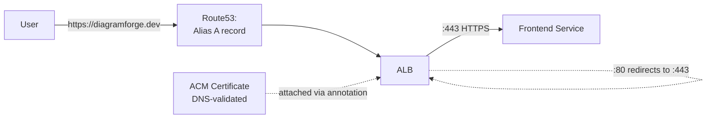

# Phase 10 — DNS & Real HTTPS
### Route53, ACM, and Forcing TLS at the Load Balancer

---

## Overview

Right now, DiagramForge is reachable only via the ALB's raw AWS hostname over plain HTTP. This phase gets you a real domain pointed at it with genuine, auto-renewing HTTPS.

**A deliberate choice worth explaining, not just following a generic tutorial:** most Kubernetes TLS tutorials reach straight for cert-manager + Let's Encrypt, because it's cloud-portable. But we're specifically on an AWS ALB, and AWS Certificate Manager (ACM) integrates with ALB natively via one Ingress annotation — no cert-manager pods to run, no HTTP-01/DNS-01 challenge machinery, AWS just handles issuance and renewal. **We're using ACM here because it's the more idiomatic choice for this specific setup**, not because cert-manager is wrong — if you ever move to a different ingress controller or a different cloud, cert-manager + Let's Encrypt is the portable answer, and worth knowing exists for that reason.

**On cost, honestly:** a real domain costs money — roughly $10-12/year for a `.com`. It's a genuinely worthwhile investment for a portfolio project (`diagramforge.dev` reads completely differently from an ALB hostname in an interview), but if budget is tight right now, you can skip the domain/TLS parts of this phase entirely and keep serving over the ALB's plain HTTP hostname — come back to this phase once you're ready.

## Architecture for this phase



---

## Step 1 — Route53 hosted zone and ACM certificate (Terraform)

```hcl
# infrastructure/dns-tls/main.tf
terraform {
  required_providers {
    aws = { source = "hashicorp/aws", version = "~> 5.0" }
  }
}

provider "aws" {
  region = var.aws_region
}

resource "aws_route53_zone" "this" {
  name = var.domain_name
}

resource "aws_acm_certificate" "this" {
  domain_name               = var.domain_name
  subject_alternative_names = ["*.${var.domain_name}"]
  validation_method          = "DNS"

  lifecycle {
    create_before_destroy = true
  }
}

resource "aws_route53_record" "cert_validation" {
  for_each = {
    for dvo in aws_acm_certificate.this.domain_validation_options : dvo.domain_name => {
      name   = dvo.resource_record_name
      record = dvo.resource_record_value
      type   = dvo.resource_record_type
    }
  }
  zone_id = aws_route53_zone.this.zone_id
  name    = each.value.name
  type    = each.value.type
  records = [each.value.record]
  ttl     = 60
}

resource "aws_acm_certificate_validation" "this" {
  certificate_arn         = aws_acm_certificate.this.arn
  validation_record_fqdns = [for record in aws_route53_record.cert_validation : record.fqdn]
}
```

```hcl
# infrastructure/dns-tls/variables.tf
variable "aws_region"  { default = "ap-south-1" }
variable "domain_name" { type = string }
```

```hcl
# infrastructure/dns-tls/outputs.tf
output "zone_id"             { value = aws_route53_zone.this.zone_id }
output "nameservers"         { value = aws_route53_zone.this.name_servers }
output "acm_certificate_arn" { value = aws_acm_certificate.this.arn }
```

```bash
cd infrastructure/dns-tls
terraform init -backend-config=backend.hcl
terraform apply -var="domain_name=yourdomain.com"
```

**If you bought the domain somewhere other than Route53** (Namecheap, GoDaddy, etc.): copy the `nameservers` output and update them at your registrar — this delegates DNS authority to Route53. Verify propagation before moving on:
```bash
dig NS yourdomain.com
# should eventually show the same 4 nameservers Terraform output
```
This can take anywhere from a few minutes to a few hours — don't panic if it's not instant.

## Step 2 — Attach the ACM cert to the Ingress and force HTTPS

```yaml
# charts/three-tier-app/templates/ingress.yaml — updated annotations
metadata:
  annotations:
    kubernetes.io/ingress.class: alb
    alb.ingress.kubernetes.io/scheme: internet-facing
    alb.ingress.kubernetes.io/target-type: ip
    alb.ingress.kubernetes.io/healthcheck-path: /healthz
    alb.ingress.kubernetes.io/certificate-arn: "{{ .Values.ingress.acmCertificateArn }}"
    alb.ingress.kubernetes.io/listen-ports: '[{"HTTP": 80}, {"HTTPS": 443}]'
    alb.ingress.kubernetes.io/ssl-redirect: '443'
```

Add the ACM ARN to `values-prod.yaml`:
```yaml
ingress:
  enabled: true
  host: diagramforge.dev
  acmCertificateArn: "arn:aws:acm:ap-south-1:<account-id>:certificate/<cert-id>"   # from Step 1's output
```

`ssl-redirect: '443'` is what makes plain `http://` requests automatically bounce to `https://` — never leave that step out; serving plaintext when HTTPS is fully available is a real, avoidable regression.

Commit and let ArgoCD sync (or push through the full pipeline if you've made other changes too).

## Step 3 — Point the domain at the ALB (this has a real, unavoidable ordering dependency)

The ALB doesn't exist until the Ingress with the ACM annotation has already synced — so this step comes *after* Step 2, not before:

```bash
kubectl get ingress -n diagramforge -o jsonpath='{.items[0].status.loadBalancer.ingress[0].hostname}'
```

Add the final DNS record:
```hcl
# infrastructure/dns-tls/main.tf — add once you have the ALB hostname
data "aws_lb" "app" {
  # or just hardcode alb_dns_name/alb_zone_id as variables from the kubectl output above
}

resource "aws_route53_record" "app" {
  zone_id = aws_route53_zone.this.zone_id
  name    = var.domain_name
  type    = "A"

  alias {
    name                   = var.alb_dns_name
    zone_id                = var.alb_zone_id  # AWS publishes these per-region; look up "ALB zone ID <your-region>"
    evaluate_target_health = true
  }
}
```

```bash
terraform apply -var="alb_dns_name=<from kubectl>" -var="alb_zone_id=<region-specific ALB zone ID>"
```

---

## Git practices for this phase

```bash
git checkout -b infra/phase-10-dns-tls

git add infrastructure/dns-tls
git commit -m "infra(dns): provision Route53 zone and ACM certificate with DNS validation"

git add charts/three-tier-app/templates/ingress.yaml charts/three-tier-app/values-prod.yaml
git commit -m "feat(ingress): attach ACM certificate, force HTTPS redirect"

git add infrastructure/dns-tls
git commit -m "infra(dns): add alias record pointing domain at the ALB"

git push origin infra/phase-10-dns-tls
```

---

## Verification checklist

- [ ] `dig NS yourdomain.com` shows Route53's nameservers
- [ ] ACM certificate status shows `ISSUED` in the AWS Console (or `terraform apply` for the validation resource completes without hanging — a stuck validation almost always means the NS delegation above hasn't propagated yet)
- [ ] `curl -v https://yourdomain.com` returns a valid certificate chain and a 200 response
- [ ] `curl -v http://yourdomain.com` redirects (301/302) to the `https://` version
- [ ] The browser padlock shows a valid, trusted certificate — no warnings
- [ ] Certificate auto-renewal requires zero action from you going forward — ACM handles this natively, unlike a manually-managed cert you'd have to remember to rotate

---

## What's next

**Phase 11** covers data persistence properly — confirming EBS-backed durability for MongoDB, and adding an actual backup strategy (not just "the PVC exists," a real, scheduled `mongodump` job with backups shipped to S3).

Say **Continue** for Phase 11.
