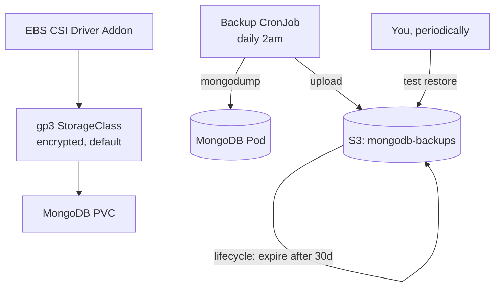

# Phase 11 — Data Persistence & Backup Strategy
### Confirming Real Durability, and a Backup You've Actually Tested Restoring

---

## Overview

Phase 7 put MongoDB on a StatefulSet with a PVC and called it durable. This phase does two things properly: confirms that claim is actually true on EKS (there's a real gap most tutorials skip), and adds a genuine backup strategy — scheduled, shipped off-cluster to S3, and **restored at least once on purpose**, because a backup nobody has ever restored from is a hope, not a backup.

**A correction to Phase 4, found the honest way — by almost losing data to it:** modern EKS clusters don't provision EBS volumes out of the box. The in-tree AWS EBS provisioner was deprecated, and the **EBS CSI driver must be explicitly installed as an EKS addon** — without it, Phase 7's PVC would sit in `Pending` forever, or in older cluster versions might silently work until it very much doesn't. Fixing this now, retroactively, in Phase 4's Terraform.

## Architecture for this phase



---

## Step 1 — Fix the EBS CSI gap in Phase 4's Terraform

```hcl
# infrastructure/eks-cluster/main.tf — add
data "aws_iam_policy_document" "ebs_csi_assume_role" {
  statement {
    actions = ["sts:AssumeRoleWithWebIdentity"]
    effect  = "Allow"
    condition {
      test     = "StringEquals"
      variable = "${replace(aws_iam_openid_connect_provider.eks.url, "https://", "")}:sub"
      values   = ["system:serviceaccount:kube-system:ebs-csi-controller-sa"]
    }
    principals {
      identifiers = [aws_iam_openid_connect_provider.eks.arn]
      type        = "Federated"
    }
  }
}

resource "aws_iam_role" "ebs_csi" {
  name               = "${var.project_name}-ebs-csi-role"
  assume_role_policy = data.aws_iam_policy_document.ebs_csi_assume_role.json
}

resource "aws_iam_role_policy_attachment" "ebs_csi" {
  role       = aws_iam_role.ebs_csi.name
  policy_arn = "arn:aws:iam::aws:policy/service-role/AmazonEBSCSIDriverPolicy"
}

resource "aws_eks_addon" "ebs_csi" {
  cluster_name             = aws_eks_cluster.this.name
  addon_name               = "aws-ebs-csi-driver"
  service_account_role_arn = aws_iam_role.ebs_csi.arn
}
```

```bash
cd infrastructure/eks-cluster
terraform apply
```

```yaml
# infrastructure/eks-cluster/gp3-storageclass.yaml — apply once
apiVersion: storage.k8s.io/v1
kind: StorageClass
metadata:
  name: gp3
  annotations:
    storageclass.kubernetes.io/is-default-class: "true"
provisioner: ebs.csi.aws.com
parameters:
  type: gp3
  encrypted: "true"
volumeBindingMode: WaitForFirstConsumer
```
```bash
kubectl apply -f infrastructure/eks-cluster/gp3-storageclass.yaml
```

Update Phase 7's MongoDB `volumeClaimTemplate` to reference it explicitly rather than hoping a default exists:
```yaml
# charts/three-tier-app/templates/mongodb-statefulset.yaml — update volumeClaimTemplates
volumeClaimTemplates:
  - metadata: { name: mongo-data }
    spec:
      accessModes: ["ReadWriteOnce"]
      storageClassName: gp3
      resources:
        requests: { storage: {{ .Values.mongodb.storage }} }
```

If your MongoDB pod has been stuck `Pending` since Phase 7, this is almost certainly why — apply this fix and it should resolve.

---

## Step 2 — S3 bucket for backups

```hcl
# infrastructure/backup/main.tf
resource "aws_s3_bucket" "backups" {
  bucket = "${var.project_name}-mongodb-backups-${var.unique_suffix}"
}

resource "aws_s3_bucket_versioning" "backups" {
  bucket = aws_s3_bucket.backups.id
  versioning_configuration { status = "Enabled" }
}

resource "aws_s3_bucket_lifecycle_configuration" "backups" {
  bucket = aws_s3_bucket.backups.id
  rule {
    id     = "expire-old-backups"
    status = "Enabled"
    expiration { days = 30 }
  }
}

resource "aws_s3_bucket_public_access_block" "backups" {
  bucket                  = aws_s3_bucket.backups.id
  block_public_acls       = true
  block_public_policy     = true
  ignore_public_acls      = true
  restrict_public_buckets = true
}
```

## Step 3 — IRSA role scoped to exactly this bucket

```hcl
# infrastructure/backup/main.tf — continued
resource "aws_iam_role" "backup" {
  name = "${var.project_name}-backup-role"
  assume_role_policy = jsonencode({
    Version = "2012-10-17"
    Statement = [{
      Action    = "sts:AssumeRoleWithWebIdentity"
      Effect    = "Allow"
      Principal = { Federated = var.oidc_provider_arn }
      Condition = {
        StringEquals = {
          "${replace(var.oidc_issuer_url, "https://", "")}:sub" = "system:serviceaccount:diagramforge:mongodb-backup-sa"
        }
      }
    }]
  })
}

resource "aws_iam_role_policy" "backup_s3" {
  name = "${var.project_name}-backup-s3-policy"
  role = aws_iam_role.backup.id
  policy = jsonencode({
    Version = "2012-10-17"
    Statement = [{
      Effect   = "Allow"
      Action   = ["s3:PutObject", "s3:GetObject", "s3:ListBucket"]
      Resource = [aws_s3_bucket.backups.arn, "${aws_s3_bucket.backups.arn}/*"]
    }]
  })
}
```

## Step 4 — A small custom image, since `mongo:7` alone has no AWS CLI

```dockerfile
# ci/backup/Dockerfile
FROM mongo:7
RUN apt-get update && apt-get install -y curl unzip && \
    curl "https://awscli.amazonaws.com/awscli-exe-linux-x86_64.zip" -o "awscliv2.zip" && \
    unzip awscliv2.zip && ./aws/install && rm -rf aws awscliv2.zip
```
Build and push this once to a small `diagramforge-backup-tools` ECR repo (extend Phase 5's Terraform with one more `aws_ecr_repository` block) — it changes rarely, so it doesn't need to live in the main CI pipeline.

## Step 5 — The backup CronJob

```yaml
# charts/three-tier-app/templates/mongodb-backup-cronjob.yaml
apiVersion: v1
kind: ServiceAccount
metadata:
  name: mongodb-backup-sa
  namespace: {{ .Release.Namespace }}
  annotations:
    eks.amazonaws.com/role-arn: {{ .Values.backup.roleArn }}
---
apiVersion: batch/v1
kind: CronJob
metadata:
  name: {{ include "three-tier-app.fullname" . }}-mongodb-backup
spec:
  schedule: "0 2 * * *"
  jobTemplate:
    spec:
      template:
        spec:
          serviceAccountName: mongodb-backup-sa
          containers:
            - name: mongodb-backup
              image: "{{ .Values.backup.image }}"
              command:
                - /bin/sh
                - -c
                - |
                  DATE=$(date +%Y%m%d-%H%M%S)
                  mongodump --uri="mongodb://{{ include "three-tier-app.fullname" . }}-mongodb:27017/diagramforge" --out=/tmp/backup
                  tar -czf /tmp/backup-$DATE.tar.gz -C /tmp/backup .
                  aws s3 cp /tmp/backup-$DATE.tar.gz s3://{{ .Values.backup.bucketName }}/mongodb/backup-$DATE.tar.gz
          restartPolicy: OnFailure
```

## Step 6 — Test the restore. Actually do this, don't just document it.

```bash
# Pull a real backup down
aws s3 cp s3://diagramforge-mongodb-backups-<suffix>/mongodb/backup-<date>.tar.gz .
mkdir restore-data && tar -xzf backup-<date>.tar.gz -C restore-data

# Spin up a temporary pod to restore into a scratch database (never restore over prod to test)
kubectl run mongo-restore-test --rm -it --image=mongo:7 --restart=Never -n diagramforge -- bash
# in another terminal, copy the dump in:
kubectl cp restore-data mongo-restore-test:/tmp/restore-data -n diagramforge

# inside the pod:
mongorestore --uri="mongodb://diagramforge-mongodb:27017/diagramforge-restore-test" /tmp/restore-data/diagramforge
```

Confirm the restored `diagramforge-restore-test` database has real, correct documents matching what you expect, then drop that scratch database. **This ten-minute exercise is what separates "I have a backup" from "I have a backup I've verified actually works"** — and it's the single most-skipped step in every learning project that includes backups at all.

---

## Git practices for this phase

```bash
git checkout -b feat/phase-11-persistence-backup

git add infrastructure/eks-cluster
git commit -m "fix(eks): add EBS CSI driver addon — PVCs were not provisioning without it"

git add infrastructure/eks-cluster/gp3-storageclass.yaml charts/three-tier-app/templates/mongodb-statefulset.yaml
git commit -m "fix(storage): use explicit gp3 StorageClass for MongoDB PVC"

git add infrastructure/backup ci/backup/Dockerfile
git commit -m "feat(backup): add S3 bucket, IRSA role, and backup tooling image"

git add charts/three-tier-app/templates/mongodb-backup-cronjob.yaml
git commit -m "feat(backup): add scheduled MongoDB backup CronJob"

git push origin feat/phase-11-persistence-backup
```

---

## Verification checklist

- [ ] `kubectl get pvc -n diagramforge` shows `Bound`, not `Pending`
- [ ] `kubectl get storageclass` shows `gp3` marked as default
- [ ] Manually trigger the CronJob once (`kubectl create job --from=cronjob/<name> test-run -n diagramforge`) and confirm a backup file lands in S3
- [ ] The restore procedure above has actually been run once, successfully, with real data verified in the scratch database
- [ ] S3 bucket versioning and the 30-day lifecycle expiration are both visible in the AWS Console
- [ ] The backup IAM role can only reach this specific bucket — confirm by checking the policy resource ARNs, not by assuming

---

## What's next

**Phase 12** is a full security hardening pass across everything built so far: Network Policies, Pod Security Standards, RBAC review, and finally replacing the plain K8s Secret from Phase 8 with the External Secrets Operator pulling live from AWS Secrets Manager.

Say **Continue** for Phase 12.
