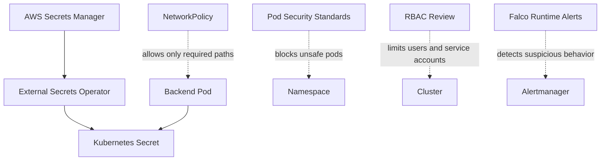

# Phase 12 - Security Hardening
### External Secrets, Network Policies, Pod Security, RBAC, and Runtime Guardrails

---

## Overview

By Phase 11 the app works, deploys through GitOps, exposes metrics, serves HTTPS, and has backups. Phase 12 turns that working platform into a safer platform. This is where we remove the temporary Kubernetes Secret approach, lock down pod-to-pod traffic, enforce sane pod security defaults, review RBAC, and add runtime visibility.

The goal is not "maximum security tooling." The goal is to learn the security controls that real Kubernetes teams apply before trusting a cluster with production workloads.

## Architecture



---

## 12.1 - Replace Manual Secrets with External Secrets Operator

Install External Secrets Operator through ArgoCD:

```yaml
# gitops/apps/external-secrets.yaml
apiVersion: argoproj.io/v1alpha1
kind: Application
metadata:
  name: external-secrets
  namespace: argocd
spec:
  project: default
  source:
    repoURL: https://charts.external-secrets.io
    chart: external-secrets
    targetRevision: "0.9.19"
  destination:
    server: https://kubernetes.default.svc
    namespace: external-secrets
  syncPolicy:
    automated: { prune: true, selfHeal: true }
    syncOptions: [CreateNamespace=true]
```

Create the real secret in AWS Secrets Manager:

```bash
aws secretsmanager create-secret \
  --name diagramforge/anthropic-api-key \
  --secret-string "$ANTHROPIC_API_KEY" \
  --region ap-south-1
```

Create an IRSA role for External Secrets with permission to read only `diagramforge/*` secrets. Then add a `ClusterSecretStore`:

```yaml
apiVersion: external-secrets.io/v1beta1
kind: ClusterSecretStore
metadata:
  name: aws-secrets-manager
spec:
  provider:
    aws:
      service: SecretsManager
      region: ap-south-1
      auth:
        jwt:
          serviceAccountRef:
            name: external-secrets
            namespace: external-secrets
```

Then define the application secret declaratively:

```yaml
# charts/three-tier-app/templates/external-secret.yaml
apiVersion: external-secrets.io/v1beta1
kind: ExternalSecret
metadata:
  name: diagramforge-secrets
spec:
  refreshInterval: 1h
  secretStoreRef:
    name: aws-secrets-manager
    kind: ClusterSecretStore
  target:
    name: diagramforge-secrets
    creationPolicy: Owner
  data:
    - secretKey: anthropic-api-key
      remoteRef:
        key: diagramforge/anthropic-api-key
```

This replaces the manual `kubectl create secret` step from Phase 8.

---

## 12.2 - Network Policies

Default-deny traffic in the `diagramforge` namespace, then allow only what is required.

```yaml
# charts/three-tier-app/templates/networkpolicy-default-deny.yaml
apiVersion: networking.k8s.io/v1
kind: NetworkPolicy
metadata:
  name: default-deny
spec:
  podSelector: {}
  policyTypes: [Ingress, Egress]
```

Allow frontend to backend, backend to MongoDB, backend DNS, and backend internet egress for the LLM API:

```yaml
# charts/three-tier-app/templates/networkpolicy-backend.yaml
apiVersion: networking.k8s.io/v1
kind: NetworkPolicy
metadata:
  name: backend-allow-required
spec:
  podSelector:
    matchLabels:
      app: {{ include "three-tier-app.fullname" . }}-backend
  policyTypes: [Ingress, Egress]
  ingress:
    - from:
        - podSelector:
            matchLabels:
              app: {{ include "three-tier-app.fullname" . }}-frontend
      ports:
        - protocol: TCP
          port: 5000
  egress:
    - to:
        - podSelector:
            matchLabels:
              app: {{ include "three-tier-app.fullname" . }}-mongodb
      ports:
        - protocol: TCP
          port: 27017
    - to:
        - namespaceSelector:
            matchLabels:
              kubernetes.io/metadata.name: kube-system
      ports:
        - protocol: UDP
          port: 53
    - to:
        - ipBlock:
            cidr: 0.0.0.0/0
      ports:
        - protocol: TCP
          port: 443
```

Important: AWS VPC CNI does not enforce NetworkPolicy by itself in every setup. Install a policy-capable CNI layer such as Calico if needed, then verify policies by attempting blocked traffic.

---

## 12.3 - Pod Security Standards

Label the namespace:

```yaml
apiVersion: v1
kind: Namespace
metadata:
  name: diagramforge
  labels:
    pod-security.kubernetes.io/enforce: restricted
    pod-security.kubernetes.io/audit: restricted
    pod-security.kubernetes.io/warn: restricted
```

Update workloads so they pass restricted policy:

```yaml
securityContext:
  runAsNonRoot: true
  seccompProfile:
    type: RuntimeDefault
containers:
  - name: backend
    securityContext:
      allowPrivilegeEscalation: false
      readOnlyRootFilesystem: true
      capabilities:
        drop: ["ALL"]
```

---

## 12.4 - RBAC Review

Create a short RBAC inventory:

```bash
kubectl get clusterrolebinding
kubectl get rolebinding -A
kubectl auth can-i --list -n diagramforge
```

Targets:

- Jenkins can update image tags through Git, not mutate the cluster directly.
- ArgoCD has deployment permissions only for namespaces it manages.
- Application service accounts have no broad Kubernetes API permissions.
- Human admin access is explicit and documented.

---

## 12.5 - Runtime Detection with Falco

Install Falco through ArgoCD or Helm:

```bash
helm repo add falcosecurity https://falcosecurity.github.io/charts
helm repo update
helm install falco falcosecurity/falco -n falco --create-namespace
```

Learn from alerts such as:

- Shell spawned inside a container
- Sensitive file read inside a container
- Unexpected outbound connection
- Privileged container attempt

Wire serious alerts into Alertmanager or a notification channel.

---

## Git Practices

```bash
git checkout -b security/phase-12-hardening

git add gitops/apps/external-secrets.yaml charts/three-tier-app/templates/external-secret.yaml
git commit -m "feat(secrets): manage application secrets through External Secrets Operator"

git add charts/three-tier-app/templates/networkpolicy-*.yaml
git commit -m "feat(security): add default-deny and least-privilege network policies"

git add charts/three-tier-app
git commit -m "feat(security): enforce restricted pod security context"

git push origin security/phase-12-hardening
```

---

## Verification Checklist

- [ ] Application secret is created by External Secrets, not by manual `kubectl create secret`
- [ ] AWS IAM policy allows reading only the required Secrets Manager path
- [ ] Default-deny NetworkPolicy blocks unrelated pod traffic
- [ ] Frontend can still reach backend, backend can still reach MongoDB
- [ ] Pods pass restricted Pod Security Standards
- [ ] RBAC inventory has no unnecessary cluster-admin bindings
- [ ] Falco produces a test alert when a shell is opened inside a pod

---

## What's Next

Phase 13 adds supply chain security and policy-as-code: SBOMs, image signing, admission policies, IaC scanning, and Kubernetes manifest validation.
