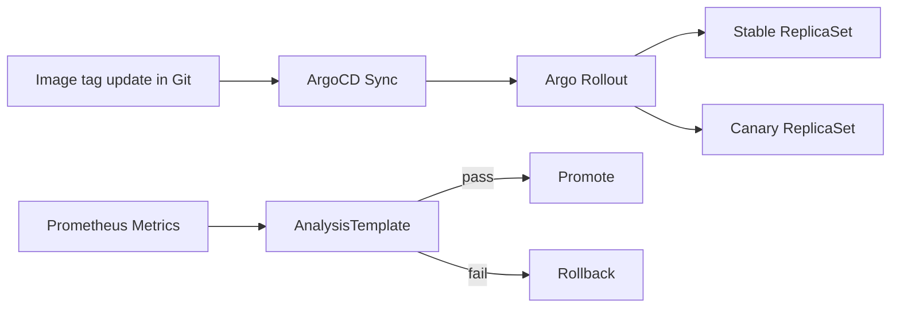

# Phase 14 - Progressive Delivery
### Argo Rollouts, Canary Releases, Metric Analysis, and Automatic Rollback

---

## Overview

So far, ArgoCD deploys the new version once Git changes. That is GitOps, but it is not yet safe progressive delivery. In production, you often want a new version to receive a small amount of traffic first, prove it behaves well, then gradually receive more traffic.

Phase 14 adds Argo Rollouts so a bad release can be stopped before every user sees it.

## Architecture



---

## 14.1 - Install Argo Rollouts

```yaml
# gitops/apps/argo-rollouts.yaml
apiVersion: argoproj.io/v1alpha1
kind: Application
metadata:
  name: argo-rollouts
  namespace: argocd
spec:
  project: default
  source:
    repoURL: https://argoproj.github.io/argo-helm
    chart: argo-rollouts
    targetRevision: "2.35.1"
  destination:
    server: https://kubernetes.default.svc
    namespace: argo-rollouts
  syncPolicy:
    automated: { prune: true, selfHeal: true }
    syncOptions: [CreateNamespace=true]
```

---

## 14.2 - Convert Backend Deployment to a Rollout

Keep the frontend simple at first. Start with the backend because it has useful metrics.

```yaml
apiVersion: argoproj.io/v1alpha1
kind: Rollout
metadata:
  name: {{ include "three-tier-app.fullname" . }}-backend
spec:
  replicas: {{ .Values.backend.replicaCount }}
  selector:
    matchLabels:
      app: {{ include "three-tier-app.fullname" . }}-backend
  strategy:
    canary:
      steps:
        - setWeight: 10
        - pause: { duration: 2m }
        - analysis:
            templates:
              - templateName: backend-success-rate
        - setWeight: 50
        - pause: { duration: 5m }
        - setWeight: 100
```

---

## 14.3 - Metric-Based Analysis

```yaml
apiVersion: argoproj.io/v1alpha1
kind: AnalysisTemplate
metadata:
  name: backend-success-rate
spec:
  metrics:
    - name: success-rate
      interval: 1m
      count: 3
      successCondition: result[0] >= 0.95
      provider:
        prometheus:
          address: http://prometheus-operated.monitoring.svc.cluster.local:9090
          query: |
            1 -
            (
              sum(rate(http_request_duration_seconds_count{status_code=~"5.."}[5m]))
              /
              sum(rate(http_request_duration_seconds_count[5m]))
            )
```

If the success rate drops below 95%, the rollout fails and can roll back.

---

## 14.4 - Jenkins Pipeline Behavior

Jenkins still does not deploy directly. It:

1. Builds and scans the image.
2. Pushes the signed image to ECR.
3. Updates the Helm values image tag in Git.
4. ArgoCD syncs.
5. Argo Rollouts controls traffic and rollback.

This keeps ownership clean: CI builds artifacts, GitOps reconciles desired state, Rollouts manages release safety.

---

## Verification Checklist

- [ ] Argo Rollouts controller is installed through ArgoCD
- [ ] Backend is deployed as a Rollout, not a plain Deployment
- [ ] A normal release gradually progresses from 10% to 100%
- [ ] A deliberately broken release fails analysis and rolls back
- [ ] Prometheus query used by the AnalysisTemplate returns real data
- [ ] Jenkins does not run `kubectl apply` for application deployment

---

## What's Next

Phase 15 adds logs, traces, SLOs, and incident runbooks so you can debug the system like an operator, not just deploy it like a pipeline.
