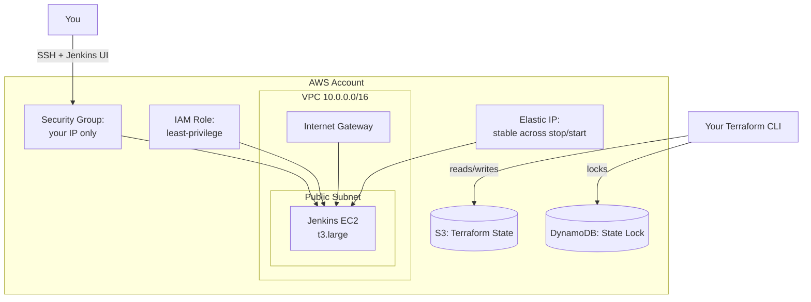

# Phase 2 — Infrastructure as Code: Jenkins Server & Networking
### Terraform, Modular, with Remote State from Day One

---

## Overview

This phase provisions the AWS infrastructure the Jenkins server needs: a VPC, a security group locked down to your IP only, a least-privilege IAM role, and the EC2 instance itself. We do this entirely in Terraform, modularized (not one giant file), with state stored remotely in S3 with DynamoDB locking — the real production pattern, not local state that only you can ever touch.

**What this phase deliberately does NOT do:** install Jenkins plugins, configure SonarQube, or set up Trivy/kubectl/eksctl on the box. That's Phase 3. This phase's user-data script does the bare minimum (Java, Jenkins, Docker) to get the service running — separating "provision the machine" from "configure the software on it" is itself a real infrastructure practice worth internalizing.

## Architecture for this phase



---

## Module structure (finalized)

```
infrastructure/
├── bootstrap/                    # one-time, local state — creates the remote state backend itself
│   ├── main.tf
│   ├── variables.tf
│   └── terraform.tfvars.example
├── modules/
│   ├── vpc/
│   │   ├── main.tf
│   │   ├── variables.tf
│   │   └── outputs.tf
│   ├── security-group/
│   │   ├── main.tf
│   │   ├── variables.tf
│   │   └── outputs.tf
│   └── iam-role/
│       ├── main.tf
│       ├── variables.tf
│       └── outputs.tf
└── jenkins-server/
    ├── main.tf
    ├── variables.tf
    ├── outputs.tf
    ├── backend.tf
    ├── backend.hcl.example
    ├── terraform.tfvars.example
    └── user_data.sh
```

**Why modules at all, this early, for one EC2 instance:** it looks like overkill for a single server, but the VPC and IAM-role modules get reused unchanged in Phase 4 for the EKS cluster — writing them once, correctly, now, means Phase 4 is mostly composition, not new Terraform.

---

## Step 1 — Bootstrap the remote state backend (one-time, local state)

Terraform can't store its own state in a bucket it's simultaneously creating — this one small config uses local state, once, just to create the S3 bucket and DynamoDB table everything else will use.

```hcl
# infrastructure/bootstrap/main.tf
terraform {
  required_providers {
    aws = { source = "hashicorp/aws", version = "~> 5.0" }
  }
}

provider "aws" {
  region = var.aws_region
}

resource "aws_s3_bucket" "terraform_state" {
  bucket = "diagramforge-tfstate-${var.unique_suffix}"

  lifecycle {
    prevent_destroy = true
  }
}

resource "aws_s3_bucket_versioning" "terraform_state" {
  bucket = aws_s3_bucket.terraform_state.id
  versioning_configuration { status = "Enabled" }
}

resource "aws_s3_bucket_server_side_encryption_configuration" "terraform_state" {
  bucket = aws_s3_bucket.terraform_state.id
  rule {
    apply_server_side_encryption_by_default { sse_algorithm = "AES256" }
  }
}

resource "aws_s3_bucket_public_access_block" "terraform_state" {
  bucket                  = aws_s3_bucket.terraform_state.id
  block_public_acls       = true
  block_public_policy     = true
  ignore_public_acls      = true
  restrict_public_buckets = true
}

resource "aws_dynamodb_table" "terraform_locks" {
  name         = "diagramforge-tfstate-locks"
  billing_mode = "PAY_PER_REQUEST"
  hash_key     = "LockID"
  attribute {
    name = "LockID"
    type = "S"
  }
}
```

```hcl
# infrastructure/bootstrap/variables.tf
variable "aws_region" {
  default = "ap-south-1"
}
variable "unique_suffix" {
  description = "Something globally unique — e.g. your AWS account ID"
  type        = string
}
```

Run this once:
```bash
cd infrastructure/bootstrap
terraform init
terraform apply -var="unique_suffix=<your-aws-account-id>"
# note the bucket name and DynamoDB table name from the output — you'll need them next
```

---

## Step 2 — The VPC module

```hcl
# infrastructure/modules/vpc/main.tf
resource "aws_vpc" "this" {
  cidr_block           = var.vpc_cidr
  enable_dns_support   = true
  enable_dns_hostnames = true
  tags = { Name = "${var.project_name}-vpc" }
}

resource "aws_internet_gateway" "this" {
  vpc_id = aws_vpc.this.id
  tags   = { Name = "${var.project_name}-igw" }
}

resource "aws_subnet" "public" {
  count                   = length(var.public_subnet_cidrs)
  vpc_id                  = aws_vpc.this.id
  cidr_block              = var.public_subnet_cidrs[count.index]
  availability_zone       = var.azs[count.index]
  map_public_ip_on_launch = true
  tags = { Name = "${var.project_name}-public-${count.index}" }
}

resource "aws_route_table" "public" {
  vpc_id = aws_vpc.this.id
  route {
    cidr_block = "0.0.0.0/0"
    gateway_id = aws_internet_gateway.this.id
  }
  tags = { Name = "${var.project_name}-public-rt" }
}

resource "aws_route_table_association" "public" {
  count          = length(aws_subnet.public)
  subnet_id      = aws_subnet.public[count.index].id
  route_table_id = aws_route_table.public.id
}
```

```hcl
# infrastructure/modules/vpc/variables.tf
variable "project_name" { type = string }
variable "vpc_cidr" { type = string }
variable "public_subnet_cidrs" { type = list(string) }
variable "azs" { type = list(string) }
```

```hcl
# infrastructure/modules/vpc/outputs.tf
output "vpc_id" { value = aws_vpc.this.id }
output "public_subnet_ids" { value = aws_subnet.public[*].id }
```

---

## Step 3 — The security group module (locked to your IP, not the world)

```hcl
# infrastructure/modules/security-group/main.tf
resource "aws_security_group" "jenkins" {
  name        = "${var.project_name}-jenkins-sg"
  description = "Jenkins server access — restricted to admin IP"
  vpc_id      = var.vpc_id

  ingress {
    description = "SSH — admin only"
    from_port   = 22
    to_port     = 22
    protocol    = "tcp"
    cidr_blocks = [var.admin_ip]
  }

  ingress {
    description = "Jenkins UI — admin only"
    from_port   = 8080
    to_port     = 8080
    protocol    = "tcp"
    cidr_blocks = [var.admin_ip]
  }

  egress {
    from_port   = 0
    to_port     = 0
    protocol    = "-1"
    cidr_blocks = ["0.0.0.0/0"]
  }

  tags = { Name = "${var.project_name}-jenkins-sg" }
}
```

```hcl
# infrastructure/modules/security-group/variables.tf
variable "project_name" { type = string }
variable "vpc_id" { type = string }
variable "admin_ip" {
  type        = string
  description = "Your public IP in CIDR form, e.g. 49.207.x.x/32"
}
```

```hcl
# infrastructure/modules/security-group/outputs.tf
output "jenkins_sg_id" { value = aws_security_group.jenkins.id }
```

**Why not `0.0.0.0/0` for simplicity:** an internet-facing Jenkins UI with no IP restriction is a genuinely common real-world breach vector — this single design choice (restrict to your own IP) is a real security decision worth being able to explain, not a default you left unexamined.

---

## Step 4 — The IAM role module (least privilege, built incrementally)

```hcl
# infrastructure/modules/iam-role/main.tf
resource "aws_iam_role" "jenkins" {
  name = "${var.project_name}-jenkins-role"
  assume_role_policy = jsonencode({
    Version = "2012-10-17"
    Statement = [{
      Action    = "sts:AssumeRole"
      Effect    = "Allow"
      Principal = { Service = "ec2.amazonaws.com" }
    }]
  })
}

resource "aws_iam_role_policy" "jenkins_policy" {
  name = "${var.project_name}-jenkins-policy"
  role = aws_iam_role.jenkins.id

  policy = jsonencode({
    Version = "2012-10-17"
    Statement = [
      {
        Sid      = "TerraformStateAccess"
        Effect   = "Allow"
        Action   = ["s3:GetObject", "s3:PutObject", "s3:ListBucket"]
        Resource = [
          "arn:aws:s3:::${var.state_bucket_name}",
          "arn:aws:s3:::${var.state_bucket_name}/*"
        ]
      }
    ]
  })
}

resource "aws_iam_instance_profile" "jenkins" {
  name = "${var.project_name}-jenkins-profile"
  role = aws_iam_role.jenkins.name
}
```

```hcl
# infrastructure/modules/iam-role/variables.tf
variable "project_name" { type = string }
variable "state_bucket_name" { type = string }
```

```hcl
# infrastructure/modules/iam-role/outputs.tf
output "instance_profile_name" { value = aws_iam_instance_profile.jenkins.name }
output "role_arn" { value = aws_iam_role.jenkins.arn }
```

**Important, explicit note:** this policy grants exactly Terraform state access — nothing else yet, not even ECR. It's tempting to add `ecr:*` push/pull rights here "since we'll need it eventually," but Jenkins doesn't push a single image until Phase 6, and the ECR repository this would reference doesn't exist until Phase 5 — so today, the only way to scope it is `Resource = "*"`, granting push/pull to *every* repository in the account for a capability nothing uses yet. We'll add the ECR statement in Phase 5, once the real repository exists, scoped to its exact ARN. Same reasoning applies to EKS: Phase 4 extends this same policy with the specific permissions needed then, not broad `eks:*` access now "just in case." Building permissions incrementally, only when a phase actually needs them, is what least-privilege looks like in practice, not just in principle.

---

## Step 5 — The Jenkins server itself

```hcl
# infrastructure/jenkins-server/main.tf
terraform {
  required_providers {
    aws = { source = "hashicorp/aws", version = "~> 5.0" }
  }
}

provider "aws" {
  region = var.aws_region
}

module "vpc" {
  source              = "../modules/vpc"
  project_name        = var.project_name
  vpc_cidr            = "10.0.0.0/16"
  public_subnet_cidrs = ["10.0.1.0/24"]
  azs                 = ["${var.aws_region}a"]
}

module "security_group" {
  source       = "../modules/security-group"
  project_name = var.project_name
  vpc_id       = module.vpc.vpc_id
  admin_ip     = var.admin_ip
}

module "iam_role" {
  source            = "../modules/iam-role"
  project_name      = var.project_name
  state_bucket_name = var.state_bucket_name
}

resource "aws_key_pair" "jenkins" {
  key_name   = "${var.project_name}-jenkins-key"
  public_key = file(var.ssh_public_key_path)
}

resource "aws_instance" "jenkins" {
  ami                    = var.jenkins_ami
  instance_type          = var.instance_type
  subnet_id              = module.vpc.public_subnet_ids[0]
  vpc_security_group_ids = [module.security_group.jenkins_sg_id]
  iam_instance_profile   = module.iam_role.instance_profile_name
  key_name               = aws_key_pair.jenkins.key_name

  root_block_device {
    volume_size = 30
    volume_type = "gp3"
    encrypted   = true
  }

  # Forces IMDSv2 (session-token-based) instead of leaving IMDSv1 (plain
  # GET) available. Without this, any SSRF bug anywhere in code running on
  # this box — now or in a future phase — can fetch this instance's live
  # IAM credentials with a single unauthenticated GET request to
  # 169.254.169.254. This is the exact mechanism behind the 2019 Capital
  # One breach. http_tokens = "required" closes it at zero cost.
  metadata_options {
    http_tokens   = "required"
    http_endpoint = "enabled"
  }

  user_data = file("${path.module}/user_data.sh")

  tags = { Name = "${var.project_name}-jenkins-server" }
}

# Without this, stopping and restarting the instance (the cost-saving habit
# recommended below) hands it a brand-new random public IP every time —
# silently breaking the GitHub webhook URL Phase 6 configures, any
# bookmarked Jenkins URL, and any DNS record pointed at it. An EIP keeps
# the address identical across every stop/start cycle. Note this isn't a
# money-saving move under current AWS pricing (public IPv4 addresses,
# EIP or not, cost the same small hourly rate since the Feb 2024 pricing
# change) — it's purely about the address staying stable.
resource "aws_eip" "jenkins" {
  instance = aws_instance.jenkins.id
  domain   = "vpc"
  tags     = { Name = "${var.project_name}-jenkins-eip" }
}
```

```hcl
# infrastructure/jenkins-server/variables.tf
variable "aws_region" { default = "ap-south-1" }
variable "project_name" { default = "diagramforge" }
variable "admin_ip" { type = string }
variable "jenkins_ami" { type = string }
variable "instance_type" { default = "t3.large" } # not t3.medium — Phase 3 adds
# SonarQube (JVM + Elasticsearch) to this same box, on top of Jenkins's own
# JVM plus the memory Docker builds need. 4GB (t3.medium) is genuinely
# tight for that combination; 8GB (t3.large) avoids a resize mid-course.
variable "ssh_public_key_path" { default = "~/.ssh/id_rsa.pub" }
variable "state_bucket_name" { type = string }
```

```hcl
# infrastructure/jenkins-server/outputs.tf
output "jenkins_public_ip" { value = aws_eip.jenkins.public_ip }
output "jenkins_instance_id" { value = aws_instance.jenkins.id }
```

```hcl
# infrastructure/jenkins-server/backend.tf
terraform {
  backend "s3" {
    # values supplied at init time via -backend-config=backend.hcl
  }
}
```

```ini
# infrastructure/jenkins-server/backend.hcl.example
bucket         = "diagramforge-tfstate-<your-account-id>"
key            = "jenkins-server/terraform.tfstate"
region         = "ap-south-1"
dynamodb_table = "diagramforge-tfstate-locks"
encrypt        = true
```

```ini
# infrastructure/jenkins-server/terraform.tfvars.example
admin_ip          = "YOUR_IP/32"
jenkins_ami        = "ami-xxxxxxxxxxxxx"
state_bucket_name  = "diagramforge-tfstate-<your-account-id>"
```

### The bootstrap script — minimum viable Jenkins, nothing more

```bash
#!/bin/bash
# infrastructure/jenkins-server/user_data.sh
set -euo pipefail

apt-get update -y
apt-get upgrade -y

# Java — required by Jenkins
apt-get install -y fontconfig openjdk-17-jre

# Jenkins repo + install
curl -fsSL https://pkg.jenkins.io/debian-stable/jenkins.io-2023.key | \
  tee /usr/share/keyrings/jenkins-keyring.asc > /dev/null
echo "deb [signed-by=/usr/share/keyrings/jenkins-keyring.asc] \
  https://pkg.jenkins.io/debian-stable binary/" | \
  tee /etc/apt/sources.list.d/jenkins.list > /dev/null
apt-get update -y
apt-get install -y jenkins

# Docker — Jenkins will need this to build images
apt-get install -y docker.io
usermod -aG docker jenkins

systemctl enable docker && systemctl start docker
systemctl enable jenkins && systemctl start jenkins
```

---

## Before you run `apply` — two things to get first

**1. Your admin IP:**
```bash
curl ifconfig.me
# append /32 — this becomes your admin_ip value
```

**2. A current Ubuntu 22.04 AMI ID for your region:**
```bash
aws ec2 describe-images \
  --owners 099720109477 \
  --filters "Name=name,Values=ubuntu/images/hvm-ssd/ubuntu-jammy-22.04-amd64-server-*" \
  --query 'sort_by(Images, &CreationDate)[-1].ImageId' \
  --region ap-south-1 --output text
```

## Running it

```bash
cd infrastructure/jenkins-server
cp terraform.tfvars.example terraform.tfvars   # fill in real values
cp backend.hcl.example backend.hcl              # fill in real bucket name

terraform init -backend-config=backend.hcl
terraform plan    # read this output carefully before applying, every time
terraform apply
```

**Cost check-in:** a `t3.large` running continuously costs real money (~$60/month on-demand in `ap-south-1`, roughly double what `t3.medium` would have been) — this is exactly what your Phase 0 AWS Budget alert is for. Consider stopping the instance (`aws ec2 stop-instances`) between working sessions rather than leaving it running 24/7 while you're mid-course, and `terraform destroy` entirely once you've moved past needing to reference this specific phase live.

---

## Git practices for this phase

```bash
git checkout -b infra/phase-2-jenkins-terraform

git add infrastructure/bootstrap
git commit -m "infra(state): bootstrap S3 + DynamoDB remote state backend"

git add infrastructure/modules
git commit -m "infra(modules): add reusable vpc, security-group, and iam-role modules"

git add infrastructure/jenkins-server
git commit -m "infra(jenkins): provision Jenkins EC2 with least-privilege IAM and locked-down SG"

git push origin infra/phase-2-jenkins-terraform
# PR against main, review your own terraform plan output in the PR description, merge
```

**Never commit:** `terraform.tfvars`, `backend.hcl` (if it ever contains anything beyond a bucket name), `*.tfstate`, or your SSH private key. Confirm these are all covered by the `.gitignore` from Phase 0 before your first commit here.

---

## Verification checklist

- [ ] `terraform plan` shows the expected resources with no errors
- [ ] `terraform apply` completes; note the `jenkins_public_ip` output
- [ ] `ssh -i ~/.ssh/id_rsa ubuntu@<jenkins_public_ip>` connects successfully
- [ ] `http://<jenkins_public_ip>:8080` loads the Jenkins unlock screen (confirms Jenkins installed via user-data)
- [ ] The security group allows access only from your IP — verify by checking from a different network/VPN if possible
- [ ] State file exists in S3 (`aws s3 ls s3://<your-bucket>/jenkins-server/`), not on your local disk
- [ ] IMDSv2 is enforced: `aws ec2 describe-instances --instance-ids <id> --query 'Reservations[0].Instances[0].MetadataOptions.HttpTokens'` returns `"required"`
- [ ] Stop the instance (`aws ec2 stop-instances --instance-ids <id>`), start it again, confirm the public IP is unchanged (proves the EIP is doing its job)
- [ ] AWS Budget alert from Phase 0 is confirmed active

---

## What's next

**Phase 3** configures Jenkins itself: unlocking it, installing the plugin set we need, and setting up the full tool chain on the box — Docker (already there), Trivy, SonarQube, kubectl, eksctl, AWS CLI, and Terraform — plus wiring Jenkins credentials properly instead of pasting secrets into fields by hand.

Say **Continue** for Phase 3.
