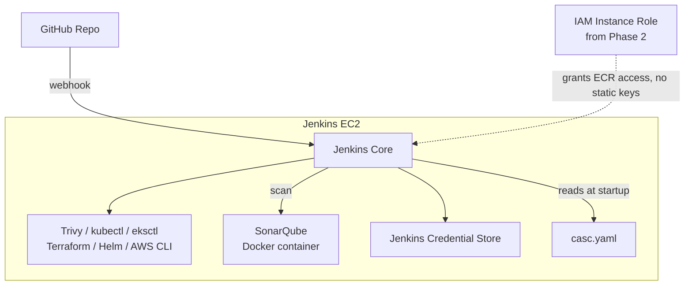

# Phase 3 — Jenkins Configuration & the DevSecOps Tool Chain
### Configuration as Code, Not ClickOps

---

## Overview

Phase 2's Terraform gave us a running EC2 with Jenkins installed. This phase turns it into an actual CI engine: the full tool chain it needs (Trivy, SonarQube, kubectl, eksctl, Terraform, Helm), credentials handled properly, GitHub wired up, and — importantly — Jenkins' own system configuration captured as code (JCasC) instead of clicked through a UI and never written down anywhere.

**Why JCasC matters here specifically:** everything so far has been reproducible from Git — infra from Terraform, the app from Dockerfiles. If Jenkins' setup lives only in clicks you made once and don't remember, that reproducibility breaks at exactly the layer that's supposed to enforce quality gates on everything else. We're not going to let that happen.

## Architecture for this phase



---

## 3.1 — First login and immediate hardening

```bash
ssh -i ~/.ssh/id_rsa ubuntu@<jenkins_public_ip>
sudo cat /var/lib/jenkins/secrets/initialAdminPassword
```

Use that to unlock Jenkins at `http://<jenkins_public_ip>:8080`, then **immediately**:
- Create a real admin account — never leave the default admin/random-password as your only account
- Install "suggested plugins" as a baseline, then add the specific ones below
- Go to **Manage Jenkins → Security** and confirm: CSRF protection is enabled, "Script Approval" is restricted (don't approve arbitrary Groovy scripts casually later), and authorization is set to **Matrix-based** or **Role-based**, not the wide-open "logged-in users can do anything."

## 3.2 — Plugins to install, and why each one

| Plugin | Why |
|---|---|
| Git | Checkout from GitHub |
| Pipeline (Workflow Aggregator) | Declarative Jenkinsfiles |
| SonarQube Scanner | Runs and reports SonarQube analysis from the pipeline |
| Credentials Binding | Injects credentials into pipeline steps safely, never as plaintext in logs |
| Configuration as Code (JCasC) | The whole point of this phase — Jenkins config lives in a YAML file, not clicks |
| Blue Ocean *(optional)* | Nicer pipeline visualization — not required, genuinely pleasant to have |

**Deliberately not using** the Amazon ECR plugin or a Kubernetes CLI plugin — we'll call `aws`, `kubectl`, `eksctl`, and `terraform` directly as shell steps inside the pipeline in later phases. It's more verbose than a plugin abstraction, but it means every command that runs is one you can read, run yourself on your laptop, and fully understand — which is the actual goal here.

## 3.3 — Installing the tool chain

```bash
#!/bin/bash
# ci/jenkins/provision-toolchain.sh
# Run once via SSH now. For a future from-scratch rebuild, fold this
# directly into Phase 2's Terraform user_data.sh instead of running it
# separately — that's the fully reproducible version of this step.
set -euo pipefail

# AWS CLI v2
curl "https://awscli.amazonaws.com/awscli-exe-linux-x86_64.zip" -o "awscliv2.zip"
unzip -q awscliv2.zip && sudo ./aws/install && rm -rf aws awscliv2.zip

# kubectl
curl -LO "https://dl.k8s.io/release/$(curl -L -s https://dl.k8s.io/release/stable.txt)/bin/linux/amd64/kubectl"
sudo install -o root -g root -m 0755 kubectl /usr/local/bin/kubectl && rm kubectl

# eksctl
PLATFORM=Linux_amd64
curl -sLO "https://github.com/eksctl-io/eksctl/releases/latest/download/eksctl_${PLATFORM}.tar.gz"
tar -xzf "eksctl_${PLATFORM}.tar.gz" -C /tmp && rm "eksctl_${PLATFORM}.tar.gz"
sudo mv /tmp/eksctl /usr/local/bin

# Terraform
wget -O- https://apt.releases.hashicorp.com/gpg | sudo gpg --dearmor -o /usr/share/keyrings/hashicorp-archive-keyring.gpg
echo "deb [signed-by=/usr/share/keyrings/hashicorp-archive-keyring.gpg] https://apt.releases.hashicorp.com $(lsb_release -cs) main" | \
  sudo tee /etc/apt/sources.list.d/hashicorp.list
sudo apt-get update && sudo apt-get install -y terraform

# Helm
curl https://raw.githubusercontent.com/helm/helm/main/scripts/get-helm-3 | bash

# Trivy
wget -qO - https://aquasecurity.github.io/trivy-repo/deb/public.key | sudo apt-key add -
echo "deb https://aquasecurity.github.io/trivy-repo/deb $(lsb_release -sc) main" | \
  sudo tee -a /etc/apt/sources.list.d/trivy.list
sudo apt-get update && sudo apt-get install -y trivy

echo "--- Installed versions ---"
aws --version && kubectl version --client && eksctl version && terraform -version && helm version && trivy --version
```

Run it: `chmod +x provision-toolchain.sh && sudo ./provision-toolchain.sh`

## 3.4 — SonarQube, as a container on the same box

```bash
# One real gotcha that trips almost everyone up: SonarQube needs this
# kernel setting bumped, or it silently fails to start.
sudo sysctl -w vm.max_map_count=262144
echo "vm.max_map_count=262144" | sudo tee -a /etc/sysctl.conf

docker run -d --name sonarqube --restart unless-stopped \
  -p 9000:9000 \
  -v sonarqube_data:/opt/sonarqube/data \
  -v sonarqube_extensions:/opt/sonarqube/extensions \
  -v sonarqube_logs:/opt/sonarqube/logs \
  sonarqube:lts-community
```

You'll need to open port 9000 to your admin IP — update Phase 2's Terraform:

```hcl
# add to infrastructure/modules/security-group/main.tf, inside aws_security_group.jenkins
ingress {
  description = "SonarQube UI — admin only"
  from_port   = 9000
  to_port     = 9000
  protocol    = "tcp"
  cidr_blocks = [var.admin_ip]
}
```
Run `terraform plan` / `terraform apply` from `infrastructure/jenkins-server` again — this is exactly the incremental, versioned infra change this whole approach is built for.

Once reachable at `http://<jenkins_public_ip>:9000`: log in with `admin`/`admin`, you'll be forced to set a real password immediately, then go to **My Account → Security → Generate Token** — save this token, you'll need it in the next step and again in Phase 6.

## 3.5 — Jenkins Configuration as Code

```yaml
# jenkins-config/casc.yaml — commit this. It contains references to secrets, not secrets themselves.
jenkins:
  systemMessage: "DiagramForge CI/CD — managed via Configuration as Code"
  numExecutors: 2
  mode: NORMAL
  authorizationStrategy:
    globalMatrix:
      permissions:
        - "Overall/Administer:${JENKINS_ADMIN_ID}"

unclassified:
  sonarGlobalConfiguration:
    installations:
      - name: "sonarqube-server"
        serverUrl: "http://localhost:9000"
        credentialsId: "sonarqube-token"

credentials:
  system:
    domainCredentials:
      - credentials:
          - usernamePassword:
              scope: GLOBAL
              id: "github-credentials"
              username: "${GITHUB_USERNAME}"
              password: "${GITHUB_PAT}"
          - string:
              scope: GLOBAL
              id: "anthropic-api-key"
              secret: "${ANTHROPIC_API_KEY}"
          - string:
              scope: GLOBAL
              id: "sonarqube-token"
              secret: "${SONARQUBE_TOKEN}"
```

The `${VARIABLE}` syntax means JCasC reads these from environment variables at Jenkins startup — the file itself is safe to commit because it never contains an actual secret value, only the *name* of where to find one.

Set the real values on the Jenkins box, then restart Jenkins to apply:
```bash
sudo tee -a /etc/default/jenkins <<'EOF'
JENKINS_ADMIN_ID=your-admin-username
GITHUB_USERNAME=your-github-username
GITHUB_PAT=ghp_xxxxxxxxxxxx
ANTHROPIC_API_KEY=sk-ant-xxxxxxxxxxxx
SONARQUBE_TOKEN=squ_xxxxxxxxxxxx
CASC_JENKINS_CONFIG=/var/lib/jenkins/casc.yaml
EOF

sudo cp jenkins-config/casc.yaml /var/lib/jenkins/casc.yaml
sudo systemctl restart jenkins
```

## 3.6 — GitHub webhook, and the real security trade-off it forces

Here's an honest tension worth naming explicitly rather than glossing over: Phase 2 locked the Jenkins security group down to *your* IP only — but GitHub's webhook servers need to reach Jenkins from *their* IPs to notify it of a push. You have three real options, not one obviously-correct answer:

1. **Open port 8080 to `0.0.0.0/0`** — simplest, but Jenkins' login page becomes internet-facing (mitigated only by your Jenkins auth being genuinely strong).
2. **Restrict port 8080 to GitHub's published webhook IP ranges** — more precise, requires occasionally refreshing the list. This is what we'll do.
3. **Skip webhooks, use SCM polling instead** — Jenkins checks for new commits every N minutes rather than being notified instantly. Fully keeps the security group locked down; the trade-off is a delay before a push triggers a build. A completely reasonable simpler fallback if you'd rather not manage IP ranges.

Going with option 2:
```bash
curl -s https://api.github.com/meta | jq -r '.hooks[]'
# gives you GitHub's current webhook source IP ranges
```

```hcl
# infrastructure/modules/security-group/main.tf — add
resource "aws_security_group_rule" "github_webhook" {
  count             = length(var.github_webhook_cidrs)
  type              = "ingress"
  from_port         = 8080
  to_port           = 8080
  protocol          = "tcp"
  cidr_blocks       = [var.github_webhook_cidrs[count.index]]
  security_group_id = aws_security_group.jenkins.id
  description       = "GitHub webhook range ${count.index}"
}
```
Add the fetched ranges as `var.github_webhook_cidrs` in your `.tfvars`, then `terraform apply`.

In your GitHub repo: **Settings → Webhooks → Add webhook** → Payload URL `http://<jenkins_public_ip>:8080/github-webhook/`, content type `application/json`, event: just the push event for now.

## 3.7 — Jenkins security hardening checklist

- [ ] No default/weak admin credentials remain
- [ ] Matrix-based or Role-based authorization configured, not "any logged-in user can do anything"
- [ ] CSRF protection enabled (default in modern Jenkins — confirm, don't assume)
- [ ] Script Approval restricted — don't rubber-stamp unapproved Groovy later when you're in a hurry
- [ ] No static AWS keys anywhere on this box — confirm Jenkins is using the Phase 2 IAM instance role (`aws sts get-caller-identity` on the box should show the instance role, not a user)
- [ ] *(Optional, worth doing if you want this genuinely production-grade)*: put Nginx + Let's Encrypt in front of Jenkins on this same box for real HTTPS instead of plain HTTP on :8080

---

## Git practices for this phase

```bash
git checkout -b infra/phase-3-jenkins-config

git add jenkins-config/casc.yaml ci/jenkins/provision-toolchain.sh
git commit -m "infra(jenkins): add JCasC configuration for reproducible Jenkins setup"
git commit -m "ci(jenkins): add DevSecOps toolchain provisioning script"

git add infrastructure/modules/security-group
git commit -m "infra(security): open SonarQube port and restrict webhook ingress to GitHub IP ranges"

git push origin infra/phase-3-jenkins-config
```

**Never commit:** `/etc/default/jenkins` contents, any real token/PAT value, the SonarQube admin password. `casc.yaml` is safe precisely because it only ever references variable names.

---

## Verification checklist

- [ ] `aws --version`, `kubectl version --client`, `eksctl version`, `terraform -version`, `helm version`, `trivy --version` all succeed on the box
- [ ] `aws sts get-caller-identity` on the box shows the IAM instance role, confirming no static keys are in use
- [ ] SonarQube reachable at `:9000`, default password changed, token generated
- [ ] Jenkins → Manage Jenkins → System shows the SonarQube server configured via `casc.yaml`, not manually re-entered
- [ ] Credentials exist in the Jenkins Credential Store by ID (`github-credentials`, `anthropic-api-key`, `sonarqube-token`) — confirm by ID, you should never need to view their raw values again
- [ ] A test push to GitHub shows a successful (200) webhook delivery in the repo's webhook settings, even though there's no pipeline job to consume it yet
- [ ] `casc.yaml` is committed to git and contains zero real secret values

---

## What's next

**Phase 4** provisions the actual EKS cluster via Terraform — reusing the VPC and IAM-role modules from Phase 2, extending the Jenkins IAM policy with the specific EKS permissions it now needs, and installing the AWS Load Balancer Controller.

Say **Continue** for Phase 4.
