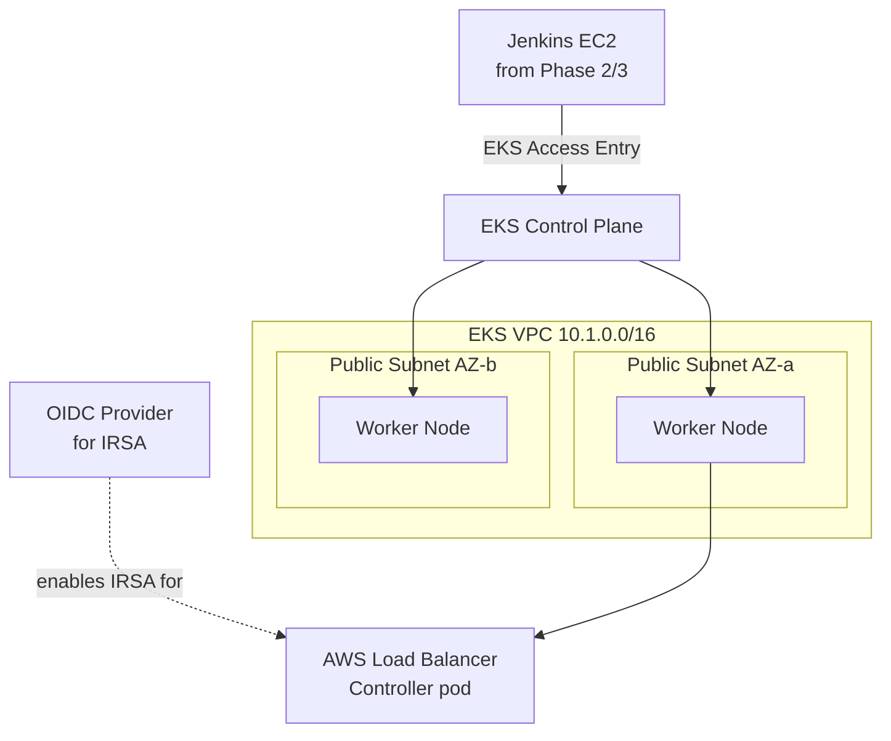

# Phase 4 — EKS Cluster via Terraform
### Cluster, Node Group, IRSA, Jenkins Access, and the AWS Load Balancer Controller

---

## Overview

This is the first phase provisioning the actual Kubernetes cluster your application will run on. We reuse the VPC module from Phase 2 (this is exactly why it was built as a module), add an EKS control plane and a managed node group, set up IRSA (IAM Roles for Service Accounts — the correct, modern way for pods to get AWS permissions, no static keys ever), extend Jenkins' access using EKS Access Entries (the current, non-deprecated way to grant cluster access — not the old `aws-auth` ConfigMap hack), and install the AWS Load Balancer Controller so we're ready for real ingress traffic in later phases.

**Read this cost note before running anything in this phase.** Unlike the Jenkins EC2 instance, which you can stop between sessions, **the EKS control plane costs money every hour it exists, whether or not you're using it** — roughly $0.10/hour, about $73/month, completely independent of node usage. Combined with node instances and this VPC's networking, this is the single most expensive phase in the whole project. Plan to `terraform destroy` this specific stack between work sessions unless you're actively building against it that day — Phase 13 covers this discipline properly, but it starts mattering right now.

## Architecture for this phase



**On the subnet choice:** production EKS setups typically put worker nodes in *private* subnets behind a NAT Gateway, with only load balancers in public subnets. We're using public subnets for the nodes here deliberately — it avoids a NAT Gateway's ~$32/month plus data-processing charges, which matters when you're running this on free-tier/student credits. This is a real, explained trade-off, not an oversight: know that a private-subnet + NAT Gateway design is the production-correct answer, and be able to say why we didn't do it here.

---

## Terraform: the EKS cluster

```
infrastructure/eks-cluster/
├── main.tf
├── variables.tf
├── outputs.tf
├── backend.tf
├── backend.hcl.example
└── terraform.tfvars.example
```

```hcl
# infrastructure/eks-cluster/main.tf
terraform {
  required_providers {
    aws = { source = "hashicorp/aws", version = "~> 5.0" }
    tls = { source = "hashicorp/tls", version = "~> 4.0" }
  }
}

provider "aws" {
  region = var.aws_region
}

module "vpc" {
  source              = "../modules/vpc"
  project_name        = "${var.project_name}-eks"
  vpc_cidr            = "10.1.0.0/16"
  public_subnet_cidrs = ["10.1.1.0/24", "10.1.2.0/24"]
  azs                 = ["${var.aws_region}a", "${var.aws_region}b"]
}

# --- EKS cluster IAM role ---
resource "aws_iam_role" "eks_cluster" {
  name = "${var.project_name}-eks-cluster-role"
  assume_role_policy = jsonencode({
    Version = "2012-10-17"
    Statement = [{
      Action    = "sts:AssumeRole"
      Effect    = "Allow"
      Principal = { Service = "eks.amazonaws.com" }
    }]
  })
}

resource "aws_iam_role_policy_attachment" "eks_cluster_policy" {
  role       = aws_iam_role.eks_cluster.name
  policy_arn = "arn:aws:iam::aws:policy/AmazonEKSClusterPolicy"
}

# --- The cluster itself ---
resource "aws_eks_cluster" "this" {
  name     = "${var.project_name}-cluster"
  role_arn = aws_iam_role.eks_cluster.arn
  version  = var.kubernetes_version

  vpc_config {
    subnet_ids              = module.vpc.public_subnet_ids
    endpoint_public_access   = true
    endpoint_private_access  = false
  }

  depends_on = [aws_iam_role_policy_attachment.eks_cluster_policy]
}

# --- OIDC provider — the foundation of IRSA ---
data "tls_certificate" "eks" {
  url = aws_eks_cluster.this.identity[0].oidc[0].issuer
}

resource "aws_iam_openid_connect_provider" "eks" {
  client_id_list  = ["sts.amazonaws.com"]
  thumbprint_list = [data.tls_certificate.eks.certificates[0].sha1_fingerprint]
  url             = aws_eks_cluster.this.identity[0].oidc[0].issuer
}

# --- Node group IAM role ---
resource "aws_iam_role" "node_group" {
  name = "${var.project_name}-eks-node-role"
  assume_role_policy = jsonencode({
    Version = "2012-10-17"
    Statement = [{
      Action    = "sts:AssumeRole"
      Effect    = "Allow"
      Principal = { Service = "ec2.amazonaws.com" }
    }]
  })
}

resource "aws_iam_role_policy_attachment" "node_worker" {
  role       = aws_iam_role.node_group.name
  policy_arn = "arn:aws:iam::aws:policy/AmazonEKSWorkerNodePolicy"
}
resource "aws_iam_role_policy_attachment" "node_cni" {
  role       = aws_iam_role.node_group.name
  policy_arn = "arn:aws:iam::aws:policy/AmazonEKS_CNI_Policy"
}
resource "aws_iam_role_policy_attachment" "node_ecr" {
  role       = aws_iam_role.node_group.name
  policy_arn = "arn:aws:iam::aws:policy/AmazonEC2ContainerRegistryReadOnly"
}

# --- Managed node group, spot instances for cost ---
resource "aws_eks_node_group" "this" {
  cluster_name    = aws_eks_cluster.this.name
  node_group_name = "${var.project_name}-node-group"
  node_role_arn   = aws_iam_role.node_group.arn
  subnet_ids      = module.vpc.public_subnet_ids

  capacity_type  = "SPOT"
  instance_types = [var.node_instance_type]

  scaling_config {
    desired_size = var.desired_nodes
    min_size     = var.min_nodes
    max_size     = var.max_nodes
  }

  depends_on = [
    aws_iam_role_policy_attachment.node_worker,
    aws_iam_role_policy_attachment.node_cni,
    aws_iam_role_policy_attachment.node_ecr,
  ]
}

# --- Grant Jenkins access via EKS Access Entries (modern, not the aws-auth hack) ---
resource "aws_eks_access_entry" "jenkins" {
  cluster_name  = aws_eks_cluster.this.name
  principal_arn = var.jenkins_role_arn
}

resource "aws_eks_access_policy_association" "jenkins_admin" {
  cluster_name  = aws_eks_cluster.this.name
  principal_arn = var.jenkins_role_arn
  policy_arn    = "arn:aws:eks::aws:cluster-access-policy/AmazonEKSClusterAdminPolicy"

  access_scope {
    type = "cluster"
  }
}
```

```hcl
# infrastructure/eks-cluster/variables.tf
variable "aws_region"          { default = "ap-south-1" }
variable "project_name"        { default = "diagramforge" }
variable "kubernetes_version"  { default = "1.29" }
variable "node_instance_type"  { default = "t3.medium" }
variable "desired_nodes"       { default = 2 }
variable "min_nodes"           { default = 1 }
variable "max_nodes"           { default = 3 }
variable "jenkins_role_arn"    { type = string }
```

```hcl
# infrastructure/eks-cluster/outputs.tf
output "cluster_name"             { value = aws_eks_cluster.this.name }
output "cluster_endpoint"         { value = aws_eks_cluster.this.endpoint }
output "cluster_oidc_issuer_url"  { value = aws_eks_cluster.this.identity[0].oidc[0].issuer }
output "oidc_provider_arn"        { value = aws_iam_openid_connect_provider.eks.arn }
```

## Extending Jenkins' IAM policy — closing the loop from Phase 3

Recall Phase 3 explicitly deferred granting Jenkins any EKS permissions. Now that the cluster exists, add exactly what's needed:

```hcl
# add to infrastructure/jenkins-server/main.tf
resource "aws_iam_role_policy" "jenkins_eks_access" {
  name = "${var.project_name}-jenkins-eks-policy"
  role = module.iam_role.role_name

  policy = jsonencode({
    Version = "2012-10-17"
    Statement = [{
      Sid      = "EKSAccess"
      Effect   = "Allow"
      Action   = ["eks:DescribeCluster", "eks:ListClusters", "eks:AccessKubernetesApi"]
      Resource = "*"
    }]
  })
}
```
*(Add `output "role_name" { value = aws_iam_role.jenkins.name }` to the `iam-role` module if you haven't already exposed it.)*

## Running it

```bash
cd infrastructure/eks-cluster
cp terraform.tfvars.example terraform.tfvars   # fill in jenkins_role_arn from Phase 2's output
cp backend.hcl.example backend.hcl              # key = "eks-cluster/terraform.tfstate"

terraform init -backend-config=backend.hcl
terraform plan
terraform apply    # this genuinely takes 10-15 minutes — EKS control planes are slow to provision
```

## Connect kubectl to the new cluster

```bash
aws eks update-kubeconfig --region ap-south-1 --name diagramforge-cluster
kubectl get nodes    # should show your node group, status Ready
```

## Installing the AWS Load Balancer Controller

```bash
# IAM policy for the controller — AWS publishes this directly
curl -O https://raw.githubusercontent.com/kubernetes-sigs/aws-load-balancer-controller/v2.7.2/docs/install/iam_policy.json
aws iam create-policy --policy-name AWSLoadBalancerControllerIAMPolicy --policy-document file://iam_policy.json

# IRSA-backed service account — eksctl remains the easiest tool for this specific step,
# even in an otherwise Terraform-first setup; that's a genuine, common industry pattern
eksctl create iamserviceaccount \
  --cluster=diagramforge-cluster \
  --namespace=kube-system \
  --name=aws-load-balancer-controller \
  --attach-policy-arn=arn:aws:iam::<your-account-id>:policy/AWSLoadBalancerControllerIAMPolicy \
  --override-existing-serviceaccounts \
  --approve

helm repo add eks https://aws.github.io/eks-charts
helm repo update
helm install aws-load-balancer-controller eks/aws-load-balancer-controller \
  -n kube-system \
  --set clusterName=diagramforge-cluster \
  --set serviceAccount.create=false \
  --set serviceAccount.name=aws-load-balancer-controller
```

Run all of this from the Jenkins box (it has every tool needed from Phase 3) or your own machine — either authenticates identically via AWS IAM.

---

## Git practices for this phase

```bash
git checkout -b infra/phase-4-eks-cluster

git add infrastructure/eks-cluster
git commit -m "infra(eks): provision EKS cluster, node group, and OIDC provider for IRSA"

git add infrastructure/jenkins-server
git commit -m "infra(jenkins): extend IAM policy with EKS access, grant cluster access via EKS Access Entries"

git commit -m "infra(eks): install AWS Load Balancer Controller via Helm with IRSA"

git push origin infra/phase-4-eks-cluster
```

---

## Verification checklist

- [ ] `terraform apply` completes without error (expect ~10-15 minutes)
- [ ] `kubectl get nodes` shows your node group in `Ready` state
- [ ] `kubectl get pods -n kube-system | grep aws-load-balancer-controller` shows the controller pod `Running`
- [ ] From the Jenkins box: `aws eks describe-cluster --name diagramforge-cluster` succeeds using only the instance role, no static keys
- [ ] `kubectl auth can-i '*' '*' --as=<jenkins-role-arn>` (via an EKS access check) confirms Jenkins' granted access actually works, not just that Terraform applied without error
- [ ] You have a clear mental note of today's date/time so you know when to `terraform destroy` this stack if you're stepping away for more than a day

---

## What's next

**Phase 5** sets up Amazon ECR — private repositories for the frontend and backend images, a real tagging strategy (not just `latest`), and image scanning on push.

Say **Continue** for Phase 5.
