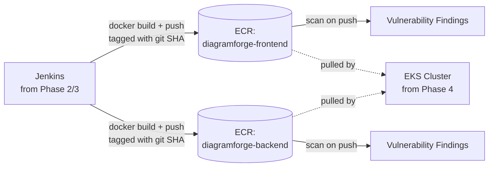

# Phase 5 — Amazon ECR & Image Tagging Strategy
### Private Registries, Scan-on-Push, and Never Shipping "latest"

---

## Overview

Two private ECR repositories — frontend and backend — with scanning on every push, a lifecycle policy so old images don't quietly accumulate storage cost forever, and a tagging convention that makes "what code is actually running in production right now" always answerable in one command, not a guess.

## Architecture for this phase



---

## Terraform: the two repositories

```
infrastructure/ecr/
├── main.tf
├── variables.tf
├── outputs.tf
├── backend.tf
└── backend.hcl.example
```

```hcl
# infrastructure/ecr/main.tf
terraform {
  required_providers {
    aws = { source = "hashicorp/aws", version = "~> 5.0" }
  }
}

provider "aws" {
  region = var.aws_region
}

resource "aws_ecr_repository" "frontend" {
  name                 = "${var.project_name}-frontend"
  image_tag_mutability = "IMMUTABLE"   # a pushed tag can never be silently overwritten

  image_scanning_configuration { scan_on_push = true }
  encryption_configuration     { encryption_type = "AES256" }
}

resource "aws_ecr_repository" "backend" {
  name                 = "${var.project_name}-backend"
  image_tag_mutability = "IMMUTABLE"

  image_scanning_configuration { scan_on_push = true }
  encryption_configuration     { encryption_type = "AES256" }
}

# Only Jenkins' role may push — defense in depth beyond IAM alone
resource "aws_ecr_repository_policy" "frontend" {
  repository = aws_ecr_repository.frontend.name
  policy = jsonencode({
    Version = "2012-10-17"
    Statement = [{
      Sid       = "AllowJenkinsPush"
      Effect    = "Allow"
      Principal = { AWS = var.jenkins_role_arn }
      Action    = ["ecr:PutImage", "ecr:InitiateLayerUpload", "ecr:UploadLayerPart", "ecr:CompleteLayerUpload", "ecr:BatchCheckLayerAvailability"]
    }]
  })
}

resource "aws_ecr_repository_policy" "backend" {
  repository = aws_ecr_repository.backend.name
  policy = jsonencode({
    Version = "2012-10-17"
    Statement = [{
      Sid       = "AllowJenkinsPush"
      Effect    = "Allow"
      Principal = { AWS = var.jenkins_role_arn }
      Action    = ["ecr:PutImage", "ecr:InitiateLayerUpload", "ecr:UploadLayerPart", "ecr:CompleteLayerUpload", "ecr:BatchCheckLayerAvailability"]
    }]
  })
}

# Lifecycle policy — bound storage cost, don't accumulate images forever
resource "aws_ecr_lifecycle_policy" "frontend" {
  repository = aws_ecr_repository.frontend.name
  policy     = local.lifecycle_policy_json
}
resource "aws_ecr_lifecycle_policy" "backend" {
  repository = aws_ecr_repository.backend.name
  policy     = local.lifecycle_policy_json
}

locals {
  lifecycle_policy_json = jsonencode({
    rules = [
      {
        rulePriority = 1
        description  = "Keep last 10 tagged images"
        selection = {
          tagStatus     = "tagged"
          tagPrefixList = ["v", "sha-"]
          countType     = "imageCountMoreThan"
          countNumber   = 10
        }
        action = { type = "expire" }
      },
      {
        rulePriority = 2
        description  = "Expire untagged images after 3 days"
        selection = {
          tagStatus   = "untagged"
          countType   = "sinceImagePushed"
          countUnit   = "days"
          countNumber = 3
        }
        action = { type = "expire" }
      }
    ]
  })
}
```

```hcl
# infrastructure/ecr/variables.tf
variable "aws_region"       { default = "ap-south-1" }
variable "project_name"     { default = "diagramforge" }
variable "jenkins_role_arn" { type = string }
```

```hcl
# infrastructure/ecr/outputs.tf
output "frontend_repo_url" { value = aws_ecr_repository.frontend.repository_url }
output "backend_repo_url"  { value = aws_ecr_repository.backend.repository_url }
```

```bash
cd infrastructure/ecr
cp backend.hcl.example backend.hcl   # key = "ecr/terraform.tfstate"
terraform init -backend-config=backend.hcl
terraform apply -var="jenkins_role_arn=<from Phase 2 output>"
```

---

## The tagging strategy — and why "latest" alone is a real anti-pattern

**Never rely on `latest` as your only tag.** It's mutable by definition, which means it answers "what's the newest image" but never "what's actually deployed right now" — if something breaks in production, you need to know the exact commit that built the running image, instantly, not by cross-referencing push timestamps.

**Our convention:**

| Tag pattern | When it's used | Example |
|---|---|---|
| `sha-<git-short-sha>` | Every single build, always | `sha-a3f9c21` |
| `v<semver>` | Only on an intentional release | `v0.1.0` |
| `latest` | Never used for deployment — informational only | — |

Every image gets the `sha-` tag; a release additionally gets a `v` tag pointing at the same image digest. This means: given any running pod, `kubectl describe pod` shows you the exact image tag, which is the exact git commit, full stop — no ambiguity, ever.

**Jenkins will build the tag like this** (this becomes real pipeline code in Phase 6):
```bash
GIT_SHA=$(git rev-parse --short HEAD)
docker build -t $ECR_REPO_URL:sha-$GIT_SHA .
docker push $ECR_REPO_URL:sha-$GIT_SHA
```

## Authentication — already solved by Phase 2's IAM role

```bash
aws ecr get-login-password --region ap-south-1 | \
  docker login --username AWS --password-stdin <account-id>.dkr.ecr.ap-south-1.amazonaws.com
```
This works from the Jenkins box with zero stored credentials — it's using the instance role from Phase 2, exactly the payoff of setting that up correctly back then instead of pasting static keys somewhere.

---

## Git practices for this phase

```bash
git checkout -b infra/phase-5-ecr

git add infrastructure/ecr
git commit -m "infra(ecr): add frontend and backend repositories with scan-on-push and lifecycle policies"

git push origin infra/phase-5-ecr
```

---

## Verification checklist

- [ ] `terraform apply` creates both repositories
- [ ] `aws ecr get-login-password | docker login ...` succeeds from the Jenkins box using only the instance role
- [ ] A manual test push (`docker tag ... && docker push ...`) succeeds and appears under scan results in the ECR console within a minute or two
- [ ] Attempting to push using a *different* IAM identity (not Jenkins' role) is denied — confirms the repository policy is actually enforcing, not just present
- [ ] Lifecycle policy is visible in the ECR console for both repos

---

## What's next

**Phase 6** is where it all starts connecting: real Jenkins pipelines with security gates — SonarQube quality gate, OWASP Dependency-Check, Trivy image scanning — that build, scan, and push these exact tagged images.

Say **Continue** for Phase 6.
