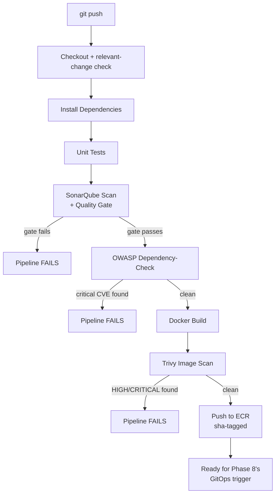

# Phase 6 — CI Pipelines with DevSecOps Gates
### SonarQube, OWASP Dependency-Check, Trivy — Wired to Actually Block Bad Builds

---

## Overview

This is where every earlier phase connects into one working pipeline: checkout → install → test → SonarQube quality gate → OWASP dependency scan → Docker build → Trivy image scan → push to ECR. Critically, **every gate can actually fail the build** — this isn't security theater bolted on after the fact, a failing quality gate or a HIGH/CRITICAL vulnerability genuinely stops the pipeline before a bad image reaches ECR.

We'll also introduce a **Jenkins Shared Library** — the frontend and backend pipelines share almost every step (scan, build, push), and duplicating that logic across two Jenkinsfiles is exactly the kind of copy-paste debt real teams regret. Write it once, call it from both.

## Architecture for this phase



---

## Additional tools needed on the Jenkins box

```bash
# OWASP Dependency-Check
DC_VERSION=9.0.9
wget https://github.com/jeremylong/DependencyCheck/releases/download/v${DC_VERSION}/dependency-check-${DC_VERSION}-release.zip
sudo unzip dependency-check-${DC_VERSION}-release.zip -d /opt
sudo ln -s /opt/dependency-check/bin/dependency-check.sh /usr/local/bin/dependency-check.sh

# Sonar Scanner CLI
SONAR_VERSION=5.0.1.3006
wget https://binaries.sonarsource.com/Distribution/sonar-scanner-cli/sonar-scanner-cli-${SONAR_VERSION}-linux.zip
sudo unzip sonar-scanner-cli-${SONAR_VERSION}-linux.zip -d /opt
sudo ln -s /opt/sonar-scanner-${SONAR_VERSION}-linux/bin/sonar-scanner /usr/local/bin/sonar-scanner
```

**Get a free NVD API key** (nvd.nist.gov/developers/request-an-api-key) and add it to Jenkins' environment — without it, OWASP Dependency-Check's vulnerability database sync is painfully slow and prone to rate-limiting.

**SonarQube webhook** — so the quality gate check gets a real callback instead of polling blindly: in SonarQube, **Administration → Configuration → Webhooks → Create**, name `jenkins`, URL `http://<jenkins_ip>:8080/sonarqube-webhook/`.

---

## The Jenkins Shared Library

```
ci/jenkins/shared-library/
└── vars/
    ├── sonarQubeScan.groovy
    ├── owaspDependencyCheck.groovy
    ├── trivyScan.groovy
    └── pushToECR.groovy
```

```groovy
// vars/sonarQubeScan.groovy
def call(Map config) {
    withSonarQubeEnv('sonarqube-server') {
        sh """
            sonar-scanner \
              -Dsonar.projectKey=${config.projectKey} \
              -Dsonar.sources=${config.sourcePath} \
              -Dsonar.host.url=\$SONAR_HOST_URL \
              -Dsonar.login=\$SONAR_AUTH_TOKEN
        """
    }
    timeout(time: 5, unit: 'MINUTES') {
        def qg = waitForQualityGate()
        if (qg.status != 'OK') {
            error "SonarQube Quality Gate failed: ${qg.status}"
        }
    }
}
```

```groovy
// vars/owaspDependencyCheck.groovy
def call(Map config) {
    sh """
        dependency-check.sh --project "${config.projectName}" --scan ${config.scanPath} \
          --format HTML --format JSON --out dependency-check-report \
          --nvdApiKey \$NVD_API_KEY \
          --failOnCVSS 8
    """
    publishHTML(target: [
        reportDir: 'dependency-check-report',
        reportFiles: 'dependency-check-report.html',
        reportName: "OWASP Report — ${config.projectName}"
    ])
}
```
`--failOnCVSS 8` is the actual gate — a dependency with a CVSS score of 8 or higher (HIGH/CRITICAL) fails the build, not just gets logged.

```groovy
// vars/trivyScan.groovy
def call(Map config) {
    sh "trivy image --exit-code 1 --severity HIGH,CRITICAL --no-progress ${config.image}"
}
```
`--exit-code 1` is what makes this a real gate — Trivy returns a non-zero exit code on findings, which Jenkins treats as a stage failure.

```groovy
// vars/pushToECR.groovy
def call(Map config) {
    sh """
        aws ecr get-login-password --region ${config.region} | \
          docker login --username AWS --password-stdin ${config.registry}
        docker tag ${config.localImage} ${config.registry}/${config.repoName}:sha-${env.GIT_SHA_SHORT}
        docker push ${config.registry}/${config.repoName}:sha-${env.GIT_SHA_SHORT}
    """
}
```

**Register the library:** Manage Jenkins → System → Global Pipeline Libraries → name `diagramforge-shared`, source = this same GitHub repo, path `ci/jenkins/shared-library`.

---

## Jenkinsfile.backend

```groovy
@Library('diagramforge-shared') _

pipeline {
    agent any

    environment {
        ECR_REGISTRY = "<account-id>.dkr.ecr.ap-south-1.amazonaws.com"
        BACKEND_REPO = "diagramforge-backend"
        AWS_REGION   = "ap-south-1"
    }

    stages {
        stage('Checkout') {
            steps {
                checkout scm
                script {
                    env.GIT_SHA_SHORT = sh(script: "git rev-parse --short HEAD", returnStdout: true).trim()
                }
            }
        }

        stage('Check Relevant Changes') {
            steps {
                script {
                    def changes = sh(script: "git diff --name-only HEAD~1 HEAD || true", returnStdout: true).trim()
                    if (!changes.contains('application/backend/') && !changes.contains('Jenkinsfile.backend')) {
                        currentBuild.result = 'NOT_BUILT'
                        error("No backend changes — skipping this pipeline run")
                    }
                }
            }
        }

        stage('Install Dependencies') {
            steps { dir('application/backend') { sh 'npm ci' } }
        }

        stage('Unit Tests') {
            steps { dir('application/backend') { sh 'npm test -- --ci' } }
        }

        stage('SonarQube Scan') {
            steps {
                dir('application/backend') {
                    sonarQubeScan(projectKey: 'diagramforge-backend', sourcePath: 'src')
                }
            }
        }

        stage('OWASP Dependency-Check') {
            steps {
                dir('application/backend') {
                    owaspDependencyCheck(projectName: 'diagramforge-backend', scanPath: '.')
                }
            }
        }

        stage('Docker Build') {
            steps {
                dir('application/backend') {
                    sh "docker build -t diagramforge-backend:${env.GIT_SHA_SHORT} ."
                }
            }
        }

        stage('Trivy Image Scan') {
            steps {
                trivyScan(image: "diagramforge-backend:${env.GIT_SHA_SHORT}")
            }
        }

        stage('Push to ECR') {
            when { branch 'main' }
            steps {
                pushToECR(
                    region: env.AWS_REGION,
                    registry: env.ECR_REGISTRY,
                    repoName: env.BACKEND_REPO,
                    localImage: "diagramforge-backend:${env.GIT_SHA_SHORT}"
                )
            }
        }
    }

    post {
        always  { cleanWs() }
        failure { echo "Backend pipeline failed — check which gate above stopped it before assuming it's a 'flaky' failure." }
    }
}
```

*(Note this pipeline stops at "Push to ECR" — the final stage that updates the GitOps manifest to actually trigger a deployment gets added in Phase 8, once ArgoCD exists to consume it. No point wiring a trigger for something that isn't built yet.)*

## Jenkinsfile.frontend

Same shape, different paths and project key:

```groovy
@Library('diagramforge-shared') _

pipeline {
    agent any

    environment {
        ECR_REGISTRY  = "<account-id>.dkr.ecr.ap-south-1.amazonaws.com"
        FRONTEND_REPO = "diagramforge-frontend"
        AWS_REGION    = "ap-south-1"
    }

    stages {
        stage('Checkout') {
            steps {
                checkout scm
                script { env.GIT_SHA_SHORT = sh(script: "git rev-parse --short HEAD", returnStdout: true).trim() }
            }
        }

        stage('Check Relevant Changes') {
            steps {
                script {
                    def changes = sh(script: "git diff --name-only HEAD~1 HEAD || true", returnStdout: true).trim()
                    if (!changes.contains('application/frontend/') && !changes.contains('Jenkinsfile.frontend')) {
                        currentBuild.result = 'NOT_BUILT'
                        error("No frontend changes — skipping this pipeline run")
                    }
                }
            }
        }

        stage('Install Dependencies') {
            steps { dir('application/frontend') { sh 'npm ci' } }
        }

        stage('SonarQube Scan') {
            steps {
                dir('application/frontend') {
                    sonarQubeScan(projectKey: 'diagramforge-frontend', sourcePath: 'src')
                }
            }
        }

        stage('OWASP Dependency-Check') {
            steps {
                dir('application/frontend') {
                    owaspDependencyCheck(projectName: 'diagramforge-frontend', scanPath: '.')
                }
            }
        }

        stage('Docker Build') {
            steps {
                dir('application/frontend') {
                    sh "docker build -t diagramforge-frontend:${env.GIT_SHA_SHORT} ."
                }
            }
        }

        stage('Trivy Image Scan') {
            steps { trivyScan(image: "diagramforge-frontend:${env.GIT_SHA_SHORT}") }
        }

        stage('Push to ECR') {
            when { branch 'main' }
            steps {
                pushToECR(
                    region: env.AWS_REGION,
                    registry: env.ECR_REGISTRY,
                    repoName: env.FRONTEND_REPO,
                    localImage: "diagramforge-frontend:${env.GIT_SHA_SHORT}"
                )
            }
        }
    }

    post {
        always  { cleanWs() }
        failure { echo "Frontend pipeline failed — check which gate above stopped it." }
    }
}
```

---

## Creating the Jenkins jobs

Since this is a monorepo with two independently-triggered pipelines, create two **Multibranch Pipeline** jobs:
1. `diagramforge-backend` → Branch Sources: this GitHub repo → Build Configuration: "by Jenkinsfile", path `ci/jenkins/Jenkinsfile.backend`
2. `diagramforge-frontend` → same repo, path `ci/jenkins/Jenkinsfile.frontend`

Both will fire on the same webhook; the "Check Relevant Changes" stage in each is what prevents a frontend-only change from wastefully running the backend's full scan suite, and vice versa.

---

## Git practices for this phase

```bash
git checkout -b ci/phase-6-pipelines

git add ci/jenkins/shared-library
git commit -m "ci(jenkins): add shared library for scan, build, and push steps"

git add ci/jenkins/Jenkinsfile.backend
git commit -m "ci(backend): add pipeline with SonarQube, OWASP, and Trivy gates"

git add ci/jenkins/Jenkinsfile.frontend
git commit -m "ci(frontend): add pipeline with SonarQube, OWASP, and Trivy gates"

git push origin ci/phase-6-pipelines
```

---

## Verification checklist

- [ ] Both Multibranch Pipeline jobs exist and picked up their respective Jenkinsfiles automatically
- [ ] A push touching only `application/backend/` triggers the backend pipeline and skips the frontend one (confirms the relevant-change guard works)
- [ ] Deliberately introduce a trivial code smell (an unused variable) and confirm SonarQube's quality gate genuinely fails the build — don't just trust that it would
- [ ] Deliberately pin a dependency with a known critical CVE (temporarily) and confirm OWASP Dependency-Check blocks the build, then revert
- [ ] A clean run completes end-to-end and the image appears in ECR tagged `sha-<commit>`
- [ ] SonarQube dashboard shows the project with real analysis history, not just a single run

---

## What's next

**Phase 7** converts the raw Kubernetes manifests concept into a proper Helm chart — templated, environment-aware (`values-dev.yaml` / `values-prod.yaml`), with the StatefulSet for MongoDB, liveness/readiness probes wired to the `/healthz` endpoints built back in Phase 1, and resource requests/limits set deliberately, not left as defaults.

Say **Continue** for Phase 7.
