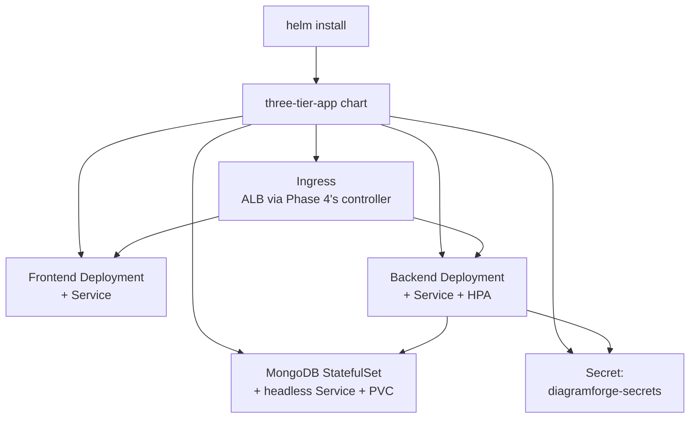

# Phase 7 — The Helm Chart
### Templated, Environment-Aware, with the Right K8s Primitives for Each Tier

---

## Overview

Raw Kubernetes YAML per environment means copy-pasting and hand-editing manifests every time something needs to change between dev and prod — exactly the kind of drift-prone process Phase-13-you will hate. This phase templates everything into one Helm chart with `values-dev.yaml` and `values-prod.yaml` doing the differentiation, uses a **StatefulSet** for MongoDB (not a bare Deployment — this matters, explained below), wires liveness/readiness probes to the `/healthz` endpoints built back in Phase 1, and sets resource requests/limits deliberately rather than leaving them as an afterthought.

## Architecture for this phase



## Chart structure

```
charts/three-tier-app/
├── Chart.yaml
├── values-dev.yaml
├── values-prod.yaml
└── templates/
    ├── _helpers.tpl
    ├── frontend-deployment.yaml
    ├── frontend-service.yaml
    ├── backend-deployment.yaml
    ├── backend-service.yaml
    ├── backend-hpa.yaml
    ├── mongodb-statefulset.yaml
    ├── mongodb-service.yaml
    ├── secret.yaml
    └── ingress.yaml
```

```yaml
# Chart.yaml
apiVersion: v2
name: three-tier-app
description: DiagramForge — templated Helm chart for all three tiers
version: 0.1.0
appVersion: "0.1.0"
```

```yaml
# templates/_helpers.tpl
{{- define "three-tier-app.fullname" -}}
{{ .Release.Name }}-{{ .Chart.Name }}
{{- end }}

{{- define "three-tier-app.labels" -}}
app.kubernetes.io/name: {{ .Chart.Name }}
app.kubernetes.io/instance: {{ .Release.Name }}
{{- end }}
```

---

## Values files — where dev and prod actually diverge

```yaml
# values-dev.yaml — lean, cost-conscious
frontend:
  image: { repository: "<account-id>.dkr.ecr.ap-south-1.amazonaws.com/diagramforge-frontend", tag: "sha-latest" }
  replicaCount: 1
  resources:
    requests: { cpu: 100m, memory: 128Mi }
    limits:   { cpu: 200m, memory: 256Mi }

backend:
  image: { repository: "<account-id>.dkr.ecr.ap-south-1.amazonaws.com/diagramforge-backend", tag: "sha-latest" }
  replicaCount: 1
  env: { nodeEnv: development }
  resources:
    requests: { cpu: 150m, memory: 256Mi }
    limits:   { cpu: 300m, memory: 512Mi }

mongodb:
  replicaCount: 1
  storage: 2Gi
  resources:
    requests: { cpu: 100m, memory: 256Mi }
    limits:   { cpu: 250m, memory: 512Mi }

ingress:
  enabled: true
  host: dev.diagramforge.example.com

autoscaling:
  enabled: false
```

```yaml
# values-prod.yaml — more headroom, autoscaling on
frontend:
  replicaCount: 2
  resources:
    requests: { cpu: 200m, memory: 256Mi }
    limits:   { cpu: 400m, memory: 512Mi }

backend:
  replicaCount: 2
  env: { nodeEnv: production }
  resources:
    requests: { cpu: 250m, memory: 512Mi }
    limits:   { cpu: 500m, memory: 1Gi }

mongodb:
  replicaCount: 1   # a true HA Mongo replica set is a genuine stretch goal, noted honestly rather than faked
  storage: 10Gi

ingress:
  enabled: true
  host: diagramforge.example.com

autoscaling:
  enabled: true
  minReplicas: 2
  maxReplicas: 6
  targetCPUUtilizationPercentage: 70
```

---

## Backend Deployment — probes wired to Phase 1's actual `/healthz`

```yaml
# templates/backend-deployment.yaml
apiVersion: apps/v1
kind: Deployment
metadata:
  name: {{ include "three-tier-app.fullname" . }}-backend
  labels:
    {{- include "three-tier-app.labels" . | nindent 4 }}
spec:
  replicas: {{ .Values.backend.replicaCount }}
  selector:
    matchLabels: { app: {{ include "three-tier-app.fullname" . }}-backend }
  template:
    metadata:
      labels: { app: {{ include "three-tier-app.fullname" . }}-backend }
    spec:
      containers:
        - name: backend
          image: "{{ .Values.backend.image.repository }}:{{ .Values.backend.image.tag }}"
          ports: [{ containerPort: 5000 }]
          env:
            - name: MONGO_URI
              value: "mongodb://{{ include "three-tier-app.fullname" . }}-mongodb:27017/diagramforge"
            - name: NODE_ENV
              value: {{ .Values.backend.env.nodeEnv }}
            - name: ANTHROPIC_API_KEY
              valueFrom:
                secretKeyRef: { name: diagramforge-secrets, key: anthropic-api-key }
          resources:
            {{- toYaml .Values.backend.resources | nindent 12 }}
          livenessProbe:
            httpGet: { path: /healthz, port: 5000 }
            initialDelaySeconds: 10
            periodSeconds: 15
          readinessProbe:
            httpGet: { path: /healthz, port: 5000 }
            initialDelaySeconds: 5
            periodSeconds: 10
```

```yaml
# templates/backend-service.yaml
apiVersion: v1
kind: Service
metadata:
  name: {{ include "three-tier-app.fullname" . }}-backend
spec:
  selector: { app: {{ include "three-tier-app.fullname" . }}-backend }
  ports: [{ port: 5000, targetPort: 5000 }]
```

```yaml
# templates/backend-hpa.yaml
{{- if .Values.autoscaling.enabled }}
apiVersion: autoscaling/v2
kind: HorizontalPodAutoscaler
metadata:
  name: {{ include "three-tier-app.fullname" . }}-backend-hpa
spec:
  scaleTargetRef:
    apiVersion: apps/v1
    kind: Deployment
    name: {{ include "three-tier-app.fullname" . }}-backend
  minReplicas: {{ .Values.autoscaling.minReplicas }}
  maxReplicas: {{ .Values.autoscaling.maxReplicas }}
  metrics:
    - type: Resource
      resource:
        name: cpu
        target: { type: Utilization, averageUtilization: {{ .Values.autoscaling.targetCPUUtilizationPercentage }} }
{{- end }}
```

## Frontend Deployment (same pattern, port 80)

```yaml
# templates/frontend-deployment.yaml
apiVersion: apps/v1
kind: Deployment
metadata:
  name: {{ include "three-tier-app.fullname" . }}-frontend
spec:
  replicas: {{ .Values.frontend.replicaCount }}
  selector:
    matchLabels: { app: {{ include "three-tier-app.fullname" . }}-frontend }
  template:
    metadata:
      labels: { app: {{ include "three-tier-app.fullname" . }}-frontend }
    spec:
      containers:
        - name: frontend
          image: "{{ .Values.frontend.image.repository }}:{{ .Values.frontend.image.tag }}"
          ports: [{ containerPort: 80 }]
          resources:
            {{- toYaml .Values.frontend.resources | nindent 12 }}
          livenessProbe:
            httpGet: { path: /healthz, port: 80 }
            initialDelaySeconds: 5
            periodSeconds: 15
          readinessProbe:
            httpGet: { path: /healthz, port: 80 }
            initialDelaySeconds: 3
            periodSeconds: 10
```

```yaml
# templates/frontend-service.yaml
apiVersion: v1
kind: Service
metadata:
  name: {{ include "three-tier-app.fullname" . }}-frontend
spec:
  selector: { app: {{ include "three-tier-app.fullname" . }}-frontend }
  ports: [{ port: 80, targetPort: 80 }]
```

---

## MongoDB — StatefulSet, not a Deployment, and here's why that's not just pedantry

A bare `Deployment` gives every pod a random name and doesn't guarantee stable storage attachment across restarts — fine for stateless frontend/backend pods, genuinely wrong for a database. A `StatefulSet` gives MongoDB a stable network identity and a `volumeClaimTemplate` that reattaches the *same* persistent volume to the *same* pod identity on restart, which is what actually keeps your data intact through a pod reschedule.

```yaml
# templates/mongodb-statefulset.yaml
apiVersion: apps/v1
kind: StatefulSet
metadata:
  name: {{ include "three-tier-app.fullname" . }}-mongodb
spec:
  serviceName: {{ include "three-tier-app.fullname" . }}-mongodb
  replicas: {{ .Values.mongodb.replicaCount }}
  selector:
    matchLabels: { app: {{ include "three-tier-app.fullname" . }}-mongodb }
  template:
    metadata:
      labels: { app: {{ include "three-tier-app.fullname" . }}-mongodb }
    spec:
      containers:
        - name: mongodb
          image: mongo:7
          ports: [{ containerPort: 27017 }]
          volumeMounts:
            - { name: mongo-data, mountPath: /data/db }
          resources:
            {{- toYaml .Values.mongodb.resources | nindent 12 }}
          livenessProbe:
            exec: { command: ["mongosh", "--eval", "db.adminCommand('ping')"] }
            initialDelaySeconds: 20
            periodSeconds: 20
  volumeClaimTemplates:
    - metadata: { name: mongo-data }
      spec:
        accessModes: ["ReadWriteOnce"]
        resources:
          requests: { storage: {{ .Values.mongodb.storage }} }
```

```yaml
# templates/mongodb-service.yaml — headless, required for StatefulSet
apiVersion: v1
kind: Service
metadata:
  name: {{ include "three-tier-app.fullname" . }}-mongodb
spec:
  clusterIP: None
  selector: { app: {{ include "three-tier-app.fullname" . }}-mongodb }
  ports: [{ port: 27017 }]
```

---

## Secret — flagged honestly as a known gap, fixed properly in Phase 12

```yaml
# templates/secret.yaml
apiVersion: v1
kind: Secret
metadata:
  name: diagramforge-secrets
type: Opaque
stringData:
  anthropic-api-key: {{ .Values.secrets.anthropicApiKey | quote }}
```

**Base64-encoded K8s Secrets are not encryption** — anyone with `kubectl get secret -o yaml` access can trivially decode it. This is fine to ship *now* to keep the phase moving, but it's explicitly a known gap: Phase 12 replaces this with the External Secrets Operator pulling live from AWS Secrets Manager. Flagging a shortcut honestly and scheduling the fix is a real practice — silently hoping nobody notices is not.

Never put a real key in `values-dev.yaml`/`values-prod.yaml` directly — pass it at install time:
```bash
helm install diagramforge charts/three-tier-app \
  -f charts/three-tier-app/values-dev.yaml \
  --set secrets.anthropicApiKey=$ANTHROPIC_API_KEY
```

## Ingress — ALB, using Phase 4's controller

```yaml
# templates/ingress.yaml
{{- if .Values.ingress.enabled }}
apiVersion: networking.k8s.io/v1
kind: Ingress
metadata:
  name: {{ include "three-tier-app.fullname" . }}-ingress
  annotations:
    kubernetes.io/ingress.class: alb
    alb.ingress.kubernetes.io/scheme: internet-facing
    alb.ingress.kubernetes.io/target-type: ip
    alb.ingress.kubernetes.io/healthcheck-path: /healthz
spec:
  rules:
    - host: {{ .Values.ingress.host }}
      http:
        paths:
          - path: /api
            pathType: Prefix
            backend:
              service: { name: {{ include "three-tier-app.fullname" . }}-backend, port: { number: 5000 } }
          - path: /
            pathType: Prefix
            backend:
              service: { name: {{ include "three-tier-app.fullname" . }}-frontend, port: { number: 80 } }
{{- end }}
```

---

## Installing it

```bash
helm lint charts/three-tier-app

# Dry run first — always read generated manifests before trusting them
helm install diagramforge charts/three-tier-app -f charts/three-tier-app/values-dev.yaml --dry-run --debug

# Real install, using the actual sha-tag from your Phase 6 ECR push
helm install diagramforge charts/three-tier-app \
  -f charts/three-tier-app/values-dev.yaml \
  --set secrets.anthropicApiKey=$ANTHROPIC_API_KEY \
  --set backend.image.tag=sha-<actual-sha> \
  --set frontend.image.tag=sha-<actual-sha>

kubectl get pods
kubectl get svc
kubectl get ingress   # note the ALB address once provisioned — takes a couple minutes
```

---

## Git practices for this phase

```bash
git checkout -b feat/phase-7-helm-chart

git add charts/three-tier-app
git commit -m "feat(helm): add templated chart with dev/prod values"
git commit -m "feat(helm): use StatefulSet for MongoDB with volumeClaimTemplate"
git commit -m "feat(helm): wire liveness/readiness probes to application healthz endpoints"

git push origin feat/phase-7-helm-chart
```

---

## Verification checklist

- [ ] `helm lint` passes with no errors
- [ ] `helm install --dry-run --debug` output looks correct before a real install
- [ ] All pods reach `Running`/`Ready` — check `kubectl describe pod` for any stuck in `CrashLoopBackOff`
- [ ] `kubectl get pvc` shows a bound volume for MongoDB
- [ ] Kill the MongoDB pod manually (`kubectl delete pod <mongo-pod>`) and confirm it comes back with the **same** PVC reattached and data intact — this is the concrete proof the StatefulSet choice was correct
- [ ] The ALB address from `kubectl get ingress` actually serves the frontend, and `/api` routes reach the backend
- [ ] `helm install` with `values-prod.yaml` (dry-run is fine) shows the HPA resource rendering, confirming the values-file differentiation works

---

## What's next

**Phase 8** installs ArgoCD and switches from `helm install` run by hand to real GitOps — an App-of-Apps pattern where Git is the single source of truth for what's deployed, and Phase 6's pipeline gets its final stage: updating this chart's values to trigger an automatic sync.

Say **Continue** for Phase 8.
