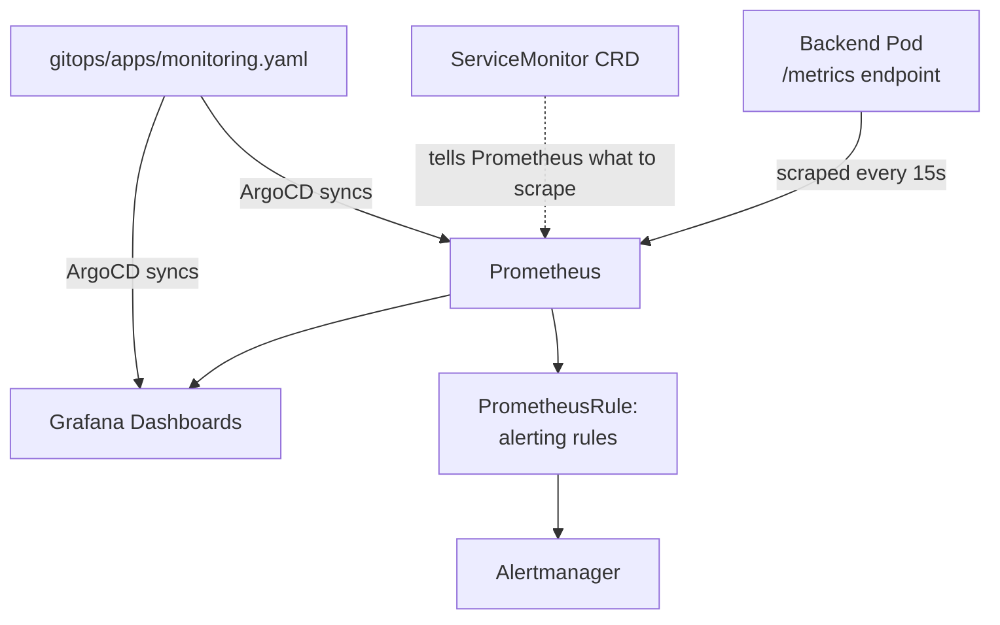

# Phase 9 — Observability: Prometheus & Grafana
### Real Metrics from the App Itself, Real Dashboards, Real Alerts

---

## Overview

"Monitoring exists" as a checkbox is nearly worthless — this phase wires actual application-level metrics (not just generic pod CPU/memory) into Prometheus, builds dashboards around DiagramForge's real behavior, and adds alerting rules that would genuinely wake you up for the right reasons. The whole stack joins the App-of-Apps pattern from Phase 8 — installing it means adding one file to `gitops/apps/`, not another manual Helm command.

**One addition needed back in Phase 1's backend first:** it never exposed a `/metrics` endpoint. Adding it now, honestly, rather than pretending it was always there.

## Architecture for this phase



---

## Step 1 — Add real metrics to the backend

```bash
cd application/backend
npm install prom-client
```

```javascript
// src/middleware/metrics.js
const client = require('prom-client');

const register = new client.Registry();
client.collectDefaultMetrics({ register });

const httpRequestDuration = new client.Histogram({
  name: 'http_request_duration_seconds',
  help: 'Duration of HTTP requests',
  labelNames: ['method', 'route', 'status_code'],
  buckets: [0.1, 0.3, 0.5, 1, 2, 5],
});
register.registerMetric(httpRequestDuration);

const diagramGenerations = new client.Counter({
  name: 'diagram_generations_total',
  help: 'Total diagram generation attempts',
  labelNames: ['status'], // success | success_after_retry | failure
});
register.registerMetric(diagramGenerations);

const diagramGenerationDuration = new client.Histogram({
  name: 'diagram_generation_duration_seconds',
  help: 'Duration of diagram generation, including the LLM call',
  buckets: [0.5, 1, 2, 5, 10, 20],
});
register.registerMetric(diagramGenerationDuration);

function metricsMiddleware(req, res, next) {
  const start = process.hrtime();
  res.on('finish', () => {
    const [sec, nano] = process.hrtime(start);
    httpRequestDuration.observe(
      { method: req.method, route: req.route?.path || req.path, status_code: res.statusCode },
      sec + nano / 1e9
    );
  });
  next();
}

module.exports = { register, metricsMiddleware, diagramGenerations, diagramGenerationDuration };
```

```javascript
// src/app.js — add these two lines
const { register, metricsMiddleware } = require('./middleware/metrics');
app.use(metricsMiddleware);
app.get('/metrics', async (req, res) => {
  res.set('Content-Type', register.contentType);
  res.end(await register.metrics());
});
```

```javascript
// src/services/diagramGenerator.js — instrument the actual product logic, not just HTTP
const { diagramGenerations, diagramGenerationDuration } = require('./metrics');

async function generateDiagram(inputText) {
  const endTimer = diagramGenerationDuration.startTimer();
  try {
    let result = await callClaude(inputText);
    let status = 'success';
    if (!basicSyntaxCheck(result.diagramType, result.mermaidSyntax)) {
      result = await callClaude(inputText, { /* ...correction context... */ });
      status = 'success_after_retry';
    }
    diagramGenerations.inc({ status });
    return result;
  } catch (err) {
    diagramGenerations.inc({ status: 'failure' });
    throw err;
  } finally {
    endTimer();
  }
}
```

Also update Phase 7's `backend-service.yaml` to name the port, so the ServiceMonitor below can reference it cleanly:
```yaml
ports: [{ name: http, port: 5000, targetPort: 5000 }]
```

---

## Step 2 — Install kube-prometheus-stack via App-of-Apps

```bash
kubectl create namespace monitoring
kubectl create secret generic grafana-admin-secret \
  --from-literal=admin-user=admin \
  --from-literal=admin-password=$GRAFANA_ADMIN_PASSWORD \
  -n monitoring
```

```yaml
# gitops/apps/monitoring.yaml
apiVersion: argoproj.io/v1alpha1
kind: Application
metadata:
  name: monitoring
  namespace: argocd
spec:
  project: default
  source:
    repoURL: https://prometheus-community.github.io/helm-charts
    chart: kube-prometheus-stack
    targetRevision: "58.2.1"
    helm:
      values: |
        grafana:
          admin:
            existingSecret: grafana-admin-secret
            userKey: admin-user
            passwordKey: admin-password
        prometheus:
          prometheusSpec:
            serviceMonitorSelectorNilUsesHelmValues: false
  destination:
    server: https://kubernetes.default.svc
    namespace: monitoring
  syncPolicy:
    automated: { prune: true, selfHeal: true }
    syncOptions: [CreateNamespace=true]
```

Push this file — no manual `kubectl apply` needed, ArgoCD's root app already watches this folder from Phase 8.

## Step 3 — Tell Prometheus what to scrape

```yaml
# charts/three-tier-app/templates/backend-servicemonitor.yaml
apiVersion: monitoring.coreos.com/v1
kind: ServiceMonitor
metadata:
  name: {{ include "three-tier-app.fullname" . }}-backend
  labels:
    release: monitoring   # must match what kube-prometheus-stack's Prometheus selects on
spec:
  selector:
    matchLabels: { app: {{ include "three-tier-app.fullname" . }}-backend }
  endpoints:
    - port: http
      path: /metrics
      interval: 15s
```

**A real ordering gotcha worth knowing about, not being surprised by:** this `ServiceMonitor` and the `PrometheusRule` below are custom resources whose CRDs are installed *by* kube-prometheus-stack. If `three-tier-app` happens to sync before `monitoring` does, these resources will fail with a "no matches for kind" error. If you hit this, it's not a real bug — just re-sync `three-tier-app` in the ArgoCD UI once `monitoring` finishes. ArgoCD supports sync waves to enforce ordering properly if this becomes annoying enough to fix permanently.

## Step 4 — Dashboard, built the practical way

Nobody hand-writes Grafana dashboard JSON from scratch. Build it interactively:
1. Port-forward Grafana (`kubectl port-forward svc/monitoring-grafana -n monitoring 3000:80`), log in with the secret you created.
2. Add panels using these queries:

| Panel | PromQL |
|---|---|
| Request rate | `sum(rate(http_request_duration_seconds_count{route=~"/api.*"}[5m]))` |
| p95 latency | `histogram_quantile(0.95, sum(rate(http_request_duration_seconds_bucket[5m])) by (le))` |
| Error rate % | `sum(rate(http_request_duration_seconds_count{status_code=~"5.."}[5m])) / sum(rate(http_request_duration_seconds_count[5m])) * 100` |
| Diagram generation success rate | `sum(rate(diagram_generations_total{status=~"success.*"}[5m])) / sum(rate(diagram_generations_total[5m])) * 100` |
| Diagram generation p95 duration | `histogram_quantile(0.95, sum(rate(diagram_generation_duration_seconds_bucket[5m])) by (le))` |
| Pod restarts (1h) | `increase(kube_pod_container_status_restarts_total{namespace="diagramforge"}[1h])` |

3. **Export as JSON** (Grafana's dashboard settings → JSON Model), save it, and commit it as code:

```yaml
# observability/prometheus-grafana/dashboards/diagramforge-overview-configmap.yaml
apiVersion: v1
kind: ConfigMap
metadata:
  name: diagramforge-overview-dashboard
  namespace: monitoring
  labels:
    grafana_dashboard: "1"   # the Grafana sidecar watches for this label
data:
  diagramforge-overview.json: |
    <paste your exported JSON here>
```

This is genuinely how dashboard-as-code works in practice — build visually, export, commit. The dashboard now survives a full cluster rebuild instead of living only in one Grafana instance's database.

## Step 5 — Alerting rules that mean something

```yaml
# charts/three-tier-app/templates/alerts.yaml
apiVersion: monitoring.coreos.com/v1
kind: PrometheusRule
metadata:
  name: diagramforge-alerts
  namespace: diagramforge
  labels:
    release: monitoring
spec:
  groups:
    - name: diagramforge.rules
      rules:
        - alert: HighErrorRate
          expr: |
            sum(rate(http_request_duration_seconds_count{status_code=~"5.."}[5m]))
            / sum(rate(http_request_duration_seconds_count[5m])) > 0.05
          for: 5m
          labels: { severity: warning }
          annotations: { summary: "Error rate above 5% for 5 minutes" }

        - alert: DiagramGenerationFailureSpike
          expr: |
            sum(rate(diagram_generations_total{status="failure"}[10m]))
            / sum(rate(diagram_generations_total[10m])) > 0.2
          for: 10m
          labels: { severity: warning }
          annotations: { summary: "Over 20% of diagram generations failing — likely an LLM API issue, not application code" }

        - alert: PodCrashLooping
          expr: increase(kube_pod_container_status_restarts_total{namespace="diagramforge"}[15m]) > 3
          for: 5m
          labels: { severity: critical }
          annotations: { summary: "A pod has restarted more than 3 times in 15 minutes" }
```

Notice the second alert's annotation is specific enough to point you toward the right diagnosis (LLM API vs. your own code) — a genuinely useful alert tells you where to look first, not just that something's wrong.

---

## Git practices for this phase

```bash
git checkout -b feat/phase-9-observability

git add application/backend/src/middleware/metrics.js application/backend/package.json
git commit -m "feat(backend): expose Prometheus metrics endpoint and instrument diagram generation"

git add gitops/apps/monitoring.yaml
git commit -m "feat(monitoring): add kube-prometheus-stack via App-of-Apps"

git add charts/three-tier-app/templates/backend-servicemonitor.yaml charts/three-tier-app/templates/alerts.yaml
git commit -m "feat(observability): add ServiceMonitor and alerting rules for diagramforge"

git add observability/prometheus-grafana/dashboards
git commit -m "feat(observability): add diagramforge overview dashboard as code"

git push origin feat/phase-9-observability
```

---

## Verification checklist

- [ ] `curl http://<backend-pod>:5000/metrics` (via port-forward) returns real Prometheus-format metrics, not an error
- [ ] Prometheus UI (port-forward `prometheus-operated` service) shows the backend target as `UP` under Targets
- [ ] Generate a few diagrams through the actual app, then confirm `diagram_generations_total` increments accordingly in Prometheus
- [ ] The Grafana dashboard renders real data, not "No Data" panels
- [ ] Deliberately trigger the `PodCrashLooping` alert (e.g., temporarily set an invalid image tag) and confirm it actually fires in Alertmanager — then revert
- [ ] `gitops/apps/monitoring.yaml`'s Application shows `Synced`/`Healthy` in ArgoCD

---

## What's next

**Phase 10** wires up a real domain: Route53 DNS, and cert-manager issuing real Let's Encrypt certificates so the app serves genuine HTTPS instead of plain HTTP through the ALB.

Say **Continue** for Phase 10.
