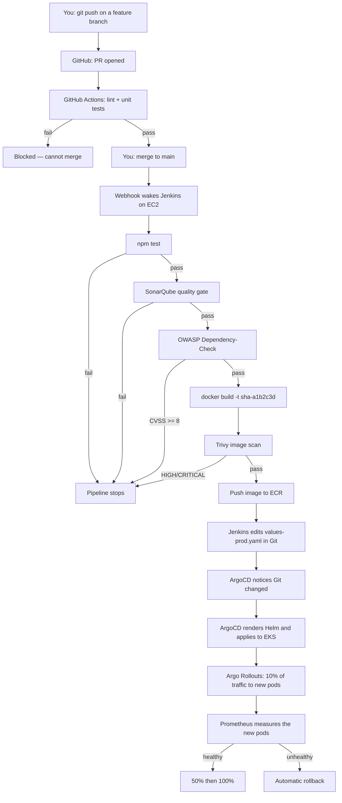

# Diagram-Ops — Understanding the Project

### What we're building, which cloud tools we use, why each one exists, and what it costs

> Read this **before** Phase 0. Every phase file tells you *what to type*. This file tells you *what it all means* — so that when something breaks in Phase 9, you understand the system well enough to reason about it instead of searching for the error message.

---

## Contents

1. [The app (deliberately boring)](#1-the-app-deliberately-boring)
2. [The real subject: everything around the app](#2-the-real-subject-everything-around-the-app)
3. [The tools, in plain words](#3-the-tools-in-plain-words)
   - [Layer 1 — Packaging](#layer-1--packaging-docker)
   - [Layer 2 — Creating the cloud](#layer-2--creating-the-cloud-terraform)
   - [Layer 3 — The AWS services](#layer-3--the-aws-services)
   - [Layer 4 — Kubernetes](#layer-4--kubernetes)
   - [Layer 5 — CI/CD](#layer-5--cicd)
   - [Layer 6 — Knowing what's happening](#layer-6--knowing-whats-happening)
   - [Layer 7 — Security and safety](#layer-7--security-and-safety)
4. [The life of a commit](#4-the-life-of-a-commit)
5. [What it actually costs](#5-what-it-actually-costs)
6. [The 16 phases as a story](#6-the-16-phases-as-a-story)
7. [Glossary](#7-glossary)

---

## 1. The app (deliberately boring)

You type a sentence:

> *"user logs in, we check the password, if correct show dashboard, if wrong show error"*

The app sends it to an AI model, which returns **Mermaid syntax** — a plain-text format for describing diagrams:

```
flowchart TD
    A[User logs in] --> B{Password correct?}
    B -->|Yes| C[Show dashboard]
    B -->|No| D[Show error]
```

The browser turns that text into an actual flowchart. You save it to a database. You can export it as an image.

That is the **entire product**. Three screens. Roughly 800 lines of code.

### Why so small — on purpose

This is the most important design decision in the project, and it's easy to mistake for laziness.

If the application were complicated, then every bug you hit would be an *application* bug. You'd spend your time debugging React state management and learn nothing about infrastructure. Because the app is small and you understand all of it, when something breaks you can be confident the problem is in the **platform** — and debugging the platform is the actual syllabus.

> **Guiding principle:** Keep the app simple. Make the platform serious.

---

## 2. The real subject: everything around the app

Here's the honest framing of what this project is for.

Any student can write a React app. What companies actually pay engineers to know is the answer to the following questions — and each one maps to a phase:

| Question a real team asks | Phase that answers it |
|---|---|
| How do I run this identically on my laptop, your laptop, and a server? | 1 — Docker |
| How do I create cloud servers without clicking through a web console? | 2 — Terraform |
| How do I stop bad code from ever reaching production? | 3, 6 — Jenkins + security scanners |
| How do I run 10 copies and restart them automatically when they crash? | 4, 7 — EKS + Helm |
| How do I deploy without anyone holding production credentials? | 8 — ArgoCD / GitOps |
| How do I find out it's broken *before* a user tells me? | 9, 15 — Prometheus, Grafana, Loki |
| How do I avoid leaking the database password? | 12 — External Secrets |
| How do I avoid losing the data? | 11 — Backups **and a tested restore** |
| How do I ship a risky change safely? | 14 — Canary releases |
| How do I avoid a surprise $900 AWS bill? | 16 — FinOps |

Every one of those is a genuine interview question. By the end of this project you won't have memorised an answer — you'll have built one.

---

## 3. The tools, in plain words

### Layer 1 — Packaging (Docker)

**The problem.** Your app needs Node.js 24, three specific libraries, and a particular config. On your laptop it works perfectly. On mine, I have Node 18, and it crashes on startup. This is the "works on my machine" problem, and it has burned every developer who ever lived.

**Docker's answer:** ship the whole environment, not just the code.

> **Analogy.** Instead of mailing someone a recipe and hoping they own the right oven, you mail them a sealed lunchbox containing the food, the oven, *and* the electricity.

A `Dockerfile` is the recipe for building that box:

```dockerfile
FROM node:24-alpine       # start from a minimal Linux that already has Node 24
WORKDIR /app
COPY package*.json ./
RUN npm ci                # install the exact locked dependency versions
COPY . .
USER appuser              # do NOT run as root
CMD ["node", "src/server.js"]
```

Two words you need to keep straight:

- **Image** — the built, frozen result. Like a class in programming, or a `.iso` file.
- **Container** — a running instance of an image. Like an object, or a booted VM.

One image → many identical containers. The same image runs on your laptop and inside AWS, byte for byte.

**Docker Compose** solves the next problem: your system is *three* things (frontend, backend, MongoDB) that must find and talk to each other. Compose is a single YAML file that starts all three and puts them on a shared network, so `docker compose up` boots your whole system locally.

> **Phase 1 rule:** you don't touch AWS until `docker compose up` gives you a working app. Deploying something broken to Kubernetes just makes your bug *Kubernetes-shaped* — you'll spend hours blaming the cluster for a typo in your code.

---

### Layer 2 — Creating the cloud (Terraform)

**The problem.** You *could* log into the AWS console and click "Create Cluster." But a week later: what exactly did you click? Can you recreate it? Can a teammate? What changed since Tuesday?

**Terraform's answer:** infrastructure is *code*.

```hcl
resource "aws_instance" "jenkins" {
  ami           = "ami-0abc123def456"
  instance_type = "t3.large"

  tags = {
    Name        = "jenkins-server"
    Project     = "diagram-ops"
    ManagedBy   = "terraform"
  }
}
```

- `terraform plan` → shows you exactly what it *would* change, before changing anything.
- `terraform apply` → the server now exists.
- `terraform destroy` → it's gone, and so is the bill.
- `terraform apply` again → an **identical** server.

That last line is the entire value proposition. Your infrastructure is reproducible, reviewable in a pull request, and diffable in Git.

**Terraform state** is Terraform's memory — a JSON file recording what it has already built. We keep it in an **S3 bucket** rather than on your laptop, because state on one machine means nobody else can safely run Terraform, and a laptop reinstall loses your entire infrastructure record.

> **Why this matters more than it first appears:** because your cluster is code, you can destroy it every night and rebuild it tomorrow with one command. That is the difference between a **$215/month** project and a **$30/month** project. See [costs](#5-what-it-actually-costs).

---

### Layer 3 — The AWS services

| Service | Plain English | Why this project needs it |
|---|---|---|
| **VPC** | Your own private network inside AWS — subnets, routing tables, firewalls | Everything else lives inside it |
| **EC2** | A rented virtual computer | Runs the Jenkins server |
| **EKS** | Managed Kubernetes | Runs the actual application |
| **ECR** | Private Docker image storage | Where your built images live, privately |
| **ALB** | Application Load Balancer — a public front door | Routes `/api/*` to backend, everything else to frontend |
| **Route53** | DNS — maps a domain name to the load balancer | Humans use names, not IP addresses |
| **ACM** | Free TLS/SSL certificates | Gives you HTTPS and the padlock icon |
| **IAM** | Permissions — who is allowed to do what | The reason nothing runs as root |
| **S3** | Object storage (files) | Terraform state + MongoDB backups |
| **Secrets Manager** | An encrypted vault for passwords and API keys | So secrets never live in Git |
| **EBS** | Virtual hard disks | MongoDB's data lives here and survives pod restarts |
| **Budgets** | Billing alarms | So AWS emails you *before* it surprises you |

---

### Layer 4 — Kubernetes

This is the hardest concept in the project, so let's go slowly.

**The problem.** You have a container. Now you want:
- Three copies running, for redundancy
- If one crashes at 3 AM, restart it — without waking anyone
- If traffic spikes, run ten; when it calms, go back to three
- If an entire server dies, move its containers to healthy servers
- Zero-downtime updates when you deploy a new version

Doing that manually is impossible. Kubernetes does it continuously and without asking.

> **Analogy.** Kubernetes is a restaurant manager. You tell it once: *"I always want three cooks on the line."* A cook quits → it hires a replacement. Friday rush → it brings in more. A cook shows up sick → it sends them home and calls someone else. It never asks your permission; it just keeps reality matching your instruction.
>
> That idea has a name: **declarative** configuration. You describe the desired *end state*, not the steps. This is the single most important mental shift in modern infrastructure, and it shows up again in Terraform and again in ArgoCD.

#### The vocabulary you actually need

| Term | What it is | Concrete example here |
|---|---|---|
| **Pod** | The smallest deployable unit — usually one container | One running copy of your backend |
| **Deployment** | "Keep N identical pods alive." Handles rolling updates | `diagramops-backend`, 3 replicas |
| **Service** | A stable internal address for a set of pods | Pods die and get new IPs constantly; `backend-service` never changes |
| **Ingress** | How outside traffic gets in | Yours creates the AWS ALB |
| **StatefulSet** | Like a Deployment, but for things with *memory* | MongoDB — a database pod must reattach to **its own** disk, not a fresh empty one |
| **PVC** | "I need 10 GB of disk that outlives the pod" | Becomes an AWS EBS volume |
| **ConfigMap** | Non-secret configuration | Log level, feature flags |
| **Secret** | Sensitive configuration | API keys (see Phase 12 — base64 is **not** encryption) |
| **Namespace** | A folder for organising resources | `diagramforge`, `monitoring`, `argocd` |
| **HPA** | Horizontal Pod Autoscaler — adds pods when CPU is high | Backend scales 3 → 10 under load |

**Why EKS specifically:** Kubernetes has a "brain" (the control plane) that makes all these decisions. Running that brain yourself — highly available, patched, backed up — is a full-time job for a team. EKS means Amazon runs the brain; you just bring the worker machines. You pay $0.10/hour for that, and it is worth every cent.

#### Helm — templating for Kubernetes

Kubernetes wants YAML. You need near-identical YAML for dev and prod, differing only in replica count and image tag. Copy-pasting them means they drift apart within a week.

Helm is mail-merge for YAML:

```yaml
spec:
  replicas: {{ .Values.backend.replicaCount }}
  containers:
    - image: "{{ .Values.backend.image.repository }}:{{ .Values.backend.image.tag }}"
```

Then:
- `values-dev.yaml` → `replicaCount: 1`
- `values-prod.yaml` → `replicaCount: 3`

One template, two environments, guaranteed to stay structurally identical. A Helm **chart** is the whole package: templates + default values + metadata.

---

### Layer 5 — CI/CD

**CI** = Continuous Integration (every change is automatically built and tested).
**CD** = Continuous Delivery/Deployment (every change that passes automatically reaches users).

#### Jenkins — the inspection line

Jenkins is a robot that watches your GitHub repo. You push code; a webhook wakes Jenkins; it runs your pipeline.

> **Analogy.** A factory inspection line. The product moves station to station, and **any station can reject it**. Nothing reaches the shipping dock without passing every station.

```
Checkout → Install deps → Unit tests → SonarQube → OWASP → Build image → Trivy → Push to ECR → Update Git
```

The pipeline itself is code (`Jenkinsfile`), lives in your repo, and is reviewed like any other file.

#### The three security gates — why you need all three

They sound redundant. They are not: each one inspects a **different layer**.

| Tool | Inspects | Catches | Example finding |
|---|---|---|---|
| **SonarQube** | Your source code | Bugs, dead code, hardcoded secrets, thin test coverage | "This variable is never used"; "This API key is hardcoded" |
| **OWASP Dependency-Check** | Your declared libraries (`package.json`) | Known CVEs in your dependencies | "`axios@1.2.0` has CVE-2023-45857" |
| **Trivy** | The finished Docker image | Known CVEs in the OS packages *inside* the image | "`openssl` in your base image has a critical CVE" |

Your own code can be flawless while sitting on top of a vulnerable operating system. That's why the image gets scanned separately from the code.

> **"Shift left"** is the industry phrase for this whole idea: catch problems at the earliest, cheapest possible moment. A bug caught in the pipeline costs three minutes. The same bug caught in production costs a weekend, plus an apology.

#### ArgoCD and GitOps — the elegant part

This is worth understanding properly, because it's the most modern idea in the project.

**The old way — "push" deployment.** Jenkins holds your production Kubernetes credentials and runs `kubectl apply`. Problems:
- Your CI server can now delete your entire cluster. That's an enormous blast radius.
- If someone manually changes something in the cluster, nothing notices or corrects it.
- Rolling back means remembering what the previous state was.

**GitOps — "pull" deployment.** Jenkins does **not** touch the cluster. It only builds images and edits a YAML file in Git. **ArgoCD lives inside the cluster**, watches the Git repo, and continuously makes the cluster match what Git says.

> **Analogy.** ArgoCD is an extremely literal employee who re-reads the blueprint every three minutes and fixes anything that doesn't match. Someone manually scales your app down to one pod? Within minutes ArgoCD has scaled it back to three, because Git says three. (This is called **self-healing**.)

Three consequences worth internalising:

1. **Git is the single source of truth.** Reading the repo tells you exactly what is running in production. No drift, no mystery.
2. **Rollback is `git revert`.** No special procedure, no runbook, no panic.
3. **Jenkins never needs cluster credentials.** A compromised CI server can't touch production.

---

### Layer 6 — Knowing what's happening

You cannot operate what you cannot see. Observability has three pillars.

**Prometheus (metrics).** Visits every pod every 15 seconds and asks "how are you?" Your app answers on a `/metrics` endpoint in plain text:

```
http_requests_total{route="/api/diagrams/generate",status="200"} 1423
http_requests_total{route="/api/diagrams/generate",status="500"} 12
diagram_generation_duration_seconds_sum 891.3
```

Prometheus stores these over time, so you can ask *"what was the error rate at 3 AM last Tuesday?"* and get a real answer.

**Grafana (dashboards + alerts).** The same data, drawn as graphs. Also where alert rules live: *"if the error rate exceeds 5% for 10 minutes, notify me."*

**Loki (logs).** Same idea, for log lines. Crucially, logs are stored *outside* the pod — so when a container crashes and is replaced, you can still read why it died.

**OpenTelemetry + Tempo (traces).** Follows a single request through every component and times each hop.

> **The three-pillar rule, as a story:**
> - **Metrics:** "The patient's heart rate is 180."
> - **Logs:** "The chart says they drank six espressos."
> - **Traces:** "The caffeine hit at 2:14 PM, and here's the exact path it took through the body."
>
> Metrics tell you *that* something is wrong. Logs tell you *what*. Traces tell you *where*.

For this app, traces answer the question you'll actually have: when diagram generation is slow, is it the AI provider, the database, or your own code? Without traces that's guesswork.

---

### Layer 7 — Security and safety

| Concern | Tool | What it does, plainly |
|---|---|---|
| Secrets in Git | **External Secrets Operator** | The API key lives in AWS Secrets Manager. ESO fetches it into the cluster at runtime. Rotate it in one place; every pod picks it up. Nothing sensitive is ever committed. |
| Lateral movement | **NetworkPolicy** | A firewall *inside* the cluster. Default: nothing may talk to anything. Then explicitly allow frontend→backend and backend→MongoDB. A compromised frontend pod cannot reach your database. |
| Container escape | **Pod Security Standards** | Containers run as a non-root user with a read-only filesystem and no extra Linux capabilities. If an attacker gets in, they land somewhere with almost no power. |
| Unknown ingredients | **Syft (SBOM)** | A Software Bill of Materials — a machine-readable ingredients list for your image. When the next Log4Shell lands, you can answer "are we affected?" in seconds instead of days. |
| Tampered images | **Cosign** | Cryptographically signs images. Combined with an admission policy (**Kyverno**), the cluster will *refuse to run* an image your pipeline didn't sign. |
| Risky releases | **Argo Rollouts** | Canary deploys: send 10% of traffic to the new version, watch the error rate for two minutes, promote to 50%, then 100% — and **automatically roll back** if metrics degrade. Nobody has to be awake for this. |
| Data loss | **CronJob → S3** | Nightly `mongodump` to S3. And critically: an actual **tested restore**, because an untested backup is a rumour, not a backup. |
| Bill shock | **AWS Budgets + tagging** | Alerts before you're surprised; tags so you know *which* resource caused it. |

---

## 4. The life of a commit

This is the single most valuable thing to be able to narrate — in an interview, in a viva, or to yourself at 2 AM. Here is what happens end to end when you fix a bug.



Step by step:

| # | Actor | What happens |
|---|---|---|
| 1 | You | `git checkout -b fix/mermaid-parse-error` |
| 2 | You | Write the fix, write a test, `git push` |
| 3 | GitHub | PR opens; branch protection blocks merge until checks pass |
| 4 | GitHub Actions | Lint + unit tests run (works even when Jenkins is torn down) |
| 5 | You | Merge to `main` |
| 6 | GitHub | Webhook wakes Jenkins |
| 7 | Jenkins | `npm test` — fail = stop |
| 8 | Jenkins | SonarQube quality gate — fail = stop |
| 9 | Jenkins | OWASP Dependency-Check — CVSS ≥ 8 = stop |
| 10 | Jenkins | `docker build -t sha-a1b2c3d` |
| 11 | Jenkins | Trivy scans the image — HIGH/CRITICAL = stop |
| 12 | Jenkins | Push to ECR (tag is **immutable** — `sha-a1b2c3d` can never be overwritten) |
| 13 | Jenkins | Edit `charts/three-tier-app/values-prod.yaml` → `tag: sha-a1b2c3d`, commit |
| 14 | ArgoCD | Notices Git changed (within ~3 min), pulls, renders Helm, applies to EKS |
| 15 | Argo Rollouts | Sends 10% of traffic to the new pods |
| 16 | Prometheus | Measures the new pods' error rate |
| 17 | Argo Rollouts | Healthy → 50% → 100%. Unhealthy → **automatic rollback** |
| 18 | Grafana | The deploy appears as an annotation on your dashboards |

### Notice what is absent

You never ran `kubectl` against production. You never SSH'd into a server. You never typed a password. The only human action in that entire chain was **merging a pull request**.

That is what "industry standard" actually means. It isn't the *number* of tools — it's that a change reaches users through a path that is **automated, gated, reversible, and auditable**.

### Why the image tag is a git SHA

`latest` is a lie that changes meaning over time. Two people pulling `myapp:latest` an hour apart can get different code, and neither can tell.

With `sha-a1b2c3d`, a running pod maps to exactly one commit, forever. When production breaks at 2 AM, you run one command, read the tag, and know the precise source. Making the ECR tag **immutable** enforces this at the registry level — the same tag can never be overwritten, even by accident.

---

## 5. What it actually costs

Real numbers for `ap-south-1` (Mumbai), running 24/7:

| Resource | Monthly cost |
|---|---|
| EKS control plane | **$73** — fixed, $0.10/hr, charged even with zero pods running |
| 2× `t3.medium` worker nodes (on-demand) | ~$60 (~$18 on spot instances) |
| Jenkins EC2 (`t3.large`) | ~$60 |
| Application Load Balancer | ~$18 + data processing |
| EBS volumes | ~$5 |
| Route53 hosted zone | $0.50 |
| ECR storage | negligible at this scale |
| **Total, always-on** | **≈ $215 / month** |

That is not a student budget. Note especially that the **EKS control plane bills whether or not anything is deployed** — an idle cluster is not a free cluster.

### The strategy that makes this affordable

Run `terraform destroy` on the EKS cluster and stop the Jenkins EC2 at the end of every work session.

Work ~15 hours a week instead of 730, and the bill lands at roughly **$25–35/month** — mostly the Jenkins root volume and the hours you're actually building.

This is precisely why Terraform matters more than it first appears. Destroying and recreating your entire cluster is only survivable *because it is code*. Doing that through the AWS console would be unthinkable.

**Set your AWS Budget to $40 with an alert at 60%**, and treat teardown as a habit rather than a chore.

> One caveat worth knowing before Phase 4: the phases deliberately avoid a **NAT Gateway** (~$32/month plus data charges) by placing worker nodes in public subnets. That is a real security trade-off made for cost reasons, and it's called out honestly in the phase file rather than hidden.

---

## 6. The 16 phases as a story

The phases are not a checklist of tools. They're a **chain of consequences** — each phase exists because the previous one exposed a specific gap.

```
Make it run            →  Phase 1
Make it reproducible   →  Phases 2–5
Make it safe to change →  Phase 6
Make it scalable       →  Phase 7
Make it hands-off      →  Phase 8
Make it observable     →  Phase 9
Make it real           →  Phases 10–11
Make it defensible     →  Phases 12–13
Make it recoverable    →  Phases 14–15
Make it sustainable    →  Phase 16
```

Read the causal chain out loud — this is the narrative that makes the whole project explainable:

> Docker Compose can't survive a machine crash → **so we need Kubernetes**.
> Raw Kubernetes YAML doesn't scale across environments → **so we need Helm**.
> Jenkins holding production credentials is a huge blast radius → **so we need ArgoCD**.
> We can't tell if a deploy made things worse → **so we need Prometheus**.
> Metrics say *something* broke but not *what* → **so we need logs and traces**.
> A bad deploy still reaches 100% of users instantly → **so we need canary releases**.
> Secrets in YAML are one `git push` from disaster → **so we need External Secrets**.
> A backup nobody has restored is a rumour → **so we need a restore drill**.
> And all of it runs up a bill nobody is watching → **so we need FinOps**.

Being able to explain that chain is worth more on your resume than any individual tool in it.

| Phase | Focus | The gap it closes |
|---|---|---|
| 0 | Foundations | Repo structure, Git strategy, AWS account safety, budget |
| 1 | Minimal application | Something real to deploy, proven locally first |
| 2 | Jenkins infrastructure | Infrastructure by hand isn't reproducible |
| 3 | Jenkins configuration | Clicking through a UI isn't configuration-as-code |
| 4 | EKS cluster | Compose can't self-heal or scale |
| 5 | ECR | Public registries aren't acceptable for private images |
| 6 | CI gates | Nothing stops broken or vulnerable code today |
| 7 | Helm | Copy-pasted YAML drifts between environments |
| 8 | GitOps | CI holding prod credentials is too much blast radius |
| 9 | Observability | You can't operate what you can't see |
| 10 | DNS and TLS | An ALB hostname isn't a product; HTTP isn't acceptable |
| 11 | Persistence and backup | A pod restart currently loses the database |
| 12 | Security hardening | Secrets in YAML, flat network, root containers |
| 13 | Supply chain | You can't prove what's in your image or where it came from |
| 14 | Progressive delivery | A bad deploy reaches every user instantly |
| 15 | Logs, traces, incidents | Metrics alone can't explain a failure |
| 16 | FinOps and resilience | Nobody's watching the bill, and DR is untested |

---

## 7. Glossary

Quick reference for terms that appear throughout the phase files.

| Term | Meaning |
|---|---|
| **Blast radius** | How much damage a single compromised component can cause |
| **CVE** | Common Vulnerabilities and Exposures — a public ID for a known security flaw |
| **CVSS** | A 0–10 severity score for a CVE. Our pipeline fails builds at ≥ 8 |
| **Declarative** | You describe the desired end state; the system figures out the steps. (Opposite: *imperative* — you list the steps yourself) |
| **Drift** | When reality no longer matches your configuration, usually from a manual change |
| **Idempotent** | Running it twice produces the same result as running it once |
| **Immutable tag** | An image tag that can never be overwritten once pushed |
| **IRSA** | IAM Roles for Service Accounts — lets a specific pod assume a specific AWS role, without long-lived keys |
| **Least privilege** | Grant the minimum permissions needed, nothing more |
| **Liveness probe** | K8s health check: "is this container alive?" Fail → restart it |
| **Readiness probe** | K8s health check: "can this container take traffic yet?" Fail → stop sending requests |
| **Reconciliation loop** | Continuously comparing desired state to actual state and correcting the difference. The core idea in both Kubernetes and ArgoCD |
| **RTO / RPO** | Recovery Time Objective (how long recovery takes) / Recovery Point Objective (how much data you can lose) |
| **Self-healing** | The system automatically corrects drift without a human |
| **Shift left** | Catch problems as early in the pipeline as possible |
| **SLO** | Service Level Objective — a measurable definition of "healthy," e.g. "99% of requests succeed over 7 days" |
| **SBOM** | Software Bill of Materials — a machine-readable ingredients list for a build artifact |

---

## Where to go next

1. **[Phase 0 — Foundations](Phases/phase-0-foundations.md)** — repo structure, Git strategy, AWS account setup, budget alarm.
2. **[Phase 1 — Application](Phases/phase-1-application.md)** — build the app and prove it works locally with Docker Compose.
3. Then follow the phases in order. Each one closes the gap the previous one exposed.
