# Diagram-Ops — System Design

### ER model, UML diagrams, and architecture

> Every diagram on this page is written in **Mermaid** and renders directly on GitHub. That is deliberate: this project's own application generates Mermaid, so the design documentation is written in the format the product produces. The source is plain text, so it diffs in pull requests like code — unlike a screenshot of a drawing tool.

**Companion documents**
- [functional-spec.md](functional-spec.md) — requirements referenced here as `FR-*` / `NFR-*`
- [project-overview.md](project-overview.md) — what each tool is and why
- [Phases/](Phases/) — the build instructions

---

## Contents

1. [System context](#1-system-context)
2. [Use case diagram](#2-use-case-diagram)
3. [ER diagram and data model](#3-er-diagram-and-data-model)
4. [Class diagram](#4-class-diagram)
5. [Sequence diagrams](#5-sequence-diagrams)
6. [Activity diagram](#6-activity-diagram)
7. [State diagram](#7-state-diagram)
8. [Component diagram](#8-component-diagram)
9. [Deployment diagram](#9-deployment-diagram)
10. [Design decisions](#10-design-decisions)

---

## 1. System context

The outermost view: who and what Diagram-Ops talks to.

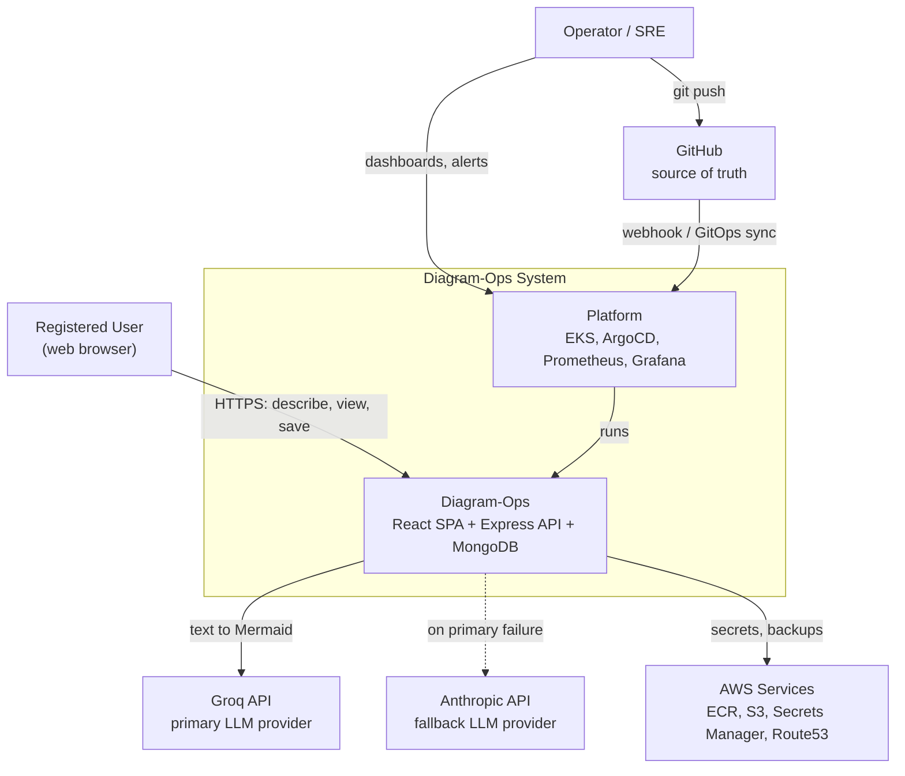

Two things worth noticing:

- **The Operator never touches the application directly.** They interact through Git and through dashboards. That separation is the entire point of GitOps.
- **The dotted line to Claude** is the failover path. It is exercised rarely by design, which is exactly why it needs an automated test (`FR-G5`) — untested failover is not failover.

---

## 2. Use case diagram

> Mermaid has no native use-case notation, so this uses actors as circles and use cases as stadium shapes inside a system boundary — the standard UML reading still applies.

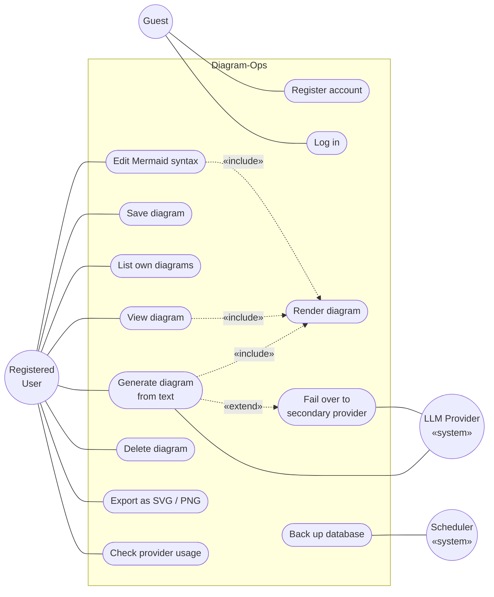

**Reading the relationships**

- **`«include»`** — the base use case *always* performs the included one. Generating, viewing, and editing all necessarily render. Rendering is factored out because it's the same behaviour in three places.
- **`«extend»`** — the extending use case happens *conditionally*. Failover extends generation because it only occurs when the primary provider fails.

---

## 3. ER diagram and data model

### A necessary caveat

MongoDB is a **document database**, not a relational one. There are no foreign-key constraints, no joins, and no schema enforced by the engine. So an ER diagram here describes the **logical** model our application enforces at the Mongoose layer — not constraints the database guarantees.

This is worth stating plainly rather than glossing over, because it has a real consequence: **referential integrity is the application's job.** If you delete a `USER`, nothing in MongoDB automatically removes their `DIAGRAM` documents. Our code must do it.

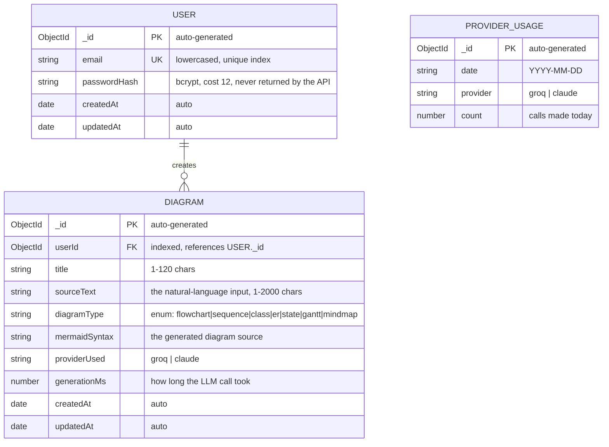

### Cardinality

| Relationship | Cardinality | Meaning |
|---|---|---|
| `USER` → `DIAGRAM` | **1 : 0..N** | A user may have no diagrams or many. Every diagram has exactly one owner. |
| `PROVIDER_USAGE` | *standalone* | Not related to users. It's a global daily counter, deliberately not per-user. |

`PROVIDER_USAGE` has no relationship line because it is an **aggregate**, not an entity in the domain. Its unique compound index on `(date, provider)` is what makes the daily cap correct — it guarantees exactly one counter row per provider per day, so two concurrent requests can't create two competing counters.

### Indexes and why each exists

| Collection | Index | Purpose |
|---|---|---|
| `USER` | `{ email: 1 }` unique | Enforces `FR-A5`; makes login lookup O(log n) |
| `DIAGRAM` | `{ userId: 1, createdAt: -1 }` | Powers `FR-D2` — "my diagrams, newest first" — in a single index scan |
| `PROVIDER_USAGE` | `{ date: 1, provider: 1 }` unique | Makes the atomic `findOneAndUpdate` upsert safe under concurrency |

> **Why the compound index order matters.** `{ userId: 1, createdAt: -1 }` — not the reverse. MongoDB can use a compound index when your query filters on a **prefix** of its fields. We always filter by `userId` and *then* sort by date, so `userId` must come first. Reversed, the index would be useless for our most common query and you'd get a collection scan that gets slower every day.

### Design decisions in the data model

| Decision | Rationale |
|---|---|
| Store `sourceText` alongside the generated syntax | Lets you regenerate later with a better model, and gives you real data on what people actually ask for |
| Store `providerUsed` per diagram | Makes "is the free provider good enough?" answerable with a query instead of a guess |
| Store `generationMs` | Feeds `NFR-P1` verification without needing to correlate to Prometheus |
| Embed nothing; reference `userId` | A user could accumulate thousands of diagrams. Embedding them in the user document would eventually hit MongoDB's 16 MB document limit — a genuine production failure mode |
| No `deletedAt` soft delete | Deliberate simplicity. Hard delete, and the nightly backup is the recovery path |

---

## 4. Class diagram

The backend's layered structure. Each layer only knows about the one below it — controllers never touch models directly, services never touch HTTP.

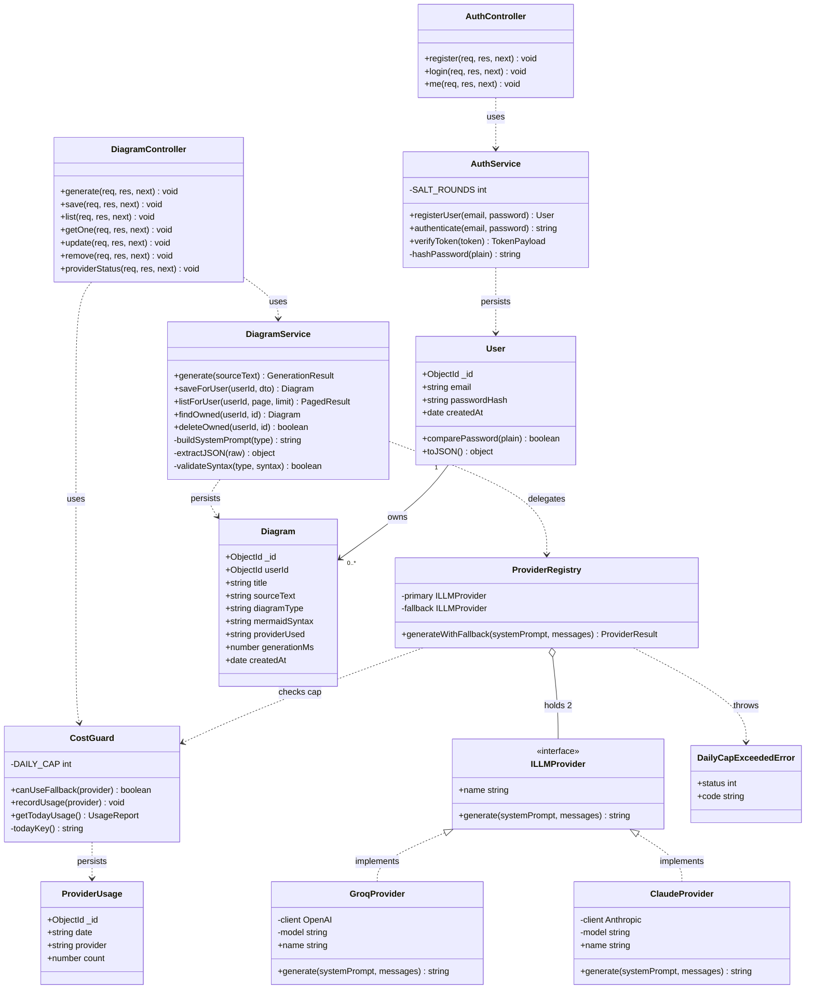

### Why this shape

**`ILLMProvider` is the important class.** It's an interface with two implementations, and `ProviderRegistry` depends on the *interface*, not the concrete classes. That is the **Dependency Inversion Principle**, and here it buys three concrete things:

1. Adding a third provider means writing one new class — no changes anywhere else.
2. Tests mock the interface, so the whole test suite runs with zero API calls and zero cost.
3. Swapping which provider is primary is an environment variable, not a code change.

**Controllers are thin on purpose.** They parse the request, call one service method, and shape the response. All business logic lives in services. This is what makes the logic testable without spinning up HTTP — and it's why `DiagramService.generate()` can be unit-tested against a mocked provider in milliseconds.

**`User.toJSON()` exists to delete `passwordHash`.** Mongoose calls it automatically during serialisation, so the hash cannot leak through an API response even if someone carelessly writes `res.json(user)`. Making the safe thing automatic beats remembering to do the safe thing.

---

## 5. Sequence diagrams

### 5.1 Diagram generation — happy path

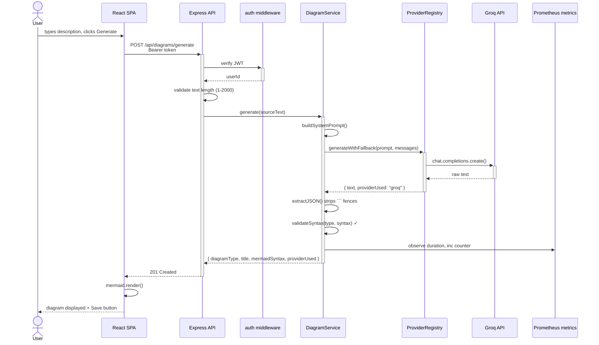

Note that nothing is written to MongoDB. Generation and persistence are separate operations (`FR-G7`) — the user decides what's worth keeping.

### 5.2 Failover, sticky retry, and the daily cap

This is the most important diagram in the document, because it encodes the cost-control logic.

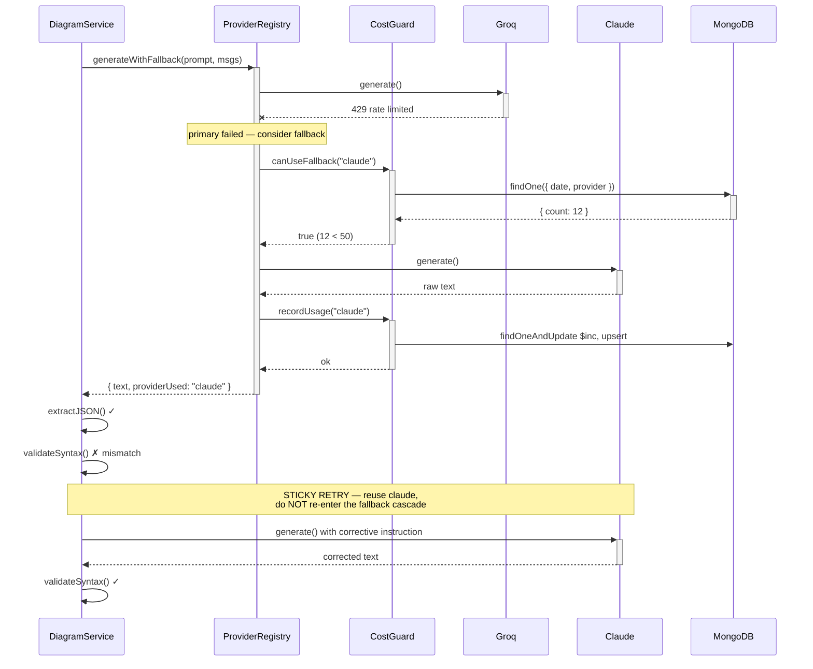

**The cap-exceeded path:**

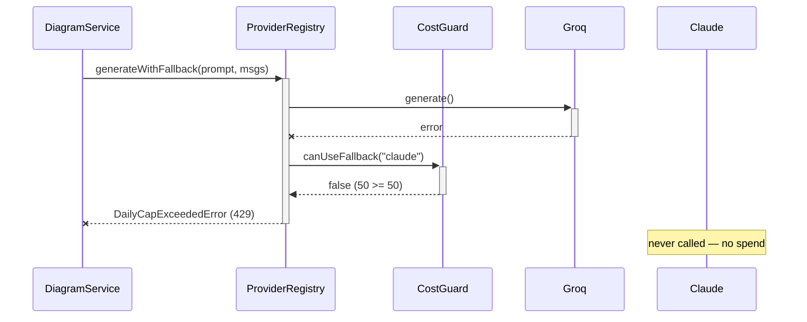

> **Read the last two lines carefully.** The paid provider is never contacted once the cap is hit. The check happens *before* the call, not after. A cap enforced after the fact isn't a cap — it's a report.

### 5.3 Authentication

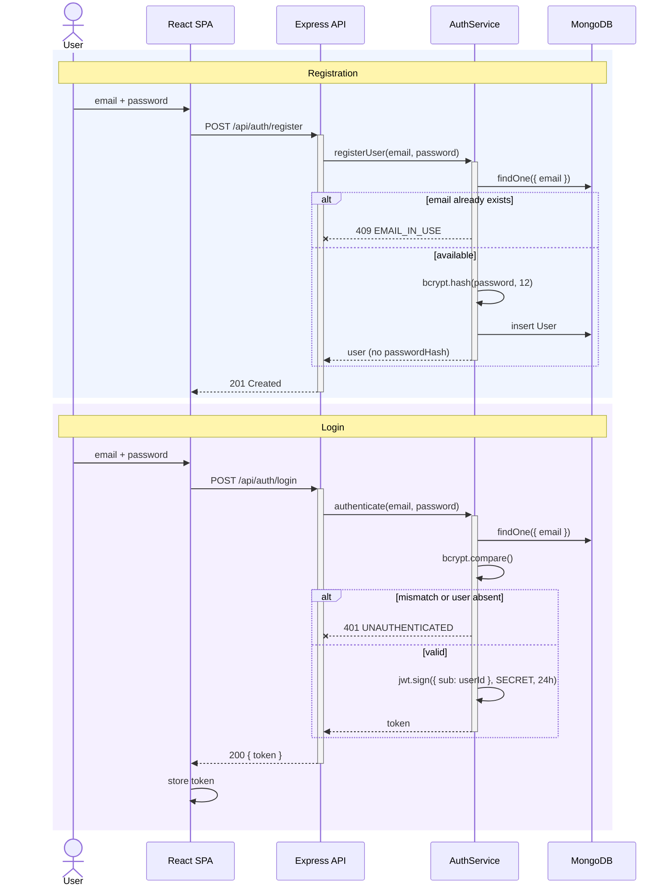

> **Both failure branches return the same `401`.** Whether the email doesn't exist or the password is wrong, the response is identical. Distinguishing them would let an attacker enumerate which email addresses have accounts.

---

## 6. Activity diagram

The full generation pipeline as a control flow, including every decision point and error exit.

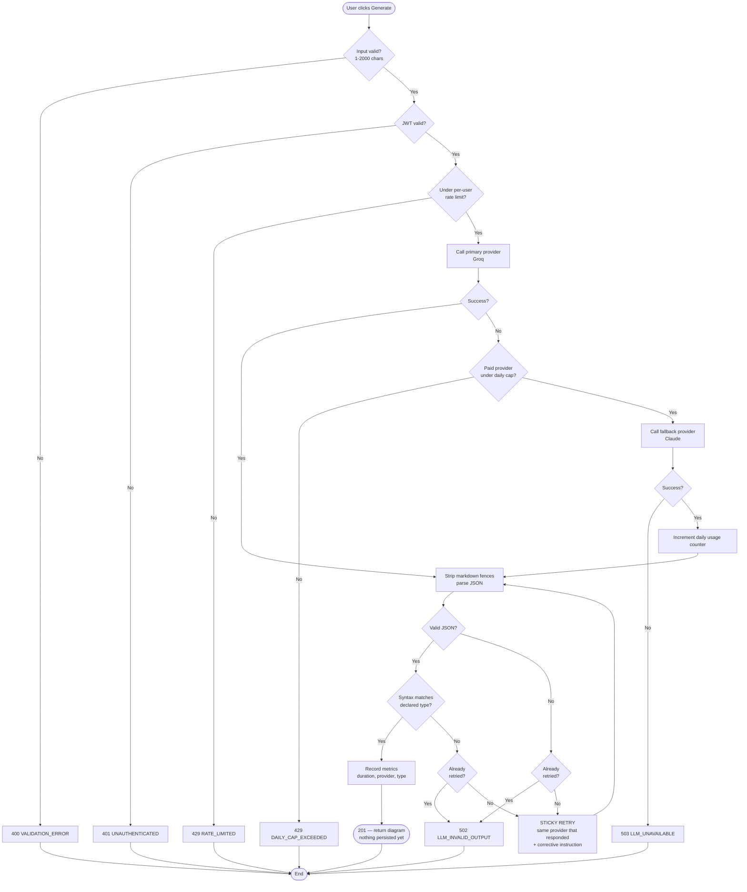

Three properties this flow guarantees, each worth checking against your code once it's written:

1. **Validation happens before any paid call.** An oversized input costs nothing.
2. **The retry can only happen once.** Both `Retried?` gates route to `502` on the second pass, so there is no infinite loop and no runaway spend.
3. **The cap is checked before the fallback call**, not after — so exceeding it costs zero.

---

## 7. State diagram

The lifecycle of a diagram, from the user's point of view.

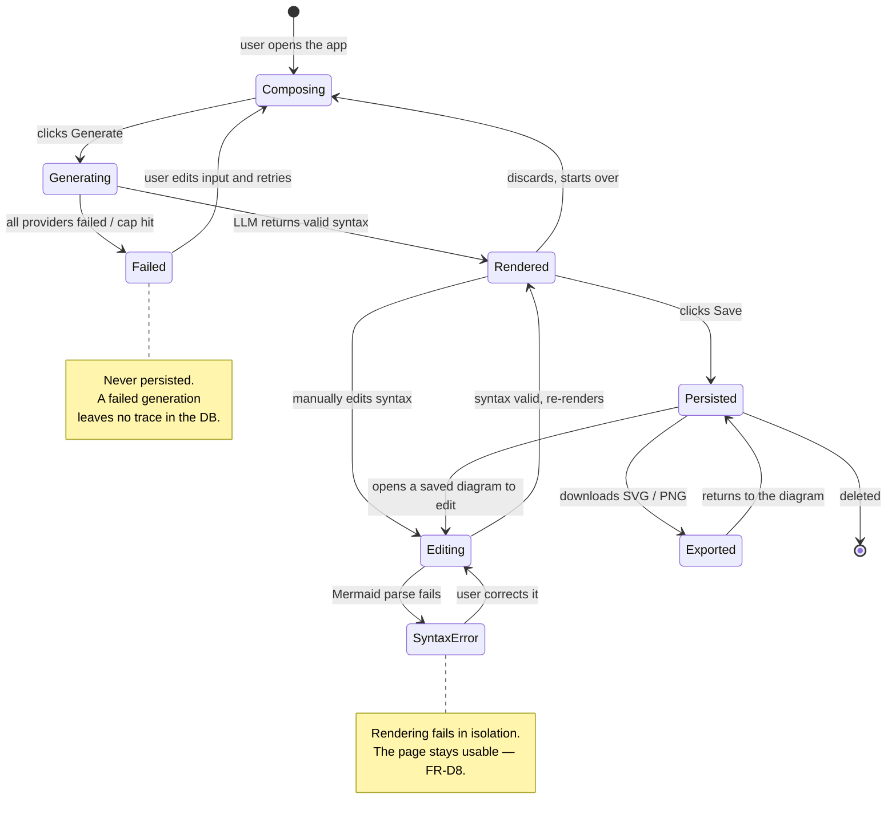

The transition worth calling out is **`Rendered → Composing`**: discarding is a first-class action. Because generation doesn't persist (`FR-G7`), throwing away a bad result costs nothing and leaves no orphan rows.

---

## 8. Component diagram

The runtime pieces and how they talk.

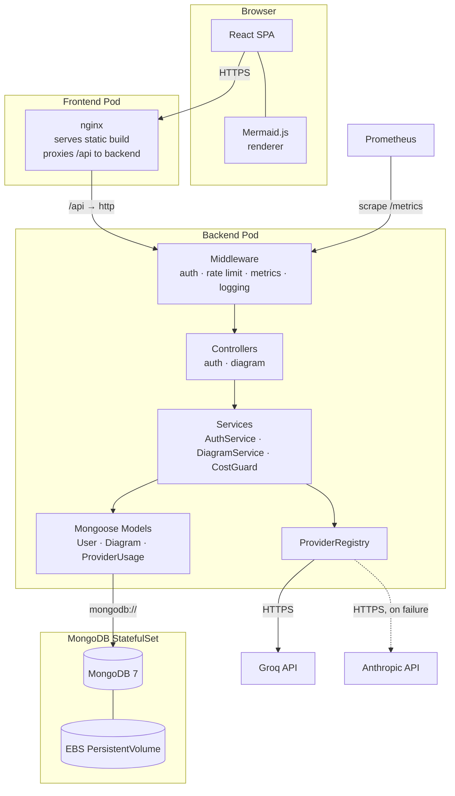

> **Note the `/api` proxy in nginx.** The frontend calls `/api/...` as a *relative* path; nginx forwards it to the backend service. This means the browser only ever talks to one origin — no CORS configuration, no build-time API URL to bake in, and identical behaviour locally under Docker Compose and in production behind the ALB. Baking an absolute API URL into the frontend at build time is the single most common way this architecture breaks, because Vite resolves environment variables at **build** time, not run time.

---

## 9. Deployment diagram

Where everything physically runs, once Phase 10 is complete.

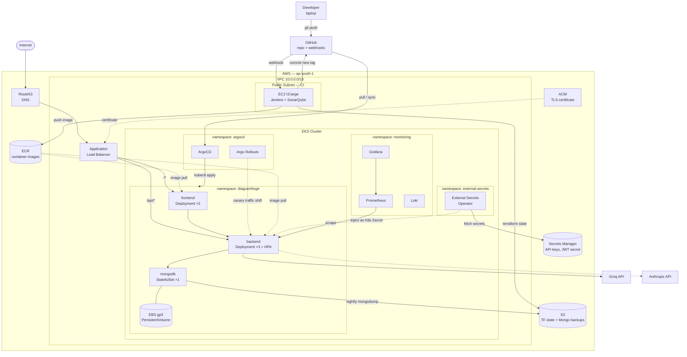

### Deployment notes

| Aspect | Choice | Reasoning |
|---|---|---|
| Region | `ap-south-1` (Mumbai) | Lowest latency from India; one region everywhere for consistency |
| Worker nodes | Public subnets | Avoids a NAT Gateway at ~$32/month. **A real security trade-off**, made deliberately for cost and documented rather than hidden |
| MongoDB | Single-replica StatefulSet | Honest limitation. Production would use a replica set or DocumentDB — recorded in the Phase 16 readiness review |
| Jenkins | Single EC2, no HA | Same reasoning. It's CI, not the product; downtime blocks deploys but not users |
| Backend replicas | 3, HPA to 10 | Survives losing one pod with room to spare (`NFR-A2`) |
| Secrets | Never in Git or images | ESO pulls from Secrets Manager at runtime (`NFR-S1`) |

> **What "destroy nightly" means on this diagram.** Everything inside the `EKS Cluster` box, plus the ALB, comes down with `terraform destroy` and rebuilds in ~15 minutes. What persists between sessions: ECR images, S3 state and backups, Secrets Manager entries, and the Route53 zone — all of which cost cents. That's how a $215/month architecture becomes a $30/month one.

---

## 10. Design decisions

These are the choices worth defending in a viva or an interview. Each is a candidate for a formal ADR in `docs/adr/`.

| # | Decision | Alternative rejected | Why |
|---|---|---|---|
| 1 | JWT stateless auth | Server-side sessions | Sessions need shared state (Redis) across pods. JWT keeps the backend stateless, satisfying `NFR-SC2`, with no extra component to run |
| 2 | Free provider primary, paid fallback | Paid provider only | Turns a per-call cost into a near-zero one, and makes failover a *real, exercised* code path rather than a theoretical one |
| 3 | Sticky retry | Retry through the full fallback chain | A formatting glitch shouldn't escalate to the paid provider. This is the difference between a $0.60 and a $60 month |
| 4 | Cap checked before the call | Cap checked after | A cap enforced after spending isn't a cap |
| 5 | Generation doesn't persist | Auto-save every generation | Users generate many drafts and keep few. Auto-save would fill the DB with noise |
| 6 | `404` for another user's resource | `403` | `403` confirms existence, enabling ID enumeration |
| 7 | nginx proxies `/api` | Build-time `VITE_API_URL` | Vite bakes env vars at build time — one image can't then serve two environments. The proxy makes the image environment-agnostic and eliminates CORS |
| 8 | Reference `userId`, don't embed diagrams | Embed in the user document | MongoDB's 16 MB document limit is a real ceiling a heavy user would eventually hit |
| 9 | Provider behind an interface | Direct SDK calls in the service | Enables zero-cost testing and one-line provider swaps |
| 10 | Mermaid for all design docs | draw.io / Lucidchart images | Diagrams diff in pull requests, render on GitHub, and can't drift out of sync with a binary you forgot to re-export |

---

## Where to go next

With this design agreed, [Phase 1](Phases/phase-1-application.md) becomes an implementation task rather than a design task — the schemas, the class boundaries, the endpoints, and the error codes are all decided.

Build order within Phase 1:

1. `User` model + `AuthService` + auth routes → prove registration and login with `curl`
2. `Diagram` model + CRUD routes with ownership checks → prove `FR-D7` with two accounts
3. `ILLMProvider` + `GroqProvider` → prove generation against one provider
4. `ClaudeProvider` + `ProviderRegistry` + `CostGuard` → prove failover with a deliberately broken API key
5. React frontend + Mermaid renderer
6. Dockerfiles + Compose with the nginx `/api` proxy
7. Jest tests covering `FR-G4`, `FR-G5`, `FR-G6`, `FR-D7`

Each step ends with something demonstrable. If a step can't be demonstrated, don't start the next one.
